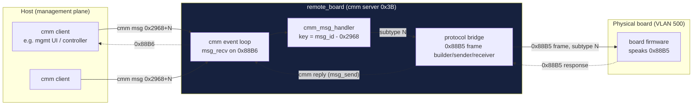
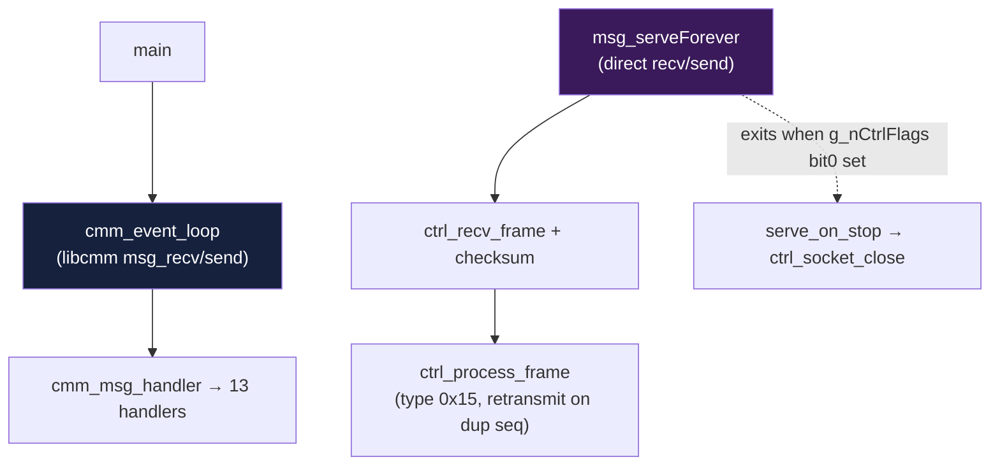
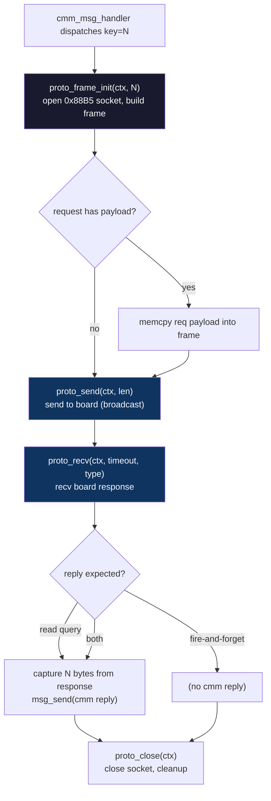
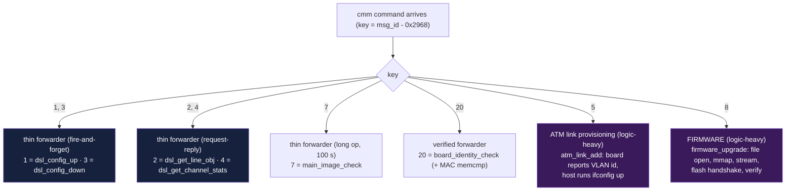

The architectural role of `remote_board`, and how data flows from the cmm bus to
the physical board.

## Role: cmm → board facade / protocol bridge

`remote_board` is a **service daemon that bridges a cmm command bus to an
external board's proprietary protocol.** It is the single point of contact
between host-side management software and the board hardware.

- **Inbound** = the cmm message bus (EtherType `0x88B6`, provided by `libcmm.so`).
  `remote_board` listens as **cmm server `0x3b`** and never initiates.
- **Outbound** = the board-native protocol (EtherType `0x88B5`), spoken directly
  to the board over raw Ethernet on VLAN 500.

> **libcmm is always the source.** `remote_board` sits idle in its `select()`
> loop until a cmm message arrives, then reacts. It is not autonomous.



## Two serve loops on the control socket

The host-side control plane has **two independent serve paths** over the `0x88B6`
socket. `main()` runs the first; the second appears to be an alternate/legacy
path (its callers are not on the `main` hot path):

| Loop | API | Driven by | Purpose |
|------|-----|-----------|---------|
| **`cmm_event_loop`** | libcmm `msg_recv` / `msg_send` | `main()` (the normal path) | Multi-connection `select()` + dispatch via `cmm_msg_handler` |
| **`msg_serveForever`** | direct `recv`/`send` on `g_nCtrlSocketFd` | *(not reached from `main`)* | Own framing + ack/retransmit keyed on `g_nCtrlSeq`; handles type-`0x15` frames |



`msg_serveForever` carries the debug string `"lgx:msg_serveForever looping!"`
and polls every 50 ms. It is the lower-level counterpart of the libcmm loop: it
does its own `recv` + `proto_verify_checksum` and acknowledges/retransmits using
a sequence number in `g_nCtrlSeq`. Its presence is worth knowing about if you
trace control-plane behavior that does not appear to flow through the dispatch
table.

## The 1:1 subtype mapping

The dispatch key **is** the wire subtype. There is no translation table — the cmm
message id directly selects the `0x88B5` operation:

```
cmm msg_id  =  0x2968  +  N
                        │
                        └──►  0x88B5 frame subtype = N
```

| cmm `msg_id` | `N` (key) | `0x88B5` subtype | → board op |
|--------------|-----------|------------------|------------|
| `0x2969` | 1 | 1 | write 12 B |
| `0x296A` | 2 | 2 | read 59 B |
| `0x296B` | 3 | 3 | (send only) |
| `0x296C` | 4 | 4 | read 28 B |
| `0x296D` | 5 | 5 | **init / VLAN discovery** |
| `0x296F` | 7 | 7 | long op (100 s timeout) |
| `0x2970` | 8 | 8 | **firmware upgrade** |
| `0x297C` | 20 | 20 | identity check (MAC verify) — **DEAD** (no sender in libcmm) |

## The uniform forward pattern

Every handler except the two logic-heavy ones follows the **same skeleton**:



Only four things vary between the thin handlers:

1. **subtype** `N` (always == cmm key)
2. **request payload size** (0, or 12 B for cmd 1)
3. **response capture size** (0, 28 B, or 59 B) — and whether `msg_send` relays it
4. **timeout** (1500 ms typical, 3000 ms for cmd 20, 100 000 ms for cmd 7)

## Command classification

*Roles resolved by cross-referencing `libcmm.so` (`oal_remote_Cfg`); see
[xdsl/index.md](xdsl/index.md).*



| Class | Key(s) | Handler | What `remote_board` adds |
|-------|--------|----------|--------------------------|
| **Thin forwarder** (fire-and-forget) | 1, 3 | `dsl_config_up`, `dsl_config_down` | none — pure cmm↔0x88B5 relay |
| **Thin forwarder** (request-reply) | 2, 4 | `dsl_get_line_obj`, `dsl_get_channel_stats` | relay N-byte response back onto cmm |
| **Thin forwarder** (long op) | 7 | `main_image_check` | 100 s timeout, no extra logic |
| **Verified forwarder** | 20 | `board_identity_check` | adds 6-byte MAC `memcmp` identity check — **DEAD** (no host sender) |
| **ATM provisioning** (logic-heavy) | 5 | `atm_link_add` | discovers VLAN id from board, brings `lan0.<vlan>` up |
| **Flash engine** (logic-heavy) | 8 | `firmware_upgrade` | full pipeline: validate → mmap → stream → handshake → verify → mark file |

## Conclusion

With the **sole exceptions of discovery (cmd 5) and firmware update (cmd 8)**,
`remote_board` is a **thin cmm→board facade**: it relays a cmm message onto the
board's `0x88B5` protocol using a 1:1 id mapping, optionally forwarding the
request payload and relaying the response back onto the cmm bus.

```
┌──────────────────────────────────────────────────────────────┐
│  cmm bus (0x88B6)                                            │
│  ─ the source ─ always inbound ─ remote_board only listens   │
└───────────────────────────────┬──────────────────────────────┘
                                 │  msg 0x2968 + N
                                 ▼
┌──────────────────────────────────────────────────────────────┐
│  remote_board (server 0x3B)                                  │
│  facade: cmm msg  ──1:1──►  0x88B5 subtype                   │
│  + 2 logic-heavy ops: discovery, firmware                    │
└───────────────────────────────┬──────────────────────────────┘
                                 │  0x88B5 frame (broadcast, VLAN 500)
                                 ▼
┌──────────────────────────────────────────────────────────────┐
│  external board                                              │
└──────────────────────────────────────────────────────────────┘
```

See also: [dispatch.md](commands/dispatch.md) for the command table,
[protocol.md](protocol.md) for the `0x88B5` frame layout,
[firmware.md](commands/firmware.md) for the flash engine.
