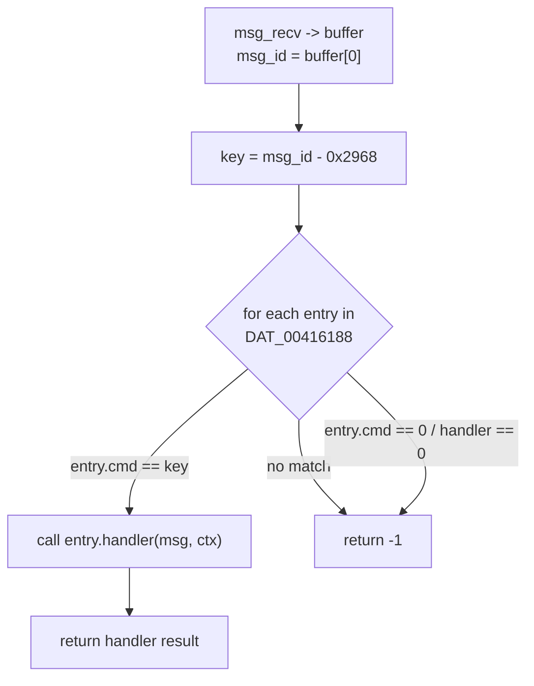

# Message Dispatch (cmm command table)

Incoming cmm messages are dispatched by `cmm_msg_handler`.

## Dispatch logic

`cmm_msg_handler(msg, ctx)` walks the table at `DAT_00416188` entry by entry:

1. Compute the dispatch key: `key = msg_id - 0x2968`.
2. For each entry, if `entry.cmd == key`, call `entry.handler(msg, ctx)` and return its result.
3. Stop the walk (return `-1`) on the first entry whose `cmd` or `handler` is zero
   (table terminator), or when no entry matches.

- Each table entry is **16 bytes** (`4 * int`): `{uint32 cmd, uint32 pad, uint64 handler}`.
- The dispatch key is `msg_id - 0x2968`.
- Table terminator: a zero `cmd` or zero `handler`.

## Dispatch flow



## Command table (DAT_00416188)

*Roles resolved by cross-referencing `libcmm.so` (`oal_remote_Cfg`); see
[../xdsl/index.md](../xdsl/index.md). `msg_id = 0x2968 + key`.*

| key | Function | Role (from libcmm) |
|-----|----------|--------------------|
| 1 | `dsl_config_up` | DSL line config UP (modulation + annex, 12 B) |
| 2 | `dsl_get_line_obj` | GET DSL line/channel object (59 B, reply) |
| 3 | `dsl_config_down` | DSL config DOWN |
| 4 | `dsl_get_channel_stats` | GET channel total stats (28 B, reply) |
| 5 | **`atm_link_add`** | ATM link add → discover VLAN, `ifconfig up` |
| 6 | **`atm_link_del`** | ATM link del → `ifconfig down` (when type=3) |
| 7 | `main_image_check` | main-board image check (100 s timeout) |
| 8 | **`firmware_upgrade`** | firmware upgrade |
| 9 | `cmd9_forward` | 2-B forward (**confirmed dead** — no host sender) |
| 14 | `cmd14_forward` | 7-B forward (**confirmed dead** — no host sender) |
| 15 | **`ptm_link_add`** | PTM/VDSL link add → `ifconfig up` |
| 16 | **`ptm_link_del`** | PTM/VDSL link del → `ifconfig down` (when type=3) |
| 20 | `board_identity_check` | board identity / MAC verify (**confirmed dead** — no host sender) |

> **All 13 handlers present.** Both ADSL (op 5/6) and VDSL (op 15/16) link
> lifecycles are fully supported — each configures the board *and* mirrors the
> VLAN interface locally. Opcodes 9, 14, and 20 are **confirmed dead** on the
> host side: an exhaustive scan of `oal_remote_Cfg` (the sole server-`0x3b`
> bridge) and all `msg_connCliAndSend` callers found no sender. Where
> decapsulation happens: [../xdsl/data_plane.md](../xdsl/data_plane.md).

## ATM link add command (msg `0x296D`)

`atm_link_add` — the "initialize the external board" command:

```mermaid
sequenceDiagram
    participant H as remote_board
    participant K as kernel (lan0)
    participant B as external board

    H->>H: proto_frame_init(ctx, subtype=5)   ;; build 0x88B5 frame
    H->>H: memcpy payload (24 bytes from request)
    H->>K: send broadcast (EtherType 0x88B5, subtype 5)
    K->>B: 802.1Q VLAN-tagged broadcast
    B-->>K: response (VLAN id in payload @0x12)
    K-->>H: proto_recv(ctx, 2000ms, 5)
    H->>H: check resp.code >= 4 AND status == 0
    alt OK
        H->>H: vlanId = resp[0x12]
        H->>K: snprintf("lan0.%u", vlanId)
        H->>K: system("ifconfig lan0.<vlan> up")
    else fail
        H->>H: return 1 (error)
    end
```

This is the **trigger that brings the VLAN interface up**, after which the cmm
control plane and firmware transfer can proceed.

## Interface up/down helpers

| Function | Action |
|----------|--------|
| `iface_vlan_up` | `snprintf("lan0.%u", vlan)` then `system("ifconfig lan0.<vlan> up")`. Prints `"vlanId = %d"`. |
| `iface_vlan_down` | `snprintf("lan0.%u", vlan)` then `system("ifconfig lan0.<vlan> down")`. |

## Firmware upgrade command (msg `0x2970`)

See [firmware.md](firmware.md) for the full multi-stage flow.
