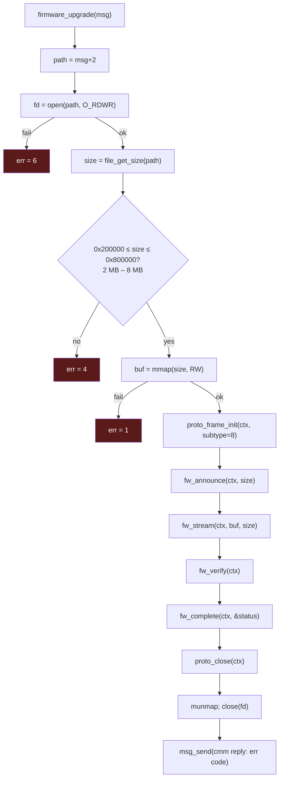
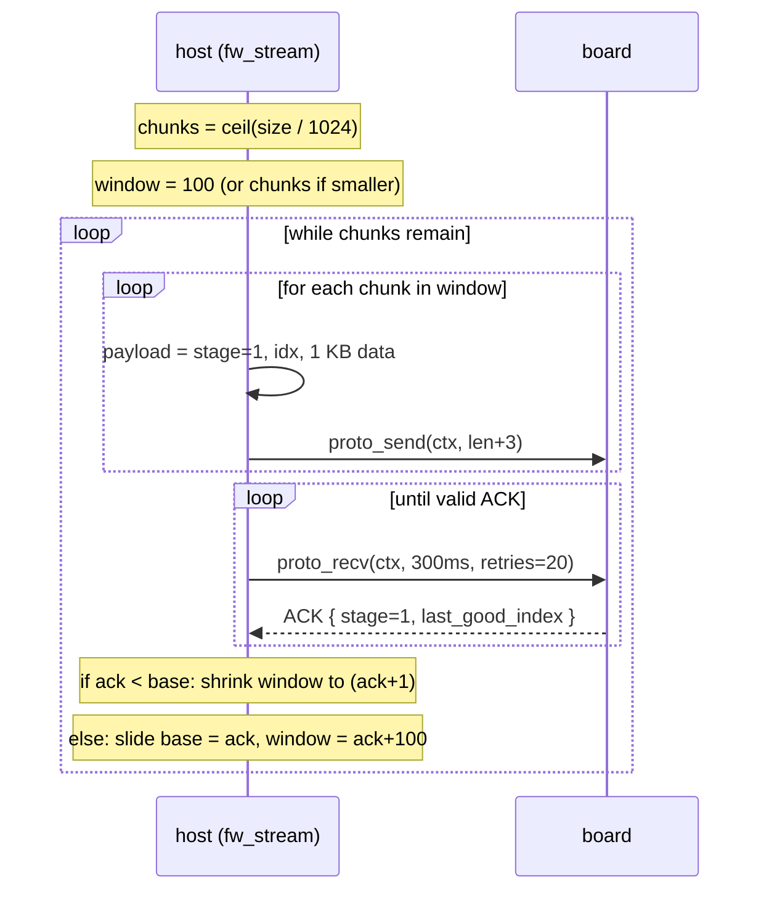

Detailed wire-level documentation of the firmware upgrade protocol spoken over
EtherType `0x88B5`. This is the deep-dive companion to
[firmware.md](firmware.md), which covers the cmm command
wrapper (`firmware_upgrade` / msg `0x2970`).

## Overview

Firmware upload is a **4-stage request/response protocol** over the board's raw
`0x88B5` channel. Each stage is identified by a `stage` byte in the payload. The
host drives every stage; the board ACKs each one.

```
host                          board
 │                             │
 │  stage 0  ANNOUNCE (size)   │
 │ ├──────────────────────────►│  erase flash for `size` bytes
 │ │◄──────────────────────────┤  status
 │  stage 1  STREAM (N chunks) │
 │ ├──────────────────────────►│  write flash, per chunk
 │ │◄──────────────────────────┤  ACK (last good chunk index)
 │           ... (windowed)    │
 │  stage 2  VERIFY            │
 │ ├──────────────────────────►│  compute checksum of flashed image
 │ │◄──────────────────────────┤  verify status
 │  stage 3  COMPLETE          │
 │ ├──────────────────────────►│  finalize / mark upgrade
 │ │◄──────────────────────────┤  version + status
 │                             │
 │  write /var/tmp/remote_upgrade marker
```

## Entry & pre-flight

`firmware_upgrade` receives a cmm message whose payload (at
`msg[2]`) is the **firmware file path**.



The flash is therefore **8 MB max** (`0x800000`); images below **2 MB**
(`0x200000`) are rejected.

## Frame layout (firmware payloads)

Built on the standard `proto_frame_hdr` (see [protocol.md](../protocol.md)). The
firmware protocol uses the **payload** region (offset `0x18` onward):

```
payload byte 0    : stage   (0=announce, 1=stream, 2=verify, 3=complete)
payload byte 1..  : stage-specific data
```

| Stage | `proto_send` len | Payload bytes after `stage` |
|-------|------------------|------------------------------|
| 0 announce | 5 | `uint32 size` (image size in bytes) |
| 1 stream | chunk_len + 3 | `uint16 chunk_index` + `chunk_data[…]` |
| 2 verify | 1 | (none) |
| 3 complete | 1 | (none) |

The sequence number (`proto_frame_hdr.seq`, from `g_dwProtoSeq`) increments per
frame, and every frame carries a checksum (`proto_verify_checksum`).

## Stage 0 — Announce (`fw_announce`)

```c
ctx.payload[0] = 0;                 // stage = announce
*(uint32*)&ctx.payload[1] = size;   // image size
proto_send(ctx, 5);                 // send 5-byte payload
proto_recv(ctx, 1500ms, retries=5); // wait, retransmit on timeout
// accept if resp.payload_len >= 9
return resp.data[0];                // board status (0 = ok)
```

The board learns the image size and **erases the flash** accordingly. Host
retransmits up to 5 times on timeout.

## Stage 1 — Stream (`fw_stream`)

The image is sent in **1024-byte (`0x400`) chunks** using a **sliding window**
of up to 100 chunks, with selective ACK and retransmit.



Per-chunk payload:
```
[0]   = 1              (stage = stream)
[1:3] = chunk_index    (uint16, little-endian in struct)
[3:]  = 1024 bytes     (or remainder for final chunk)
```

ACK handling:
- Board returns the **highest contiguous chunk index** it has fully received.
- If `ack < window_base` → board fell behind; host shrinks the window and
  resumes from `ack`.
- If `ack >= window_base` → advance `base = ack`, open window to `ack + 100`.
- ACK wait: 300 ms timeout, up to 20 retransmissions of the in-flight frames.

## Stage 2 — Verify (`fw_verify`)

```c
ctx.payload[0] = 2;                    // stage = verify
proto_send(ctx, 1);
do {
    proto_recv(ctx, 60000ms, retries=20);
} while (resp.stage != 2 || resp.payload_len < 9);
return resp.data[0];                   // verify status (0 = ok)
```

The board recomputes a checksum over the flashed image and compares it to the
host's image. The **60-second timeout** reflects the time needed to checksum 8 MB
of flash.

## Stage 3 — Complete (`fw_complete`)

```c
ctx.payload[0] = 3;                    // stage = complete
proto_send(ctx, 1);
do {
    proto_recv(ctx, 60000ms, retries=20);
} while (resp.stage != 3 || resp.payload_len < 9);

// board reports its upgrade version:
sprintf(cmd, "echo %d > /var/tmp/remote_upgrade", resp.version);
do {
    system(cmd);
    usleep(1000);
} while (access("/var/tmp/remote_upgrade", F_OK) == -1);

*out_status = resp.data[4];
return resp.version;
```

On success the host writes the **`/var/tmp/remote_upgrade`** marker file
(containing the new version). A supervisor process is expected to consume this
marker and reboot the board into the new image.

## Checksum (`proto_verify_checksum`)

Every received frame is integrity-checked before its payload is trusted:

```c
saved      = frame.checksum;        // offset 0x16
frame.checksum = 0;
len        = ntohs(frame.payload_len);
computed   = htons(proto_compute_checksum(0, &frame.magic, len + 10));
if (saved != computed) return -1;   // drop frame
proto_postprocess(frame);
return 0;
```

The checksum covers `magic` (offset `0x0E`) through end-of-payload — i.e. the
10 fixed bytes (`magic, subtype, seq, payload_len, checksum`) plus `payload_len`
data bytes. The algorithm is **CRC-16/ARC** (see [checksum.md](../checksum.md)
for the full analysis and a reference implementation).

## MAC learning (first contact)

The first firmware frame is sent to the **broadcast MAC** (`g_abDestMac` =
`FF:FF:FF:FF:FF:FF`). When `proto_recv_frame` gets the board's reply, it detects
that the destination was broadcast and **copies the response's source MAC into
`g_abDestMac`**. All subsequent frames are then unicast directly to the board.

## Reliability summary

| Stage | Timeout | Retries (retransmits) | Notes |
|-------|---------|-----------------------|-------|
| announce | 1500 ms | 5 | board erases flash |
| stream (per ACK) | 300 ms | 20 | 1 KB chunks, window ≤ 100 |
| verify | 60 000 ms | 20 | board checksums full image |
| complete | 60 000 ms | 20 | writes upgrade marker |

`proto_recv(ctx, timeout_ms, retries)` retransmits the last sent frame on each
timeout, decrementing `retries`; it returns `-1` only when retries are
exhausted or `select()` fails.

## Error codes (cmm reply)

Returned to the caller via `msg_send` (`msg[0] = 1`, `msg[1] = err`):

| Code | Meaning |
|------|---------|
| `0` | success |
| `1` | transfer / verify / handshake failure |
| `4` | file size out of range (must be 2–8 MB) |
| `6` | `open()` failed |

## Socket lifecycle

A **dedicated `0x88B5` socket** is opened per upgrade by `proto_frame_init` and
closed by `proto_close` at the end — independent of the always-on `0x88B6`
control socket, so cmm traffic keeps flowing during an upgrade.
