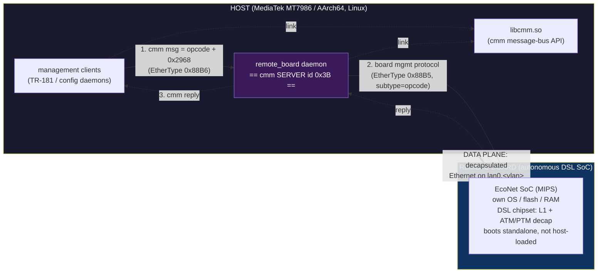

# remote_board — Reverse Engineering Documentation

Analysis of the `remote_board` ELF binary, its shared library `libcmm.so`, and
the DSL board they manage. **Two architectures are in play** (confirmed from the
host build-path string leaked in `diagTool`):

| Side | SoC | Architecture |
|------|-----|--------------|
| **Host** (router main CPU) | MediaTek **MT7986** (Filogic 830) | **AArch64** (Cortex-A53), little-endian |
| **Remote xDSL board** | **EcoNet** (EN75xx family) | **MIPS** |

`remote_board`, `libcmm.so`, and the host management clients are all **AArch64**
ELFs (loaded into Ghidra as `AARCH64:LE:64:v8A`). The board firmware — not in
hand; see [reverse-engineering-plan.md](../plans/reverse-engineering-plan.md) §1 — would be a **MIPS** image.

> **Addresses live in [map.md](map.md).** This documentation uses **mnemonic
> names** throughout; raw code/data addresses are intentionally omitted from
> narrative docs and centralized in the symbol map. Protocol constants
> (EtherTypes, message IDs, opcodes) are kept inline where they belong.

---

## Preface: who is who

This system is a **DSL modem/router** split across two pieces of hardware,
talking over a raw Ethernet link. Getting the roles straight up-front avoids
confusion throughout the rest of the docs.

### Roles

| Actor | What it is | Role in cmm | Role in 0x88B5 |
|-------|-----------|-------------|----------------|
| **Host** | Router main SoC: **MediaTek MT7986** (AArch64), running Linux. Executes `remote_board` and the management clients. | — | — |
| **Management clients** | Host processes (TR-181/config daemons) that drive DSL configuration. They use `libcmm.so`. | **cmm clients** — send commands addressed to server `0x3B` | (do not speak 0x88B5) |
| **`remote_board`** | The daemon under analysis. The single bridge between host management and the DSL board. | **cmm server `0x3B`** — receives & dispatches | **0x88B5 master** — talks to the board |
| **`libcmm.so`** | Shared library implementing the cmm message bus over EtherType `0x88B6`. | provides the API to both clients and server | — |
| **Remote board** | Autonomous embedded SoC: **EcoNet** part (MIPS), with its **own OS, flash, and RAM** — boots standalone (the host does not load its firmware at runtime). Exposes `0x88B5` as its management interface. | (does not participate in cmm) | **0x88B5 endpoint** — executes DSL ops |

### The two planes (don't confuse them)

| Plane | EtherType | Path | Carries |
|-------|-----------|------|---------|
| **Control / management** | `0x88B6` (cmm) + `0x88B5` (board mgmt) | clients → `remote_board` → board | config commands, status, firmware |
| **Data** | standard Ethernet/IP | board (after decap) → host `lan0.<vlan>` | user traffic — `remote_board` never touches it |

> `remote_board` only ever handles the **control plane**. DSL ATM/PTM
> decapsulation happens **on the remote board**; `remote_board` merely configures
> the VLAN tag and mirrors the interface locally. See
> [xdsl/data_plane.md](xdsl/data_plane.md).

### Key protocol constants

| Constant | Value | Meaning |
|----------|-------|---------|
| cmm server id | `0x3B` | the address `remote_board` listens on |
| cmm msg base | `0x2968` | `msg_id = 0x2968 + opcode` |
| Control EtherType | `0x88B6` | cmm message bus (clients ↔ `remote_board`) |
| Board-mgmt EtherType | `0x88B5` | `remote_board` ↔ board management |
| Default interface | `lan0.500` | VLAN 500 sub-interface (kernel adds the 802.1Q tag) |
| Dest MAC (init) | `FF:FF:FF:FF:FF:FF` | broadcast until the board's MAC is learned |

Both `0x88B5`/`0x88B6` are IEEE-registered **Local Experimental** EtherTypes
(proprietary protocol).

---

## TL;DR

`remote_board` is a **cmm server and a 0x88B5 protocol bridge**. Management
clients send it cmm messages (`msg_id = 0x2968 + opcode`); it forwards each
opcode to the DSL board as a `0x88B5` frame with the same subtype, optionally
relaying the reply back onto the cmm bus. With two exceptions (board init /
firmware), it is a thin 1:1 facade. It also runs a second, lower-level control
loop (`msg_serveForever`) with its own ack/retransmit.

---

## Document index

### Architecture & protocol
| Document | Topic |
|----------|-------|
| [architecture.md](architecture.md) | The cmm→board facade, the two serve loops, command classification |
| [network.md](network.md) | Raw `AF_PACKET` sockets, BPF filter, VLAN/interface binding |
| [protocol.md](protocol.md) | Wire frame formats (`0x88B5`/`0x88B6`), checksum, MAC learning |
| [checksum.md](checksum.md) | **Frame checksum (P0, solved)** — CRC-16/ARC, coverage, Python reference |
| [libcmm.md](libcmm.md) | The `libcmm.so` API used (`msg_init`/`msg_srvInit`/`msg_send`/`msg_recv`) |
| [initialization.md](initialization.md) | `main()` startup → serve → shutdown lifecycle |

### Commands (handler detail)
| Document | Topic |
|----------|-------|
| [commands/dispatch.md](commands/dispatch.md) | The 13-entry dispatch table + per-command roles |
| [commands/firmware.md](commands/firmware.md) | Firmware upload: 4-stage wire protocol, chunking, handshake |

### DSL configuration
| Document | Topic |
|----------|-------|
| [xdsl/index.md](xdsl/index.md) | How `libcmm.so` drives ATM/PTM/annex via `remote_board` (cross-reference) |
| [xdsl/opcodes.md](xdsl/opcodes.md) | Per-opcode breakdown (payloads, reply semantics) |
| [xdsl/layers.md](xdsl/layers.md) | ATM vs PTM link handling, annex & modulation types |
| [xdsl/modulation_annex.md](xdsl/modulation_annex.md) | **Modulation & annex map** — valid codes, standards, combinations |
| [xdsl/data_plane.md](xdsl/data_plane.md) | Where decapsulation happens (board, not host) |
| [xdsl/payloads.md](xdsl/payloads.md) | **TX payload layouts (P1, solved)** — per-opcode byte maps + enum tables |
| [xdsl/responses.md](xdsl/responses.md) | **RX response layouts (P2, solved)** — opcode 2/4 reply parsing |

### Reference (in `docs/`)
| Document | Topic |
|----------|-------|
| [rbctl-dsl.md](rbctl-dsl.md) | **The Rust daemon (newcomer guide)** — workspace layout, crates & deps, startup & runtime lifecycle, request flow, with diagrams |
| [safety-audit.md](safety-audit.md) | **Type/memory-safety audit (pre-P4)** — every `unsafe` site, fixes applied, SDK verification gate |
| [map.md](map.md) | **Symbol map**: every function/global/type, original → renamed, with addresses |
| [led_control.md](led_control.md) | **LED control & DSL polling** — `cos` daemon, `tp_gpio.ko`, blink patterns, 10s polling interval, handler table |
| [hunt.md](hunt.md) | **Search kit**: grep patterns & commands for finding missing binaries (rootfs, board firmware, EcoNet SDK) |
| [tr-181.md](tr-181.md) | **TR-181 quick reference** — the Device:2 data model, why it shapes the code, and the `Device.DSL.` field mappings |

### Plans (in [`../plans/`](../plans/))
| Document | Topic |
|----------|-------|
| [reverse-engineering-plan.md](../plans/reverse-engineering-plan.md) | **Binary analysis plan** — P0–P4 RE steps that produced the protocol spec (checksum / TX / RX / QinQ) |
| [rbctl-daemon-plan.md](../plans/rbctl-daemon-plan.md) | **Daemon build plan** — phased Rust `rbctl-dsl`: toolchain, protocol core, board control, OpenWrt integration, packaging (external feed) |

---

## How to reproduce

Ghidra project *RemoteBoard Modulus* in the repository root. Programs:
`/remote_board` (fully renamed, 0 `FUN_*` remaining) and `/libcmm.so`
(analyzed, 5838 functions). All code/data addresses are image-relative; see
[map.md](map.md).
