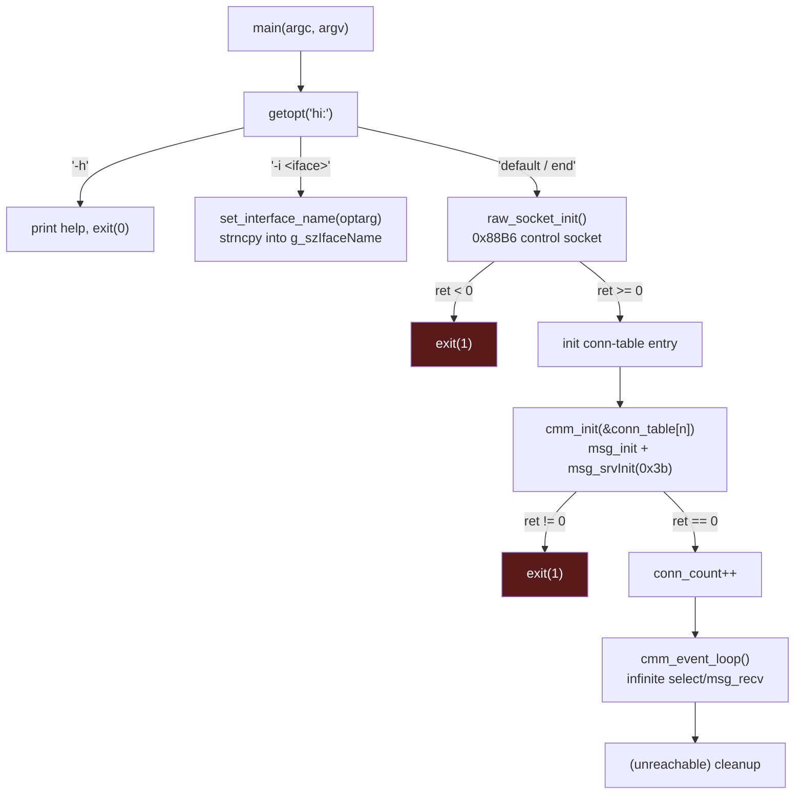
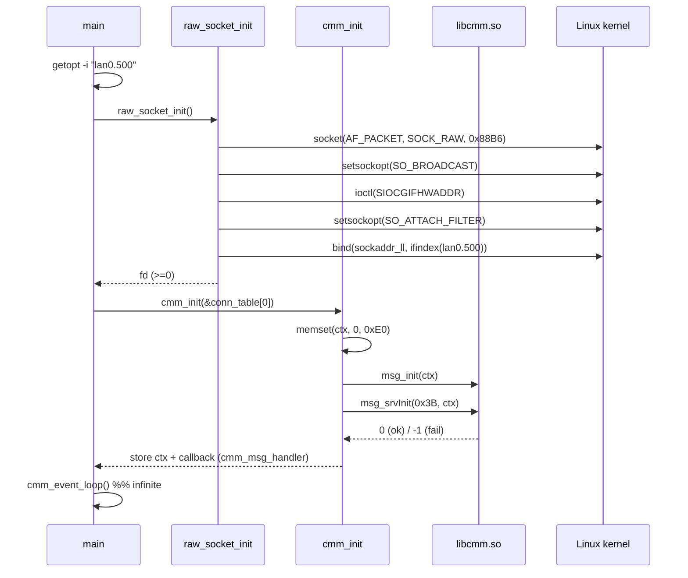

The startup sequence of `remote_board`, from ELF entry to the running event loop.

## Entry → main

ELF `_start` is at `entry`. Per the glibc ABI, it invokes:

```c
__libc_start_main(main, argc, argv, _init, _fini, 0);
```

where `main` is at.

## main()



### Command-line options

Parsed with `getopt(argc, argv, "hi:")`:

| Option | Argument | Handler | Effect |
|--------|----------|---------|--------|
| `-h` | — | `print_usage` | Print usage and `exit(0)` |
| `-i` | `<iface>` | `set_interface_name` | `strncpy(g_szIfaceName, optarg, 16)` |

`-i` overrides the default interface name `"lan0.500"`. On a real board this is
typically `eth0.500` or similar. The `.NNN` suffix selects the VLAN.

### raw_socket_init()

Opens the **control-plane** socket (EtherType `0x88B6`). See
[network.md](network.md) for details. On failure prints one of:

- `"socket init failed"`
- `"set socket filter failed"`
- `"bind interface failed"`

and returns `-1` → `main` exits.

### cmm_init()

Initializes the libcmm context. See [libcmm.md](libcmm.md).

### cmm_event_loop()

Never returns — runs the `select()`/`msg_recv` dispatch loop. See
[libcmm.md](libcmm.md#event-loop) and [dispatch.md](commands/dispatch.md).

## Startup sequence (timeline)


