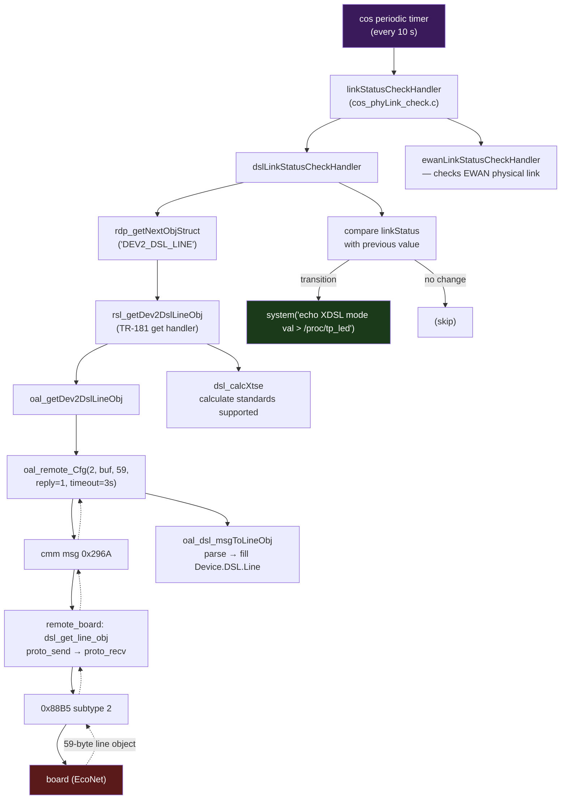
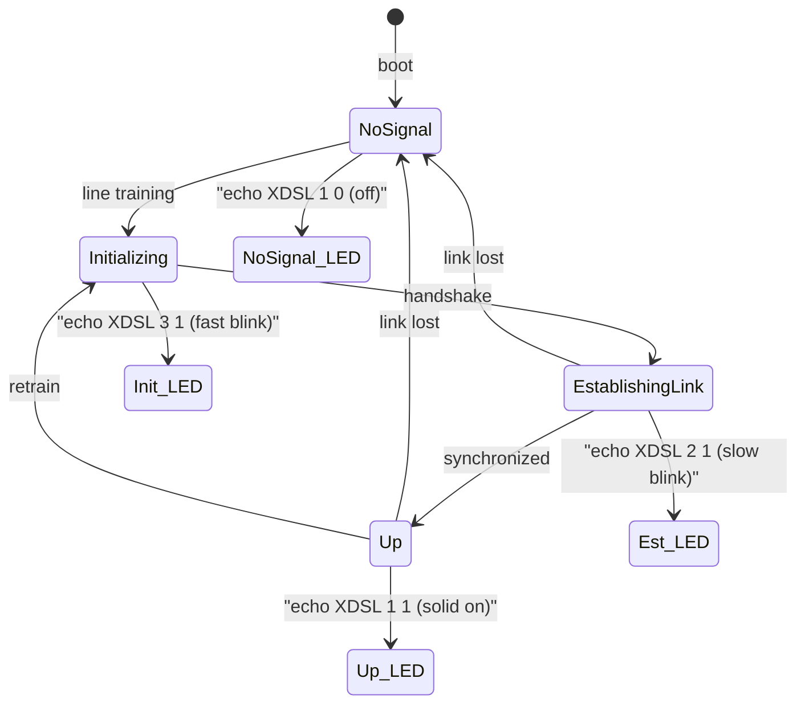

# LED Control & DSL Polling Architecture

How the DSL LED is controlled and how DSL line status is polled in the original
firmware. All findings are from static analysis of `cos` (the TP-Link central
management daemon), `libcmm.so`, `remote_board`, and the `tp_gpio.ko` kernel
module.

## TL;DR

- The board **never pushes events** — all status detection is poll-driven.
- DSL line status is polled **every 10 seconds** via opcode 2 (full round-trip
  to the board through `remote_board` over `0x88B5`).
- The DSL LED is controlled by `cos` via `/proc/tp_led` shell commands, only on
  status transitions.
- Channel stats (opcode 4) are **not polled** — fetched on-demand only.

## LED hardware & kernel driver

| Aspect | Value |
|--------|-------|
| LED name | `XDSL` |
| GPIO pin | 20 |
| Kernel driver | `tp_gpio.ko` (TP-Link custom, depends on `tp_board.ko`) |
| Control interface | `/proc/tp_led` (format: `echo XDSL <mode> <on/off> [ifname]`) |
| Timer interval | 25 jiffies (~250 ms at 100 Hz) — drives blink patterns |
| Netdev-bound? | No — mode 1 (simple GPIO), not mode 6/7 |

### LED modes (tp_gpio.ko)

| Mode | Command | Effect |
|------|---------|--------|
| 0 | off | LED disabled |
| 1 | `echo XDSL 1 1` | Solid on |
| 1 | `echo XDSL 1 0` | Solid off |
| 2 | `echo XDSL 2 1` | Blink (equal on/off) |
| 3 | `echo XDSL 3 1` | Blink (longer on, shorter off) |
| 6 | `echo XDSL 6 1 <ifname>` | Bind to network device (tracks interface up/down) |
| 9 | `echo XDSL 9 <speed>` | Custom blink pattern with configurable speed |

Blink rate is driven by the kernel timer (25 jiffies). The `speed` field in the
LED table entry controls how many timer ticks per on/off phase.

## DSL LED control logic (`cos`)

**Source file**: `cos_phyLink_check.c`, function `dslLinkStatusCheckHandler`.

`cos` detects `linkStatus` transitions and writes shell commands to
`/proc/tp_led` and `/proc/tplink/led_dsl`:

| `linkStatus` (from board) | LED mode | `/proc/tplink/led_dsl` | `/proc/tp_led` | Visual |
|---------------------------|----------|------------------------|----------------|--------|
| `Up` | 1 (solid) | `echo 1` | `echo XDSL 1 1` | **Solid green** |
| `NoSignal` | 1 (off) | `echo 0` | `echo XDSL 1 0` | **Off** |
| `Initializing` | 3 (fast blink) | `echo 3` | `echo XDSL 3 1` | **Fast blink** |
| `EstablishingLink` (other) | 2 (blink) | `echo 2` | `echo XDSL 2 1` | **Slow blink** |

The handler compares the current status with the previous one (stored in a
static variable initialized to `"NoSignal"`). LED commands are issued **only on
transitions**, not on every poll.

Debug log on transition:
```
DSL linkStatus:%s->%s
```

## Polling architecture

### Periodic handler table

`cos` has a table of periodic handlers at a fixed address in `.data`. Each
entry is 32 bytes (interval + padding + function pointer). The full table:

| Interval | Handler | Source file | Function name | Purpose |
|----------|---------|-------------|---------------|---------|
| **10 s** | `0x00426554` | `cos_phyLink_check.c` | `linkStatusCheckHandler` | **DSL + EWAN line status + LED control** |
| 1 s | `0x0042A714` | `cos_gpio.c` | (Internet LED updater) | Internet/EWAN LED state (reads cached DSL status) |
| 1 s | `0x004255B4` | `cos_linux_usb.c` | `usb3gBackupActiveHandler` | USB 3G backup switch |
| 5 s | `0x004254D8` | — | — | List processing (non-DSL) |
| 5 s | `0x004249E0` | `cos_led_schedule.c` | `ledCheckScheduleHandler` | LED schedule (time-based on/off) |
| 5 s | `0x00424C4C` | `cos_reboot_schedule.c` | `rebootScheduleHandler` | Reboot scheduling + NTP |
| 60 s | `0x00407304` | — | — | Process status update |
| 1 s | `0x00433528` | — | — | — |

### DSL-specific polling chain (every 10 seconds)



### LED state machine



### What is NOT polled

| Data | Opcode | When fetched |
|------|--------|-------------|
| Channel stats | 4 | **On-demand only** (web UI, TR-069 query) |
| Line stats sub-objects | (part of op 2) | Parsed but no separate poll |
| Firmware status | 8 | Not polled (firmware update excluded) |
| DSL config (modulation/annex) | 1 | Set on configuration change (not polled) |

### Secondary status reader (every 1 second)

`FUN_0042A714` (the 1-second Internet LED handler) calls
`getWanPhylinkStatus()` which also reads `DEV2_DSL_LINE.linkStatus`. This reads
the data model value that was refreshed by the 10-second handler — it does
**not** send an additional opcode 2 to the board.

## `/proc/tplink/led_dsl`

A secondary proc interface (created by `tp_board.ko` or `tp_gpio.ko`) used by
`cos` alongside `/proc/tp_led`. Values written by `dslLinkStatusCheckHandler`:

| Value | Meaning |
|-------|---------|
| `0` | DSL line down (LED off) |
| `1` | DSL line up (LED solid) |
| `2` | Training — slow blink |
| `3` | Initializing — fast blink |

This interface is consumed by the LED schedule subsystem
(`INCLUDE_LED_SCHEDULE=y` in `config.bba`) to honour time-based LED on/off
settings.

## Other LED control in the firmware

The `tp_gpio.ko` driver also manages other LEDs (Power, Internet, WiFi, LAN,
WAN, SFP, USB, VoIP). These are controlled by various daemons (`libcmm.so`
for WiFi, `rcS` for Power, `voip_client` for VoIP) but are **not relevant to
the DSL replacement**.

## Implications for the daemon replacement

1. **Polling interval**: the original firmware polls every 10 s. The daemon
   plan's Phase 2 poller at ~1 s is **10x more responsive** — safe, since each
   poll is a single lightweight 59-byte exchange.

2. **LED control**: the daemon does **not** need to control the DSL LED via
   `/proc/tp_led` — `tp_gpio.ko` won't exist on a mainline kernel. On OpenWrt,
   the LED would be controlled through the standard Linux LED subsystem
   (`/sys/class/leds/`) with a netdev or timer trigger. The daemon's hotplug
   events (`DSL_INTERFACE_STATUS=UP/DOWN/TRAINING`) can drive a udev/hotplug
   script that toggles the LED.

3. **Channel stats**: since the original firmware fetches opcode 4 on-demand
   only, the daemon can do the same — the ubus `dsl.statistics` method triggers
   a fresh opcode-4 poll when queried, with no need for periodic background
   polling.
