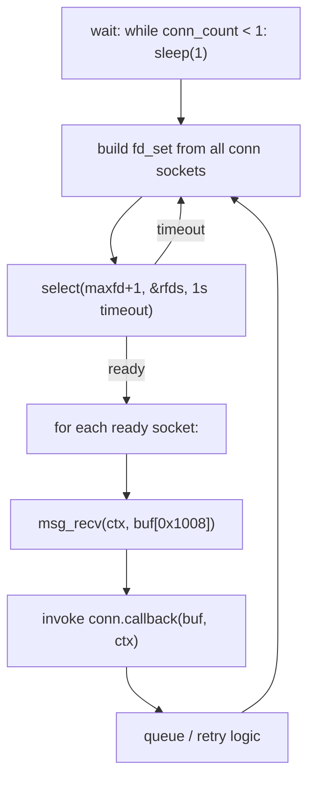

# libcmm.so — cmm Message Bus & OAL Layer

`libcmm.so` serves two roles in this system:

1. **Message bus** (`0x88B6`) — the IPC layer that `remote_board` (cmm server
   `0x3B`) and all host management clients use to exchange commands.
2. **OAL layer** (`oal_*` functions) — the DSL/ATM/PTM abstraction that
   serializes host-side data model objects into `0x88B5` wire payloads and
   deserializes board replies. This is the layer a `libcmm.so`-free replacement
   must reproduce.

## Role 1 — cmm Message Bus

### Imported by remote_board

`remote_board` imports exactly **four functions** from `libcmm.so`. No structs,
enums, or typedefs are imported — the cmm context is passed around as an opaque
byte buffer (`g_abCmmCtx`, 0xE0 bytes).

| Symbol | Inferred signature | Purpose |
|--------|--------------------|---------|
| `msg_init` | `void msg_init(void *ctx)` | Initialize a cmm context (fills the 0xE0-byte buffer) |
| `msg_srvInit` | `int msg_srvInit(int server_id, void *ctx)` | Register as a cmm server; returns `0` / `-1` |
| `msg_recv` | `void msg_recv(void *ctx, void *buf)` | Receive next message into `buf` (0x1008 B) |
| `msg_send` | `void msg_send(void *handle, void *msg)` | Send a cmm message |

> Signatures are inferred from call-site usage in `remote_board`.

### Opaque context type

The cmm context (`g_abCmmCtx`) is a 0xE0 (224) byte buffer. Its internal layout
is owned by `libcmm.so` and treated as opaque by `remote_board`:

- Zeroed with `memset` before `msg_init`.
- Passed by pointer to `msg_init`, `msg_srvInit`, and stored in the connection
  table (`g_conn_table[i].ctx`).
- `close()` is called on its first word on failure (`ctx._0_4_` holds the
  socket fd after `msg_init`).

### cmm_init()

```c
int cmm_init(void **out_conn) {
    memset(&g_abCmmCtx, 0, 0xE0);                 // zero 224-byte context
    msg_init(&g_abCmmCtx);                        // libcmm fills the context

    int r = msg_srvInit(0x3B, &g_abCmmCtx);       // register server id 0x3B
    if (r == -1) {
        close(g_abCmmCtx);                        // close the socket fd
        return -1;
    }
    puts("finished bind socket to cmm");
    out_conn[0] = &g_abCmmCtx;                    // store context ptr
    out_conn[2] = cmm_msg_handler;                // store recv callback
    return 0;
}
```

Key points:

- **Server id `0x3B` (59)** is hardcoded. This is the cmm address the host
  listens on.
- The receive callback `cmm_msg_handler` is stored into the connection table so
  the event loop can dispatch per-connection.

### libcmm call sites (in remote_board)

| libcmm fn | In function | Role |
|-----------|-------------|------|
| `msg_init` | `cmm_init` | init context |
| `msg_srvInit` | `cmm_init` | register server 0x3B |
| `msg_recv` | `cmm_event_loop` | read incoming msg |
| `msg_send` | `firmware_upgrade` | firmware-upgrade reply |
| `msg_send` | `dsl_get_line_obj` | cmd 2 reply |
| `msg_send` | `dsl_get_channel_stats` | cmd 4 reply |

### Connection table

`cmm_event_loop` walks a table of 0x28-byte records. Layout of one record:

| Offset | Size | Field |
|--------|------|-------|
| `0x00` | 8 | cmm context pointer (e.g. `&g_abCmmCtx`) |
| `0x08` | 4 | state flag (written by event loop) |
| `0x10` | 8 | receive callback (`cmm_msg_handler`) |
| `0x18` | ... | linked-list head for pending messages |

### Event loop

`cmm_event_loop` — never returns:



- Uses a 1-second `select()` timeout so it can poll connection state.
- On data ready, calls `msg_recv` into a 0x1008-byte buffer, then invokes the
  per-connection callback (which is `cmm_msg_handler`, see
  [dispatch.md](commands/dispatch.md)).
- Maintains a pending-message queue (up to 10 entries) with retry on failure.

### msg message format

A received message buffer's first word is the **message id**. The dispatcher
(`cmm_msg_handler`) computes `msg_id - 0x2968` to index the command table.

```
+-------------------+-------------------+
| uint32  msg_id    | (msg_id - 0x2968) |  = table key
+-------------------+-------------------+
| payload ...                            |
+----------------------------------------+
```

See [dispatch.md](commands/dispatch.md) for the full command table.

---

## Role 2 — OAL Layer (fully analyzed)

`libcmm.so` is also where the **OAL (Object Abstraction Layer)** lives — the
functions that translate between BBF TR-181 data model objects and the board's
`0x88B5` wire payloads. This is the critical layer for the replacement: every
byte the board sees is serialized here, and every reply is deserialized here.

### The sole bridge: `oal_remote_Cfg`

`oal_remote_Cfg` (`./src/oal_dsl_remote.c`) is the **only** function in the
entire host software that sends DSL commands to cmm server `0x3B`
(`remote_board`). It is a thin wrapper around `msg_connCliAndSend`:

```c
int oal_remote_Cfg(int opcode, void *payload, int payload_len, void *reply_buf) {
    // msg_id = 0x2968 + opcode
    return msg_connCliAndSend(0x3B, opcode + 0x2968, payload, payload_len, reply_buf);
}
```

**Sole-bridge proof:** exhaustive enumeration of all 85+
`msg_connCliAndSend` call sites in the host rootfs shows that `oal_remote_Cfg`
is the only caller targeting server `0x3B` with DSL opcodes. Therefore any
opcode not passed through `oal_remote_Cfg` has **no host sender**.

### Opcodes sent through the bridge

The 16 call sites across 15 OAL wrappers pass only these opcodes:

| Opcode | OAL wrapper | Direction | Payload |
|--------|-------------|-----------|---------|
| 1 | `oal_dsl_lineObjToMsg` | TX | 12 B — modulation + annex + VDSL2 profile bitmask |
| 2 | `oal_dsl_msgToLineObj` | RX | 59 B — line status + 12 metrics |
| 3 | (inline in `oal_atm_setAtmIfStatus`) | TX | 0 B — config down |
| 4 | `oal_dsl_msgToChannelStatsTotObj` | RX | 28 B — channel stats |
| 5 | `oal_atm_linkObjToMsg` + `oal_atm_qosObjToMsg` | TX | 24 B — ATM link + QoS + VLAN tag |
| 6 | (inline) | TX | 3 B — ATM link delete |
| 7 | (inline) | TX | 0 B — main image check |
| 8 | `oal_formatPppoeCmd` | TX | 128 B — firmware path string |
| 15 | (inline `oal_ptm_setVlanTag`) | TX | 8 B — PTM link + VLAN tag |
| 16 | (inline) | TX | 3 B — PTM link delete |

### Dead opcodes (confirmed)

**Opcodes 9, 14, 20 have no host sender.** They have handlers in
`remote_board` (`cmd9_forward`, `cmd14_forward`, `board_identity_check`) but no
code path in the host rootfs ever invokes them through `oal_remote_Cfg`. They
are **dead code** in this build. Their semantics would only surface from a
board-firmware analysis.

See [xdsl/opcodes.md](xdsl/opcodes.md) for the verification note.

### TX serializers (payload builders)

These functions pack host data model objects into wire bytes. All use
big-endian byte order (confirmed via `proto_postprocess` cross-check).

| Function | File | Opcode | Builds |
|----------|------|--------|--------|
| `oal_dsl_lineObjToMsg` | `oal_dsl_remote.c` | 1 | DSL line config (modulation, annex, VDSL2 profile bitmask) |
| `oal_atm_linkObjToMsg` | `oal_atm.c` | 5 (part 1) | ATM link params (VPI/VCI/encap/linkType/VLAN tag) |
| `oal_atm_qosObjToMsg` | `oal_atm.c` | 5 (part 2) | ATM QoS params (PCR/SCR/MBS) |
| `oal_ptm_setVlanTag` | `oal_ptm.c` | 15 | PTM VLAN tag (enable/vid/priority) |

Full byte-level layouts in [xdsl/payloads.md](xdsl/payloads.md); reference
encoders in [../examples/pack.py](../examples/pack.py).

### RX deserializers (reply parsers)

These functions unpack board replies back into host data model objects.

| Function | File | Opcode | Parses |
|----------|------|--------|--------|
| `oal_dsl_msgToLineObj` | `oal_dsl_remote.c` | 2 | Line status (status/linkStatus/modulation/annex/profile + 12 metrics) |
| `oal_dsl_msgToChannelObj` | `oal_dsl_remote.c` | 2 (slicer) | Channel sub-object within line obj |
| `oal_dsl_msgToLineStatsObj` | `oal_dsl_remote.c` | 2 (slicer) | Stats sub-object within line obj |
| `oal_dsl_msgToChannelStatsTotObj` | `oal_dsl_remote.c` | 4 | Channel stats totals (6 counters) |

Full byte-level layouts in [xdsl/responses.md](xdsl/responses.md); reference
parsers in [../examples/unpack.py](../examples/unpack.py).

### ATM semantics

Extracted from the TX serializers:

| Field | Offset in op5 payload | Values |
|-------|-----------------------|--------|
| encapsulation | `0x10` | `0` = LLC/SNAP, `1` = VCMUX |
| linkType | `0x11` | `0` = EoA (bridged), `6` = PPPoA, `7` = IPoA (routed) |

Interface naming: ATM interfaces are named `lan0.<vlan+2000>` (e.g.
`lan0.2008` for VLAN 8). No `nas0`/`veip` prefix is used.

### Steady-state VLAN management

Outside the OAL DSL layer, `libcmm.so` also manages the data-plane VLAN
interfaces using standard Linux tools:

- **`vconfig add`** — creates 802.1Q VLAN interfaces (single tag, TPID
  `0x8100`, `REORDER_HDR` on). Nested naming: `lan0.2001.835`.
- **`oal_util_getVlanIfname`** — generates `%s.%d` interface names.
- **`oal_wan_initPPPoE`** (`src/oal_ppp.c`) — launches `pppd pppoe ...` on the
  top-of-stack L2 interface.

See [network.md](network.md) § Data plane for the full QinQ model.

> **netifd is NOT used for xDSL.** Confirmed against the upstream Lantiq
> `ltq-vdsl-vr9-app` reference: grep for `netifd` returns nothing; `dsl_control`
> is a plain procd script. The xDSL path is entirely outside netifd. See
> [openwrt.md](openwrt.md) for the capability matrix.
