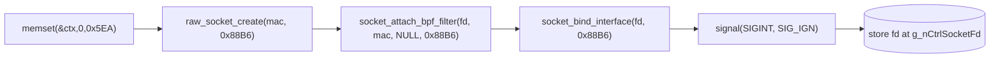
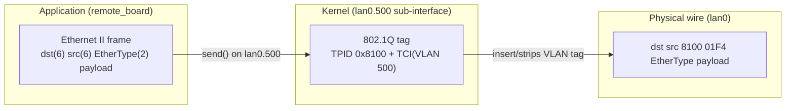
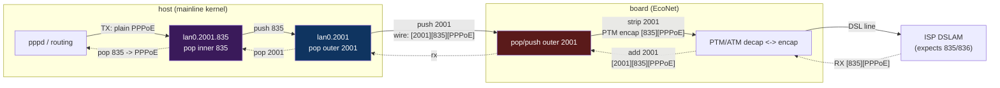

# Network Layer (Raw Socket & VLAN)

`remote_board` communicates with the external board using **raw Ethernet
frames** — there is no IP/TCP/UDP stack involved. This page documents the socket
setup, the BPF filter, and the VLAN handling.

## Two raw sockets

| Socket | EtherType | Opened by | Purpose |
|--------|-----------|-----------|---------|
| Control | `0x88B6` | `raw_socket_init` | cmm control plane (libcmm) |
| Init/FW | `0x88B5` | `proto_frame_init` | board init + firmware transfer |

Both use the same recipe (see below) and bind to the same interface.

## raw_socket_create()

```c
int raw_socket_create(uint8_t *out_mac, uint16_t ethertype) {
    int fd = socket(AF_PACKET /*0x11*/, SOCK_RAW /*3*/, htons(ethertype));
    setsockopt(fd, SOL_SOCKET, SO_BROADCAST, &one, 4);

    struct ifreq ifr = {0};
    strncpy(ifr.ifr_name, g_szIfaceName /*"lan0.500"*/, 16);
    ioctl(fd, SIOCGIFHWADDR /*0x8927*/, &ifr);   // get local MAC
    memcpy(out_mac, ifr.ifr_hwaddr.sa_data, 6);
    return fd;
}
```

## socket_attach_bpf_filter()

Attaches a **classic BPF program** via `setsockopt(SO_ATTACH_FILTER)` so the
kernel only delivers frames matching this EtherType / MAC / optional VLAN tag.
The filter is a 10-instruction program; key constants embedded in it:

- EtherType match value (`0x88B5` or `0x88B6`)
- A length cap of `0x05EA` (1514 bytes — full Ethernet MTU)

The filter is built on the stack and patched with `ntohs(param)` /
`ntohl(param)` so it matches the runtime EtherType and source MAC. When a
non-NULL third argument is passed, one branch is rewritten to also match a VLAN
field (offset `0x28` instead of `0x30`), i.e. the filter adapts to tagged vs.
untagged frames.

## socket_bind_interface()

```c
int socket_bind_interface(int fd, uint16_t ethertype) {
    unsigned int ifindex = if_nametoindex(g_szIfaceName /*"lan0.500"*/);
    struct sockaddr_ll addr = {
        .sll_family   = AF_PACKET,          // 0x11
        .sll_protocol = htons(ethertype),
        .sll_ifindex  = ifindex,
    };
    return bind(fd, &addr, sizeof(addr));
}
```

## raw_socket_init()

Orchestrates the control-plane socket:



The socket descriptor is stored in global `g_nCtrlSocketFd` and reused by the
libcmm event loop.

## VLAN 500 handling



**The application never builds the VLAN tag.** Because the socket is bound to
the `lan0.500` sub-interface, the Linux kernel:

- **Adds** the 802.1Q header (`TPID 0x8100`, `VLAN ID 500`) on `send()`.
- **Strips** it on `recv()` before delivering to the BPF filter / app.

This is why the wire shows VLAN 500 but the app-level frame (documented in
[protocol.md](protocol.md)) has no VLAN field.

### Interface name format

| Symbol | Value | Notes |
|--------|-------|-------|
| `g_szIfaceName` | `"lan0.500"` | default interface-name buffer |
| *(format string)* | `"lan0.%u"` | `snprintf` format for dynamic VLAN id |

`iface_vlan_up` constructs `"lan0.%u"` from a discovered VLAN id and runs
`ifconfig lan0.<vlan> up` (used by the board-init command, see
[dispatch.md](commands/dispatch.md)). `iface_vlan_down` does the inverse (`... down`).

---

## Data plane (xDSL user traffic)

The data plane is standard Ethernet/IP the board emits after decapsulating the
DSL signal. `remote_board` never processes data frames — it only *configures*
the VLAN tagging. The host **kernel** handles data via VLAN interfaces.

> **Headline: the board↔host segment is standard 802.1Q QinQ.** Both tags use
> TPID `0x8100`. A mainline Linux kernel handles it natively with **stacked VLAN
> interfaces** — no custom daemon needed for steady-state forwarding. The only
> "custom" piece is the `0x88B5` board config (the `rbctl` tool) to set up the
> outer transport tag on the board side.

### The three VLANs in play

| VLAN | Where | Tag | Role | Created by |
|------|-------|-----|------|------------|
| **500** | host↔board | outer (mgmt) | control plane `0x88B5`/`0x88B6` | `raw_socket_init` (fixed) |
| **transport** (`dslVlan+2000`, e.g. 2001) | host↔board | **outer** (data) | carry decapsulated frames across the host↔board Ethernet | `remote_board` via op 5/15 (`iface_vlan_up`) |
| **ISP service** (835 data / 836 voip) | end-to-end (DSL↔host) | **inner** | the VLAN the ISP expects on the DSL line; separates data/voip | preserved through the board |

The transport VLAN is the **outer** tag of a QinQ pair; the ISP VLAN is the
**inner** tag. Evidence:

- `wanConfWind3` (Wind ISP daemon, `src/wanConfWind3.c`) **manually inserts the
  ISP VLAN as the inner tag** during link detection:
  ```c
  if (vid != 0) { buf[o++]=0x81; buf[o++]=0x00; *tci=htons(vid|0xa000); }  // 0x8100, PCP=5 for voip
  ```
  Sent on an `AF_PACKET SOCK_RAW` socket bound to a per-connection `ifName`.
  `createWanConnection` keys each connection on `vid` (835/836), with **PCP 5 +
  QoS `VBR-nrt` for VoIP**, PCP 0 for data. `vlanTagging` is forced off for ADSL
  (ATM uses VPI/VCI), so the tagged path is the **VDSL/PTM** one.
- `remote_board`/`libcmm` creates the transport interface `lan0.<dslVlan+2000>`
  and configures the board's outer tag (`oal_ptm_setVlanTag` /
  `oal_atm_setVlanTag`; see [xdsl/payloads.md](xdsl/payloads.md)).
- All host VLAN interfaces are created with **`vconfig add`** (standard 802.1Q,
  `TPID 0x8100`, `REORDER_HDR`) and `%s.%d` naming (`oal_util_getVlanIfname`) —
  which stacks naturally (`lan0.2001.835`).

### Host interface stack (steady state)

```
lan0  ──(physical, to board)──
  └─ lan0.2001        transport VLAN (outer) — strips 2001 on rx   [remote_board creates]
       └─ lan0.2001.835   ISP VLAN (inner) — strips 835 on rx       [libcmm steady-state creates]
            └─ (bridge port) → pppd / routing                       [oal_wan_initPPPoE binds here]
```

Each level is a standard kernel VLAN interface. `pppd` is launched by
`oal_wan_initPPPoE` (`src/oal_ppp.c`) as `pppd pppoe ... <L2IntfName>`, where
`L2IntfName` is the top of this stack — so by the time `pppd` sees a frame, the
kernel has already popped **both** tags and it sees plain PPPoE.

### Detection vs steady state

- **Detection** (pre-connection): `wanConfWind3` sends raw PADI/DHCP frames with
  the ISP VLAN tag inserted by hand, because the kernel VLAN interfaces don't
  exist yet. This daemon is ISP-specific and only runs during link-up.
- **Steady state**: standard kernel VLAN interfaces + `pppd`/DHCP. **No custom
  daemon is needed for forwarding** — the kernel does all tag push/pop.

### Mainline-kernel replacement (the goal)

Because both tags are `0x8100` and the host uses ordinary stacked VLAN
interfaces, a mainline kernel reproduces this with no vendor modules:

```bash
# transport (outer) — corresponds to remote_board's lan0.<dslVlan+2000>
ip link add link lan0 name lan0.2001 type vlan id 2001
# ISP service (inner) — the real 835/836
ip link add link lan0.2001 name lan0.2001.835 type vlan id 835
ip link set lan0.2001.835 up
# PPPoE on the inner interface — pppd sees untagged PPPoE
pppd plugin rp-pppoe.so lan0.2001.835 ...
```

The only non-standard piece is telling the **board** to push/pop the outer
transport tag — that is the `0x88B5` opcode-15 (PTM) / opcode-5 (ATM) config that
`rbctl` sends. Once the board is configured, the data path is 100% mainline.

### TX / RX flow



### ATM vs PTM

- **ATM** (ADSL, opcodes 5/6): the board reassembles AAL5 cells → Ethernet, then
  the same QinQ push/pop. VPI/VCI (not an Ethernet VLAN) selects the channel on
  the DSL side, so ADSL connections have `vlanTagging` off — only the transport
  tag is used.
- **PTM** (VDSL2, opcodes 15/16): the frame is already Ethernet on the DSL side,
  carrying the ISP VLAN (835/836) directly. This is the path that uses the full
  QinQ (transport outer + ISP inner). Symmetric to ATM otherwise.

### Confidence note

The QinQ structure (transport outer + ISP inner, both `0x8100`, stacked kernel
VLAN interfaces) is firmly supported by the host code (`wanConfWind3` manual
inner-tag insertion + `libcmm` transport-tag setup + standard `vconfig`
tooling). The **board-side** push/pop of the outer transport tag is inferred —
that logic lives in the EcoNet firmware (not in hand) — but it is the only model
consistent with all host-side evidence. A single `tcpdump` on `lan0` during a
live VDSL session would confirm the double-tagged frames (`0x8100 2001 · 0x8100
835 · 0x8864`) and lock it down completely ( folds into P4).
