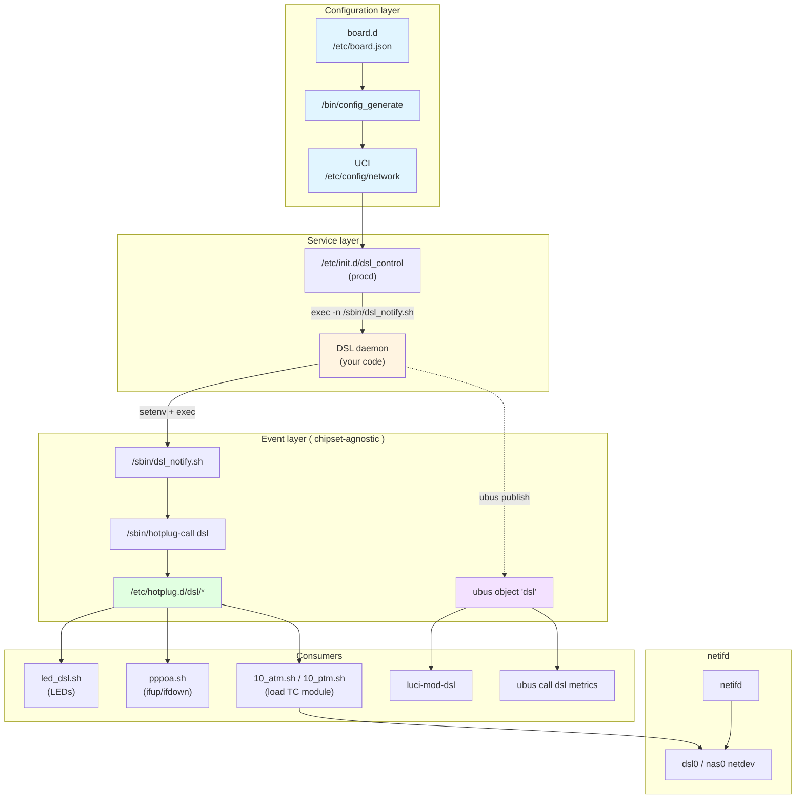
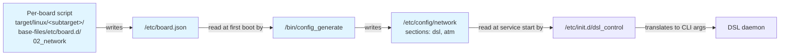
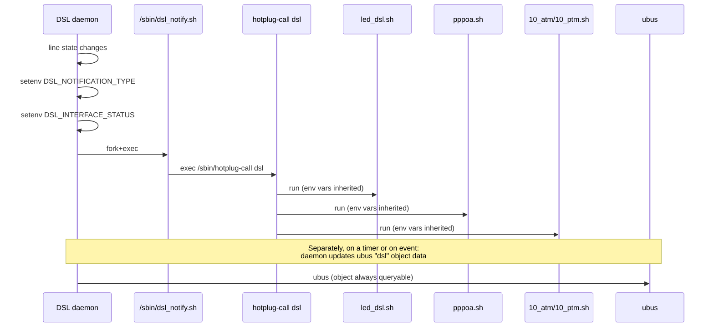
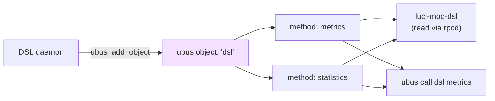
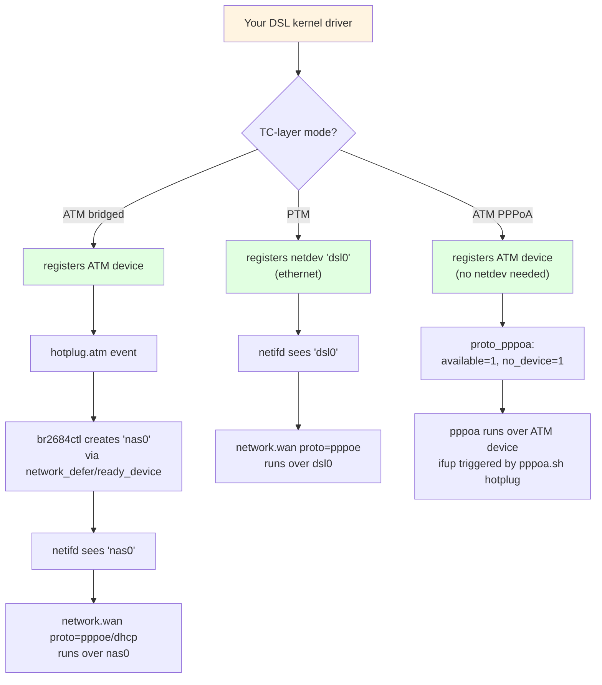
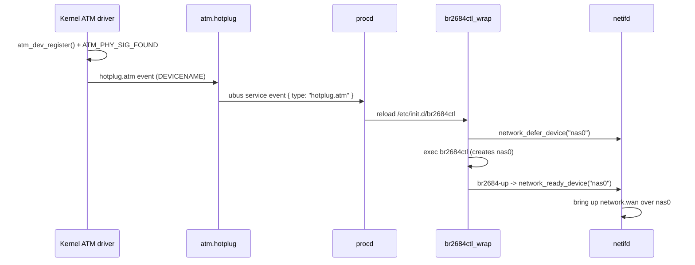
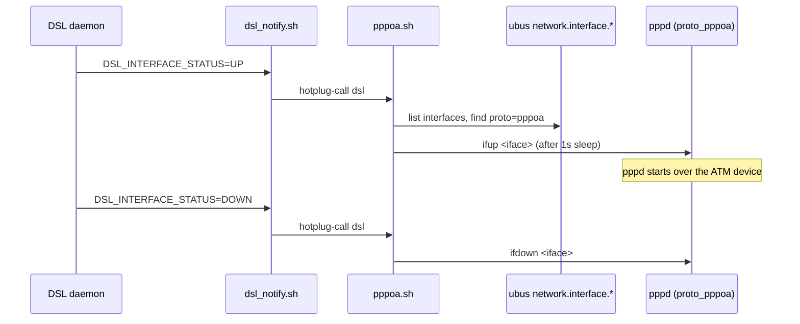
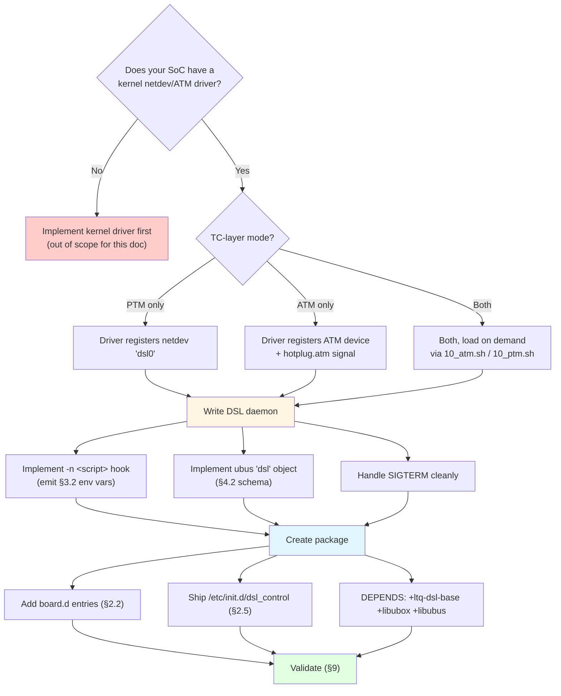

# OpenWrt xDSL Integration — Glue Logic Documentation

This document describes the **configuration and event glue** between
OpenWrt and a DSL daemon: UCI schema, board.d, procd, ubus, hotplug,
netifd, LEDs, and LuCI.

It is written for someone **writing a brand-new DSL daemon from scratch**
for a non-Lantiq architecture. The Lantiq-specific daemon internals
(ioctls, firmware loading, MEI protocol, XTSE tables, autoboot scripts)
are deliberately out of scope — only the OpenWrt-side contract is
documented, because that contract is chipset-agnostic and reusable.

> Reference implementation: `package/network/config/ltq-vdsl-vr9-app/`
> and `package/network/utils/ltq-dsl-base/`. Look there for examples.

---

## 1. Architecture Overview



The **green** cluster is fully chipset-agnostic and ships in
`ltq-dsl-base`. The **yellow** cluster is your daemon — its only required
interface to the rest of OpenWrt is the two arrows leaving it: the
hotplug notification (`-n` script) and the ubus object. Everything else
in the diagram already exists; you reuse it.

---

## 2. The Configuration Layer

This is the part you must understand most deeply, because every chipset
needs to plug into it the same way.

### 2.1 The full pipeline



There are **two configuration artifacts** in OpenWrt: the per-board JSON
(`/etc/board.json`) and the user-facing UCI (`/etc/config/network`).
board.json is generated by board.d scripts at boot; UCI is generated from
board.json on first boot, then editable by the user.

### 2.2 board.d (the JSON source of truth)

Per-board scripts emit a `dsl` object. The Lantiq helper at
`target/linux/lantiq/base-files/lib/functions/lantiq.sh` shows the
canonical pattern:

```sh
lantiq_setup_dsl_helper() {
    local annex="$1"
    # ATM bridge section, only if the SoC has an ATM TC-layer driver:
    ls /lib/modules/$(uname -r)/ltq_atm* 1> /dev/null 2>&1 && \
        ucidef_add_atm_bridge "1" "32" "llc" "bridged" "dsl"
    # Modem section:
    if lantiq_is_vdsl_system; then
        ucidef_add_vdsl_modem "$annex" "av"
    else
        ucidef_add_adsl_modem "$annex" "/lib/firmware/adsl.bin"
    fi
    # Netifd WAN interface bound to the DSL netdev:
    ucidef_set_interface_wan "dsl0" "pppoe"
}
```

The helpers in `package/base-files/files/lib/functions/uci-defaults.sh`
produce this JSON shape in `/etc/board.json`:

```json
{
  "dsl": {
    "atmbridge": {
      "vpi": 1, "vci": 32,
      "encaps": "llc", "payload": "bridged",
      "nameprefix": "dsl"
    },
    "modem": {
      "type": "vdsl",        // or "adsl"
      "annex": "a",
      "tone": "av",
      "xfer_mode": "ptm",    // VDSL-only
      "firmware": "/lib/firmware/..."  // ADSL-only
    }
  }
}
```

| Helper                    | When to use                       | JSON keys emitted                                  |
|---------------------------|-----------------------------------|----------------------------------------------------|
| `ucidef_add_atm_bridge`   | SoC exposes an ATM TC-layer       | `vpi vci encaps payload nameprefix`                |
| `ucidef_add_adsl_modem`   | ADSL-only chipset                 | `type=adsl annex firmware`                         |
| `ucidef_add_vdsl_modem`   | VDSL2-capable chipset             | `type=vdsl annex tone xfer_mode`                   |
| `ucidef_set_interface_wan`| Always — binds netifd WAN to dsl0 | standard `network.wan` interface                   |

### 2.3 UCI generation (`/bin/config_generate`)

At first boot, `generate_config()` reads the `dsl` JSON object and writes
the corresponding UCI sections (see lines 56–89):

```
config atm-bridge 'atm'
    option nameprefix 'dsl'
    option vpi        '1'
    option vci        '32'
    option encaps     'llc'
    option payload    'bridged'

config dsl 'dsl'
    option annex     'a'
    option firmware  '/lib/firmware/...'   # ADSL only
    option tone      'av'                  # VDSL only
    option xfer_mode 'ptm'                 # VDSL only
```

### 2.4 The UCI `dsl` schema (the contract `dsl_control` consumes)

Your `/etc/init.d/dsl_control` reads this section and translates it to
daemon CLI arguments. The schema is:

| UCI option       | Type   | Used for                                              | Required?              |
|------------------|--------|-------------------------------------------------------|------------------------|
| `annex`          | string | Selects annex/mode (`a`, `b`, `j`, `m`, ...)         | **Yes**                |
| `firmware`       | path   | Path to firmware blob passed via `-f`                 | Auto-detected if unset |
| `tone`           | string | Tone-group / band plan selector                       | VDSL only              |
| `xfer_mode`      | enum   | `atm` or `ptm` — selects TC-layer mode                | VDSL only              |
| `line_mode`      | enum   | `adsl` or `vdsl` — restricts handshake to one family  | Optional               |
| `ds_snr_offset`  | int    | Target SNR margin tweak (vendor-specific encoding)    | Optional               |

> The exact meaning of each value is **between your init script and your
> daemon**. OpenWrt only requires that the UCI section type is `dsl` and
> that `dsl_control` is a procd init script. You can add your own options.

The `atm-bridge` section is consumed by the separate `br2684ctl` init
script (`package/network/utils/linux-atm/files/br2684ctl`) for the ATM
path; you don't need to handle it.

### 2.5 Service wiring (`/etc/init.d/dsl_control`)

A minimal procd init script that conforms to the contract:

```sh
#!/bin/sh /etc/rc.common
START=97
USE_PROCD=1

service_triggers() {
    procd_add_reload_trigger network        # reload on UCI network changes
}

start_service() {
    local annex firmware xfer_mode line_mode
    config_load network
    config_get annex     dsl annex
    config_get firmware  dsl firmware
    config_get xfer_mode dsl xfer_mode
    config_get line_mode dsl line_mode
    # ... translate to your daemon's CLI ...

    procd_open_instance
    procd_set_param command /sbin/your_dsl_daemon \
        -n /sbin/dsl_notify.sh \      # <-- THE GLUE HOOK (required)
        -f "$firmware" \
        # ... your chipset-specific args ...
    procd_set_param term_timeout 10
    procd_close_instance
}

stop_service() {
    # Synthesize a final DOWN event so consumers tear down cleanly.
    DSL_NOTIFICATION_TYPE="DSL_INTERFACE_STATUS" \
    DSL_INTERFACE_STATUS="DOWN" \
        /sbin/dsl_notify.sh
}
```

The two non-negotiable pieces are:
1. Pass `-n /sbin/dsl_notify.sh` (or any path to a script that calls
   `/sbin/hotplug-call dsl`) to your daemon.
2. Synthesise a final DOWN event in `stop_service`.

---

## 3. The Event-Layer Contract

This is the single most important interface. If you implement nothing
else from this document, implement this — it's what makes the rest of the
system work.

### 3.1 Sequence: line-state change reaches all consumers



### 3.2 Required environment variables

There are **two notification types**. Your daemon must emit them by
setting environment variables and then exec'ing the `-n` script.
Consumers grep on these exact names — case-sensitive.

#### Type A: line-state notification

```
DSL_NOTIFICATION_TYPE=DSL_INTERFACE_STATUS
DSL_INTERFACE_STATUS=<value>
```

| `DSL_INTERFACE_STATUS` | Meaning                              | Consumer reaction                       |
|------------------------|--------------------------------------|-----------------------------------------|
| `HANDSHAKE`            | entered handshake phase              | LED slow-blink                          |
| `TRAINING`             | entered training / full init         | LED fast-blink                          |
| `UP`                   | reached showtime with TC sync        | LED on, `pppoa.sh` runs `ifup`          |
| `DOWN`                 | line dropped (or anything else)      | LED off, `pppoa.sh` runs `ifdown`       |

> If your daemon only knows "up" and "down" initially, emit just those.
> `HANDSHAKE` / `TRAINING` are nice-to-have for LED UX; the system
> functions correctly with only `UP` / `DOWN`. **Never invent new
> values** without also shipping a hotplug hook that understands them —
> unknown values are treated as "down" by the LED script.

#### Type B: TC-layer / mode notification (PTM/ATM chipsets only)

```
DSL_NOTIFICATION_TYPE=DSL_STATUS
DSL_TC_LAYER_STATUS=<value>
```

| `DSL_TC_LAYER_STATUS` | Real-world name | Consumer reaction                              |
|-----------------------|-----------------|------------------------------------------------|
| `ATM`                 | ATM             | `10_atm.sh` loads the ATM TC kernel module    |
| `EFM`                 | PTM (Bonded EF) | `10_ptm.sh` loads the PTM TC kernel module    |

> The value is `EFM`, **not** `PTM`, despite PTM being the common name.
> This is a historical quirk; preserve it for compatibility with the
> existing `10_atm.sh` / `10_ptm.sh` hooks.

### 3.3 The consumers (already shipped in `ltq-dsl-base`)

You do **not** need to write these. They live in
`package/network/utils/ltq-dsl-base/files/etc/hotplug.d/dsl/` and run on
any DSL event:

| File (numeric order) | Triggers on                                | Action                                                         |
|----------------------|--------------------------------------------|----------------------------------------------------------------|
| `10_atm.sh` *        | `DSL_STATUS` + `DSL_TC_LAYER_STATUS=ATM`   | `modprobe ltq_atm_*`                                           |
| `10_ptm.sh` *        | `DSL_STATUS` + `DSL_TC_LAYER_STATUS=EFM`   | `modprobe ltq_ptm_*`                                           |
| `led_dsl.sh`         | `DSL_INTERFACE_STATUS`                     | Drives the `led_dsl` UCI LED (timer / netdev trigger / on/off) |
| `pppoa.sh`           | `DSL_INTERFACE_STATUS`                     | `ifup`/`ifdown` all `pppoa` interfaces                         |

\* Only shipped by the Lantiq `-app` packages; ship your own if your TC-layer
   module loading is event-driven. If your SoC has a fixed TC-layer (e.g.
   PTM-only), you don't need these at all.

---

## 4. The ubus Contract

In addition to the notification script, your daemon should publish a ubus
object named **`dsl`** so LuCI and `ubus call dsl metrics` work.



### 4.1 Methods

| Method        | Purpose                                                            |
|---------------|-------------------------------------------------------------------|
| `metrics`     | Full line status: state, mode, rates, SNR, errors, vectoring, ERB |
| `statistics`  | Per-tone data: bit allocation, SNR, QLN, HLOG, band borders       |

Both are no-argument, return a blobmsg table.

### 4.2 The `metrics` schema (treat as ABI)

The reference implementation lives in
`package/network/config/ltq-vdsl-vr9-app/src/src/dsl_cpe_ubus.c` — copy
this file, replace the `ioctl()` calls with calls into your daemon, but
keep the JSON field names and enum values verbatim. LuCI's
`feeds/luci/modules/luci-mod-dsl/htdocs/luci-static/resources/view/status/dsl/stats.js`
reads this schema:

```js
var callDSLMetrics = rpc.declare({
    object: 'dsl', method: 'metrics', expect: { '': {} }
});
```

Top-level fields (abridged):

```
.api_version, .firmware_version, .chipset, .driver_version
.state       (string, e.g. "Showtime with TC-Layer sync")
.state_num   (int,   enum LSTATE_MAP_*, see below)      # ABI
.up          (bool)
.uptime      (seconds)
.mode        (string, e.g. "G.993.2 (VDSL2, Profile 35b)")
.annex       ("A"|"B"|"C"|"I"|"J"|"L"|"M")
.standard    ("G.992.1" ... "G.993.2")
.profile     ("8a" ... "35b")                            # VDSL2 only
.power_state, .power_state_num                           # ABI
.atu_c       { .vendor, .vendor_id[], .system_vendor, .serial[], ... }
.upstream    { .vector, .trellis, .bitswap, .retx,
               .ra_mode, .ra_mode_num,                   # ABI
               .data_rate, .interleave_delay, .inp,
               .latn, .satn, .snr, .actps, .actatp, .attndr }
.downstream  { ... same shape as upstream ... }
.olr         { .downstream { .bitswap, .sra, .sos },
               .upstream   { .bitswap, .sra, .sos } }    # each with
                                                        # {requested,executed,rejected,timeout}
.errors      { .near { .es,.ses,.loss,.uas,.lofs,.fecs,
                       .leftrs,.cv_c,.fec_c,.hec,.ibe,.crc_p,... },
               .far  { ... } }
.erb         { .sent, .discarded }                       # vectoring only
```

#### ABI enum values (do not renumber)

```c
LSTATE_MAP_UNKNOWN=-1, NOT_INITIALIZED, EXCEPTION, IDLE, SILENT,
HANDSHAKE, FULL_INIT, SHOWTIME_NO_SYNC, SHOWTIME_TC_SYNC, RESYNC

PSTATE_MAP_UNKNOWN=-2, NA, L0, L1, L2, L3

RAMODE_MAP_UNKNOWN=-1, MANUAL, AT_INIT, DYNAMIC, DYNAMIC_SOS
```

If you can't map a state cleanly, emit `-1` (UNKNOWN) and the string
field absent. LuCI degrades gracefully.

### 4.3 Hooking ubus into the daemon lifecycle

The reference patch (`300-ubus.patch` in `ltq-vdsl-vr9-app/patches`)
calls `ubus_init()` after devices are opened and `ubus_deinit()` before
exit, and runs the ubus event loop in a dedicated thread. Do the same —
the daemon must keep the ubus object alive and queryable throughout its
lifetime, not just at startup.

### 4.4 Capability matrix for this board

The §4.2 schema is the Lantiq *full* set. The `0x88B5` board protocol
exposes a subset — populate what is available, emit `UNKNOWN`/empty for the
rest (LuCI degrades gracefully per §4.2). Cross-referenced against the
reverse-engineered opcode surface ([xdsl/responses.md](xdsl/responses.md),
[xdsl/payloads.md](xdsl/payloads.md)).

| ubus field group | Source on this board | Notes |
|------------------|----------------------|-------|
| `.state`, `.up`, `.state_num` | op 2 `linkStatus` byte | NoSignal/Up/Initializing/EstablishingLink → map to `LSTATE_MAP_*` |
| `.mode`, `.standard`, `.annex`, `.profile` | op 2 (modulation/annex bytes + VDSL2 profile bitmask) | full enum in [payloads.md](xdsl/payloads.md) |
| `.upstream`/`.downstream` `.data_rate`, `.latn`, `.satn`, `.snr`, `.actatp`, `.attndr` | op 2 metric uint32 block (12 fields) | aggregate, per-direction — authoritative offsets, inferred names |
| `.errors.near`/`.far` `.es`, `.ses`, … | op 2 stats + op 4 channel counters | **partial** — ES/SES-ish map; HEC/CRC/FEC/LEFTRS likely absent |
| `.power_state` / `.power_state_num` | **none** | board-autonomous; emit fixed `L0` or `UNKNOWN` |
| `.olr` (bitswap / SRA / SOS) | **none** | autonomous; cannot report requested/executed/rejected |
| `.atu_c` (far-end vendor / serial) | **none parsed** | `oal_dsl_msgToLineObj` reads only numeric metrics; far-end id not surfaced over `0x88B5` |
| `.erb` (vectoring) | **none** | no vectoring status/control opcode |
| `statistics` method (per-tone bit / SNR / QLN / HLOG) | **none** | **no opcode exposes per-tone data** — LuCI statistics graphs cannot be populated; return empty |
| `ds_snr_offset` (UCI) | **none** | SNR is *reported* (op 2) but not *settable*; ignore the option |

**Works fully:** line status, modulation/annex/VDSL2 profile, aggregate
rates/SNR/attenuation, ATM/PTM link config, VPI/VCI/QoS, VLAN tagging, line
up/down. **Does not:** per-tone data, SNR tuning, power/OLR/vectoring control,
far-end identification, full error-counter granularity.

> Net: the LuCI **status overview** works; the **statistics graphs** and
> **advanced tuning** do not. The board is a "config + headline-status" device,
> not a full DSL-management chip — and tone masks are not the only thing missing
> (see [reverse-engineering-plan.md](../plans/reverse-engineering-plan.md) for the full opcode surface).

---

## 5. netifd Integration

netifd has **no DSL-specific knowledge**. The DSL stack surfaces to
netifd as a normal Linux netdev, by one of three paths.



### 5.1 PTM path (recommended for new VDSL designs)

Your kernel driver registers an Ethernet netdev. The Lantiq driver
hard-codes the name:

```c
// package/kernel/lantiq/ltq-ptm/src/ifxmips_ptm_vdsl.c:128
static char *g_net_dev_name[1] = {"dsl0"};
```

Use `dsl0` if you want the existing `board.d` and LuCI to work
unchanged. Once the module is loaded, netifd sees `dsl0` like any other
Ethernet interface. The `network.wan` interface (set up by
`ucidef_set_interface_wan "dsl0" "pppoe"`) immediately starts PPPoE.

### 5.2 ATM bridged path

This uses the **`br2684ctl` plumbing** which is fully generic (in
`package/network/utils/linux-atm/`):



You don't write any of this. You only need to ensure your ATM driver:
- registers via `atm_dev_register()`,
- fires `atm_dev_signal_change(... ATM_PHY_SIG_FOUND)` when the line
  comes up (this is what triggers the hotplug event),
- appears under `/sys/class/atm/`.

### 5.3 PPPoA path (ADSL, no bridged Ethernet)

PPPoA bypasses the netdev layer entirely. The `proto_pppoa` handler in
`package/network/services/ppp/files/ppp.sh` sets:

```sh
no_device=1
available=1
```

`available=1` means netifd considers the interface immediately
bring-up-able — but we don't want PPPoA to start before the DSL line is
up. That's what `pppoa.sh` (in `ltq-dsl-base`) is for: it listens for
`DSL_INTERFACE_STATUS` and triggers `ifup`/`ifdown` on the matching
interface.



### 5.4 External-board variant (this port — EcoNet over `0x88B5`)

§5.1–5.3 assume the DSL chip is on the host SoC, surfaced by a **kernel driver**
that registers `dsl0` / an ATM device. **This port is different:** the DSL
chipset (EcoNet EN75xx) lives on a **separate board** attached over Ethernet
(`lan0`). There is **no kernel DSL driver** and no `dsl0` netdev.

| Aspect | SoC-attached (§5.1–5.3) | External board (this port) |
|--------|--------------------------|----------------------------|
| DSL chip location | on the host SoC | separate board over `lan0` |
| Kernel DSL driver | required (`ltq-ptm` / `ltq-atm`) | **none** |
| netifd involvement | binds `network.wan` to `dsl0` / `nas0` | **none** — netifd does not manage xDSL; the daemon creates the interfaces itself (see below) |
| TC-layer module loading | `10_atm.sh` / `10_ptm.sh` | **not needed** — standard 802.1Q |
| Daemon's data-plane role | none (driver handles it) | create/tear down the `lan0` VLAN stack |
| Firmware | blob loaded into the local chip at boot | **not used** — see note below |

#### The netdev is a stacked VLAN interface (standard QinQ)

Per [network.md](network.md) §Data plane, the board↔host segment is **standard
802.1Q QinQ** (both tags TPID `0x8100`, mainline-kernel-native):

- **Outer** = transport VLAN `dslVlan + 2000` (e.g. `2001`) — created by the
  daemon via the board-config opcode (op 5 ATM / op 15 PTM) plus `ip link`.
- **Inner** = the ISP service VLAN (e.g. `835` data / `836` voip) — preserved
  end-to-end.

#### netifd is NOT used for xDSL

**xDSL is not a protocol netifd manages** — neither in the reference firmware
nor in this port. The daemon is the sole manager: it creates the stacked VLAN
interfaces itself and netifd is bypassed entirely. netifd may *passively detect*
the new interfaces via netlink but takes **no DSL-specific action** — no
`network.wan` binding, no proto handler, no device bring-up. Do **not** call
`ucidef_set_interface_wan` for the DSL path here.

```bash
# the daemon creates the FULL stack itself (standalone; no netifd, no proto):
ip link add link lan0      name lan0.2001     type vlan id 2001   # outer transport
ip link add link lan0.2001 name lan0.2001.835 type vlan id 835   # inner ISP (vid from UCI)
# nothing binds to lan0.2001.835 through netifd — the daemon owns the WAN-facing
# interface; whatever consumes it does so outside netifd's DSL awareness
```

The `nameprefix` / `nas0` / `br2684ctl` concepts from §5.2 do not apply at all —
there is no ATM TC device; ATM VCs are likewise just VLAN sub-interfaces of
`lan0` (see [xdsl/payloads.md](xdsl/payloads.md)).

> **Confirmed against the upstream Lantiq reference**
> (`package/network/config/ltq-vdsl-vr9-app/`): `grep` for
> `netifd` / `network_defer` / `network_ready` / `proto` in the DSL app returns
> **zero** matches. `dsl_control` is a plain procd script that reads UCI and
> runs `vdsl_cpe_control`; `10_ptm.sh` / `10_atm.sh` only `modprobe` the TC
> kernel module. netifd's sole role is passively noticing the `dsl0` netdev via
> netlink — exactly the "detects but does nothing" behavior, unless a *separate*
> UCI interface references the device. xDSL is not a netifd-managed protocol
> upstream either; the standalone-daemon model matches the reference.

#### The daemon is control-plane only

Its job is exactly four things — **none** of them is a kernel driver:

1. **Configure the board** over `0x88B5` (line up/down, ATM/PTM link, VLAN tags)
   — the protocol in [reverse-engineering-plan.md](../plans/reverse-engineering-plan.md); building blocks in
   `examples/checksum.py` / `pack.py` / `unpack.py`.
2. **Manage the `lan0` VLAN stack** (`ip link` / `vconfig`) in lockstep with the
   board config.
3. **Poll line state** — the `0x88B5` protocol is **request/response, not
   interrupt-driven**: the daemon sends `dsl_get_line_obj` (op 2) ~1/s and emits
   the §3.2 hotplug events on transition (NoSignal→`DOWN`,
   EstablishingLink→`HANDSHAKE`, Initializing→`TRAINING`, Up→`UP`).
4. **Publish the ubus `dsl` object** (§4) from the op 2/4 replies.

#### Firmware is NOT mapped to UCI

Unlike the Lantiq model, the board **boots and runs its own firmware
autonomously** — the host does **not** load a blob to make the DSL work. The
`firmware` UCI option and the `-f` flag from §2.4 / §8.1 are therefore **not
used** in this port and should be omitted from `dsl_control`.

Board-firmware updates are an **out-of-band maintenance operation**, performed
via opcode 8 (`oal_remote_upgradeImage`, `/var/tmp/remoteflash.bin`), documented
in [commands/firmware.md](commands/firmware.md) — not part of the boot/config
flow.

---

## 6. LED Integration

LED handling is fully chipset-agnostic and ships in
`ltq-dsl-base/files/etc/hotplug.d/dsl/led_dsl.sh`. It triggers on
`DSL_INTERFACE_STATUS` and drives a UCI-configured LED:

```
config led 'led_dsl'
    option sysfs   '<sysfs-name>'
    option trigger 'netdev'        # or absent for simple on/off
    option dev     'dsl0'          # for netdev trigger
    list mode      'link'          # 'link'/'tx'/'rx' for netdev trigger
```

| `DSL_INTERFACE_STATUS` | LED behaviour                 |
|------------------------|------------------------------|
| `HANDSHAKE`            | slow blink (500ms on/off)    |
| `TRAINING`             | fast blink (200ms on/off)    |
| `UP`                   | solid on (or netdev trigger) |
| anything else          | off                          |

You do not need to implement anything here — just emit the right
`DSL_INTERFACE_STATUS` values.

---

## 7. LuCI Integration

The LuCI status page is in `feeds/luci/modules/luci-mod-dsl/` and is a
**pure consumer** of the ubus `dsl` object. It is granted read access
via
`feeds/luci/modules/luci-mod-dsl/root/usr/share/rpcd/acl.d/luci-mod-dsl.json`.

If your daemon publishes the `dsl` ubus object with the §4.2 schema,
LuCI works unmodified: status overview, statistics graphs (SNR/QLN/HLOG
per tone), and error counters.

There is **no LuCI configuration page** for the `dsl` UCI section — by
design, annex/firmware/tone are board-specific and not user-editable.

---

## 8. Porting Checklist (writing a new daemon)



### 8.1 What you must implement

| Component               | Required?                | Notes                                                              |
|-------------------------|--------------------------|--------------------------------------------------------------------|
| Kernel driver + netdev  | **Yes**                  | `dsl0` for PTM, or ATM device for ATM path                         |
| DSL daemon binary       | **Yes**                  | Accepts `-n <path>`, emits env vars per §3.2                       |
| ubus `dsl` object       | Recommended              | Skip only if you don't need LuCI / CLI status                      |
| `/etc/init.d/dsl_control`| **Yes**                 | procd init script, `procd_add_reload_trigger network`              |
| Firmware blob           | **Yes**                  | Under `/lib/firmware/`                                             |
| board.d entries         | **Yes**                  | `ucidef_add_*_modem` + `ucidef_set_interface_wan`                  |
| `target.mk` packages    | **Yes**                  | Add your kmod + app + firmware packages to DEFAULT_PACKAGES        |

> **External-board variant (this port, §5.4):** the *Kernel driver + netdev*
> and *Firmware blob* rows are **N/A** — there is no DSL kernel driver (the
> netdev is a stacked VLAN interface on `lan0`) and no firmware blob is loaded
> (the board runs its own firmware; updates are out-of-band via opcode 8). Drop
> both from the package/`target.mk` list.

### 8.2 What you reuse unchanged

- `ltq-dsl-base` — all hotplug hooks (`led_dsl.sh`, `pppoa.sh`)
- `luci-mod-dsl` — LuCI status pages
- `br2684ctl` machinery — if you do ATM bridged
- `proto_pppoa` handler — if you do PPPoA
- `/bin/config_generate` and `uci-defaults.sh` helpers — for UCI generation

### 8.3 What you may need to add

- `10_atm.sh` / `10_ptm.sh` equivalents — only if your TC-layer module
  must be loaded on demand based on the negotiated mode, and the two
  cannot coexist in one kernel session.
- Migration uci-defaults scripts (see
  `target/linux/lantiq/base-files/etc/uci-defaults/02_migrate_xdsl_iface`
  for the pattern) — only if you're replacing an older DSL stack.

---

## 9. Validation

Once it builds and boots:

```sh
# 1. Configuration was generated
uci show network.dsl
uci show network.atm         # ATM only

# 2. Daemon is running and ubus is published
ubus list | grep '^dsl$'
ubus call dsl metrics | jsonfilter -e '@.state' -e '@.up'

# 3. Hotplug chain works — watch in real time
logread -f | grep dsl-notify

# 4. Manual event injection (great for testing without a real line)
DSL_NOTIFICATION_TYPE=DSL_INTERFACE_STATUS \
DSL_INTERFACE_STATUS=UP /sbin/hotplug-call dsl

DSL_NOTIFICATION_TYPE=DSL_STATUS \
DSL_TC_LAYER_STATUS=EFM /sbin/hotplug-call dsl

# 5. (this port) the daemon created the VLAN stack — verify directly, NOT via netifd:
ip -d link show lan0.2001
ip -d link show lan0.2001.835
# netifd does not manage xDSL here, so `ubus call network.interface.wan` is N/A
# for the DSL path (§5.4).
```

### 9.1 Common pitfalls

- **Wrong env var names.** Consumers filter on `DSL_NOTIFICATION_TYPE`
  first; if it's missing or mis-spelled, nothing happens. Values are
  case-sensitive (`UP`, not `up`).
- **`EFM` vs `PTM`.** The TC-layer status value is `EFM`, not `PTM`,
  even though everything else calls it PTM. Historical, preserved for
  compatibility.
- **Renaming `dsl0`.** If your driver uses a different netdev name,
  update `board.d` and any literal `dsl0` references.
- **Forgetting the synthetic DOWN in `stop_service`.** Without it, LEDs
  stay on and PPPoA keeps retrying after the daemon dies.
- **ubus schema drift.** Treat JSON field names and the `*_MAP_*` enum
  values as ABI — LuCI silently shows blanks on mismatch.
- **Daemon exits before ubus is ready.** Call `ubus_add_object()` early
  in startup, before any blocking work.

---

## 10. Quick Reference — File Map

```
package/network/utils/ltq-dsl-base/           # REUSE AS-IS
├── Makefile
└── files/
    ├── sbin/dsl_notify.sh                     # exec /sbin/hotplug-call dsl
    └── etc/hotplug.d/dsl/
        ├── led_dsl.sh                         # LED handling
        └── pppoa.sh                           # ifup/ifdown pppoa

package/base-files/files/
├── bin/config_generate                        # board.json -> UCI dsl/atm
└── lib/functions/uci-defaults.sh              # ucidef_add_*_modem helpers

package/network/utils/linux-atm/files/         # REUSE for ATM path
├── atm.hotplug                                # ubus hotplug.atm event
├── br2684ctl                                  # procd service
├── br2684ctl_wrap                             # network_defer/ready_device
└── br2684-up                                  # network_ready_device

package/network/services/ppp/files/ppp.sh      # REUSE for PPPoA/PPPoE

feeds/luci/modules/luci-mod-dsl/               # REUSE — pure ubus consumer

# Reference implementation (Lantiq) — model yours on this:
package/network/config/ltq-vdsl-vr9-app/
├── Makefile                                   # PROVIDES:=ltq-dsl-app
├── files/dsl_control                          # /etc/init.d/dsl_control
├── files/10_atm.sh, 10_ptm.sh                 # optional TC-layer hooks
└── src/src/dsl_cpe_ubus.c                     # ubus 'dsl' object (copy this)

target/linux/<your-subtarget>/base-files/
└── etc/board.d/02_network                     # your per-board DSL setup

target/linux/<your-subtarget>/target.mk        # DEFAULT_PACKAGES += ...
```
