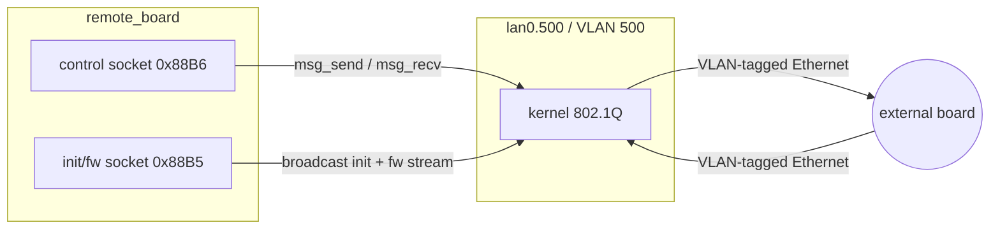

# Wire Protocol (EtherType 0x88B5 / 0x88B6)

This page documents the Layer-2 frame formats. Two EtherTypes are in use:

| EtherType | Plane | Built by |
|-----------|-------|----------|
| `0x88B6` | cmm control | libcmm (inside `msg_send`/`msg_recv`) |
| `0x88B5` | init / firmware | `proto_frame_init` |

Both `0x88B5` / `0x88B6` are **IEEE 802 registered "Local Experimental"**
EtherTypes — this is a proprietary protocol.

## 0x88B5 frame format

The header is **24 bytes** (`0x00`–`0x17`); payload starts at `0x18`. The frame
is built by `proto_frame_init` into a 0x5EA (1514) byte buffer. Layout:

```
Offset  Size  Field            Value / source
------  ----  ---------------  -----------------------------------------------
0x00    6     dst MAC          FF:FF:FF:FF:FF:FF   (broadcast, from g_abDestMac)
0x06    6     src MAC          local interface MAC (via SIOCGIFHWADDR)
0x0C    2     EtherType        0x88B5
0x0E    1     magic            0x11 (command) / 0x10 (response)
0x0F    1     subtype          opcode / message sub-type (param to proto_frame_init)
0x10    4     sequence         htonl(g_dwProtoSeq)  (incrementing counter)
0x14    2     payload length   set by proto_send  (= descriptor length, not frame length)
0x16    2     checksum         CRC-16/ARC, big-endian (zeroed during computation)
--- payload starts here (0x18) ---
0x18    ..    payload          up to MTU; byte 0 = bPayload_type (e.g. fw stage 0-3)
              (padded to min)  total >= 0x3C (60 bytes) -- min Ethernet frame
```

> **Checksum** covers `frame[0x0E .. 0x0E + payload_len + 9]` with the checksum
> field zeroed. Algorithm = **CRC-16/ARC** (poly `0x8005`, reflected `0xA001`,
> init `0x0000`, refin = refout = true, xorout `0x0000`). Full details in
> [checksum.md](checksum.md); reference impl in
> [../examples/checksum.py](../examples/checksum.py).

### Diagram

```
 +--------+--------+--------+--------+--------+--------+
 | dst MAC (6 bytes, broadcast FF:FF:FF:FF:FF:FF)      |  0x00
 +--------+--------+--------+--------+--------+--------+
 | src MAC (6 bytes, local interface)                   |  0x06
 +--------+--------+--------+--------+--------+--------+
 | EtherType 0x88B5 (2)                                 |  0x0C
 +--------+--------+--------+--------+--------+--------+
 |magic(1)|subtype | sequence number (4, htonl)         |  0x0E
 +--------+--------+--------+--------+--------+--------+
 | payload_len (2) | checksum (2, CRC-16/ARC)           |  0x14
 +--------+--------+--------+--------+--------+--------+
 | payload ...  (byte 0 at 0x18 = bPayload_type)        |  0x18
 +--------+--------+--------+--------+--------+--------+
   ^0x0E              ^0x14            ^0x16        ^0x18
```

### Frame send — proto_send

```c
int proto_send(void *ctx, int payload_len) {
    *(short *)(ctx + 0x14) = payload_len;          // set payload-len field
    int total = payload_len + 0x18;                // + 24-byte header
    if (total < 0x3C) {
        memset(ctx + total, 0, 0x3C - total);      // pad to min frame
        total = 0x3C;
    }
    *(short *)(ctx + 0xBD4) = total;               // store frame length
    return send(*(int *)(ctx + 0xBD8), ctx, total, 0);  // 0xBD8 = fd
}
```

The socket descriptor is stored at context offset `0xBD8` (= `ctx[0x2F6]`),
set during `proto_frame_init`.

### Frame recv — proto_recv

Receives with a timeout (e.g. 2000 ms for init, 60000 ms for firmware stages),
checks the response `subtype` and `code` fields. Response fields read back by
callers:

| Offset | Field | Used by |
|--------|-------|---------|
| `0x5FA` | code (must be >= N) | init / fw stages |
| `0x5F6` | status (0 = OK) | init |
| `0x5FE` | length (must be >= N) | fw handshake |
| `0x602` | response payload | fw status |

## Destination MAC

`g_abDestMac` holds the destination MAC, hardcoded to **broadcast**:

```
FF FF FF FF FF FF
```

All `0x88B5` frames are broadcast on the VLAN segment — the board listens and
responds. The `0x88B6` cmm frames are managed by libcmm.

## Two-plane model



### Why broadcast?

The host does not know the board's MAC at startup. The init command
(`0x296D`, see [dispatch.md](commands/dispatch.md)) sends a broadcast type-5 request; the
board replies (source MAC learned), after which the host brings up the VLAN
interface and proceeds with cmm control / firmware transfer.

## BPF filter (0x88B6 / 0x88B5 socket)

A 10-instruction classic-BPF program is attached to each socket
(`socket_attach_bpf_filter`,) so only matching frames reach the app:

- Match on EtherType (`0x88B5` or `0x88B6`).
- Match on the local source MAC.
- Optionally match a VLAN field at offset `0x28` vs `0x30` (tagged vs untagged).
- Cap frame length at `0x05EA` (1514 bytes).

The bytecode is assembled on the stack and patched at runtime with
`ntohs`/`ntohl` so the same builder serves both EtherTypes.
