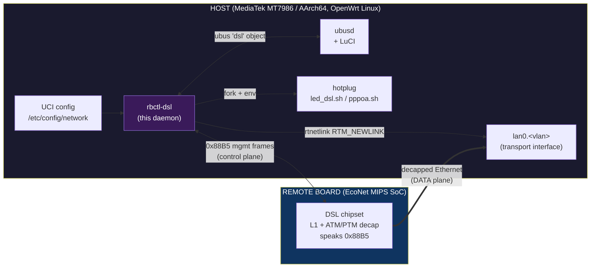
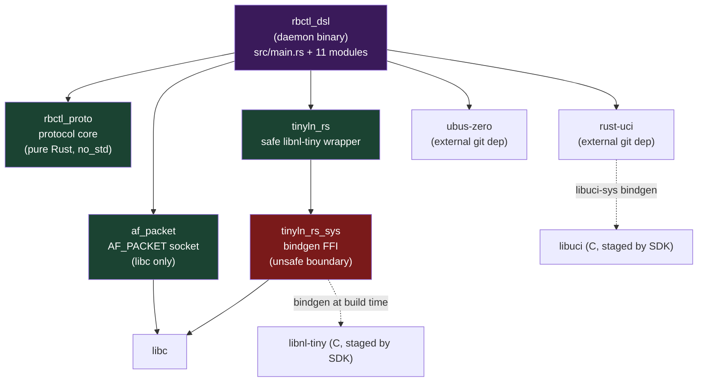
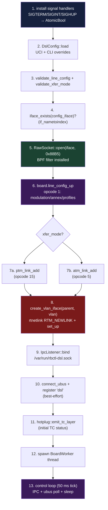
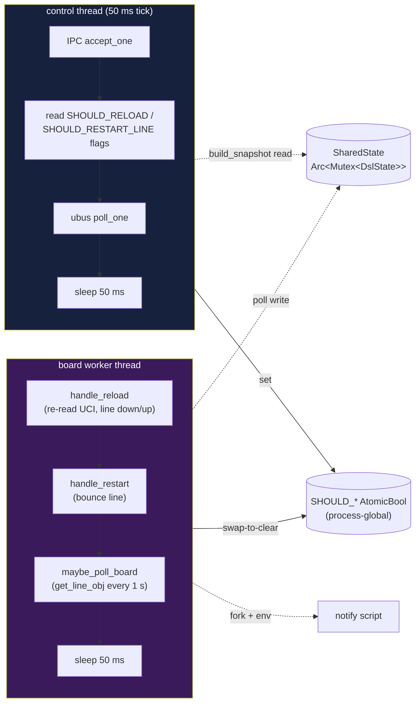
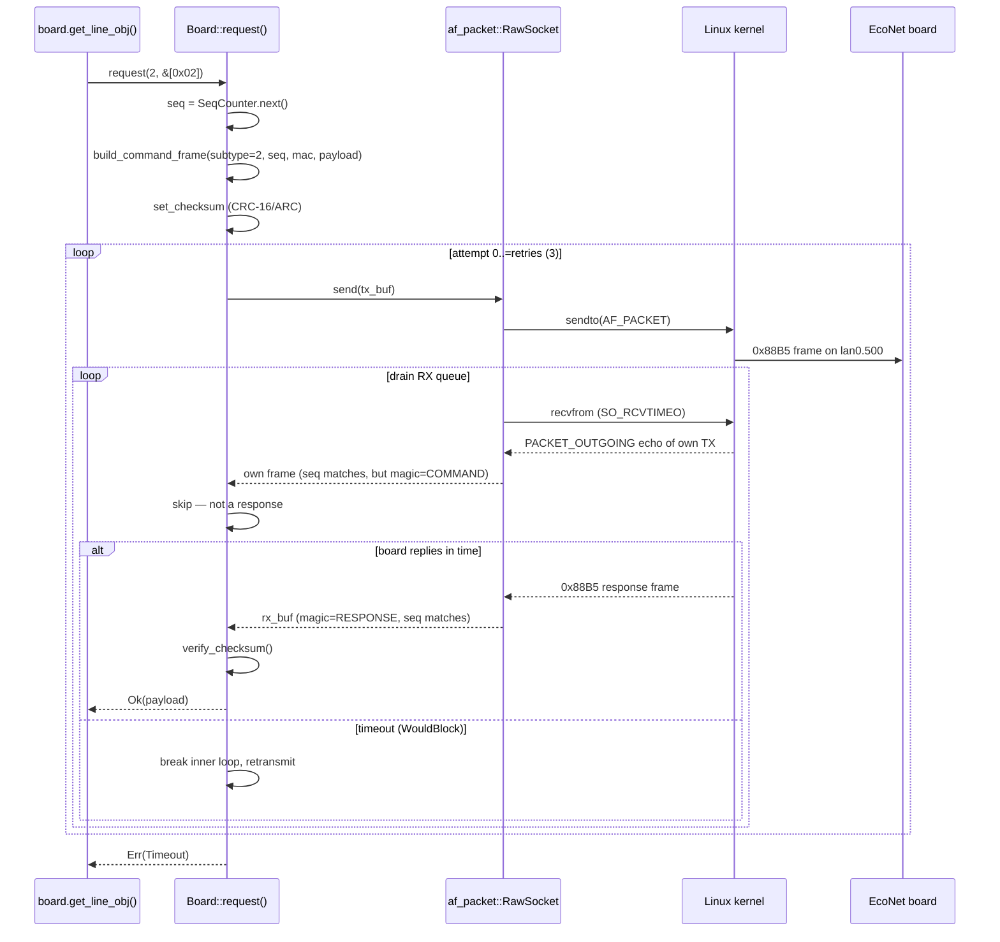

# rbctl-dsl — the Rust daemon

This is the **onboarding doc** for `rbctl-dsl`, the Rust daemon that replaces
the proprietary `remote_board` + `libcmm.so` stack for managing an EcoNet xDSL
board on mainline OpenWrt. If you're new to the project, read this first — it
explains *what the binary does at runtime*, *how the crates fit together*, and
*where the unsafe lives*.

> **Sibling docs.** The reverse-engineering side of the house (the original
> `remote_board` ELF, the `0x88B5`/`0x88B6` wire formats, the cmm bus) is in
> [index.md](index.md). This file covers only the **replacement Rust binary**
> living under [`rbctl-feed/rbctl-dsl/`](../rbctl-feed/rbctl-dsl/). For the
> safety posture (every `unsafe` site, drop guarantees, deferred items) see
> [safety-audit.md](safety-audit.md).

---

## TL;DR

`rbctl-dsl` is a single OpenWrt daemon binary that:

1. Reads DSL config from UCI (`/etc/config/network`).
2. Opens a raw `AF_PACKET` socket on the management VLAN (default `lan0.500`).
3. Speaks the proprietary `0x88B5` protocol to the EcoNet board — brings the
   line up, adds an ATM/PTM data link, and polls status every second.
4. Creates the board-assigned transport VLAN on the host (via rtnetlink).
5. Publishes live metrics on the ubus `dsl` object (LuCI-compatible) and emits
   hotplug events on line-state transitions.
6. Accepts control commands (`status` / `reload` / `restart-line` / `stop`)
   over a Unix socket so a second invocation can drive the running daemon.

It is the clean-room reimplementation of the binary analysed in
[architecture.md](architecture.md).

---

## The two-plane picture

The daemon sits in the **control plane** only. User traffic never passes
through it.

The double arrow on `0x88B5` is the only path `rbctl-dsl` owns end-to-end;
everything else (UCI read, ubus publish, hotplug fork, VLAN create) is a host
side-effect of what it learns over that socket.

---

## Workspace layout

Five crates, one workspace. The dependency graph is strictly layered: the
daemon binary depends on four library crates, two of which are pure Rust and
two of which carry the only `unsafe` in the tree.

Green = pure safe Rust, red = the FFI boundary, purple = the binary. The
safety story falls directly out of this shape: the entire business logic
(`rbctl_proto` + the non-FFI half of `rbctl_dsl`) is `unsafe`-free; see
[safety-audit.md](safety-audit.md).

---

## Crates

### `rbctl_proto` — protocol core  *(pure Rust, `no_std`)*

Zero C dependencies, builds on any host without the SDK. The `0x88B5` wire
format lives here. 18 unit tests, no `unsafe`.

| Module | Role | RE source |
|---|---|---|
| `checksum.rs` | CRC-16/ARC set / verify (poly `0x8005`, refin=refout=true) | [checksum.md](checksum.md), `examples/checksum.py` |
| `frame.rs` | 24-byte `proto_frame_hdr` builder, `Frame` parser, `SeqCounter` | [protocol.md](protocol.md) |
| `pack.rs` | TX payload encoders — opcodes 1 / 5 / 15 / 6 / 16 | `examples/pack.py`, [xdsl/payloads.md](xdsl/payloads.md) |
| `unpack.rs` | RX payload decoders — opcodes 2 (line obj) / 4 (channel stats) | `examples/unpack.py`, [xdsl/responses.md](xdsl/responses.md) |
| `validate.rs` | Config guard — modulation × annex × profile × xfer_mode | — |

Wire constants it exports: `ETHTYPE_BOARD = 0x88B5`, `MAGIC_COMMAND = 0x11`,
`MAGIC_RESPONSE = 0x10`, `HEADER_LEN = 24`, `MIN_FRAME = 60`.

**Dependencies:** `crc = "3"` (no_std CRC-16/ARC table generator). Nothing
else — not even `libc`.

### `af_packet` — raw Ethernet socket  *(libc-only)*

The thinnest possible layer over `socket(AF_PACKET, SOCK_RAW, ...)`. 10 unit
tests, 10 `unsafe` blocks (all `libc` calls).

- Binds to a named interface (`lan0.500`)
- Installs a classic BPF filter that matches ethertype `0x88B5`
- TX / RX with a configurable `SO_RCVTIMEO` timeout
- Reads the local MAC from `/sys/class/net/<iface>/address`
- RAII `OwnedFd` — closes on drop, no double-free possible

**Dependencies:** `libc = "0.2"` only.

### `tinyln-rs` / `tinyln-rs-sys` — libnl-tiny wrapper

The host-side VLAN management path. `tinyln_rs_sys` is a `bindgen`-generated
FFI layer against OpenWrt's `libnl-tiny` C library and the kernel rtnetlink
UAPI headers; `tinyln_rs` is the hand-written safe wrapper on top.

The safe crate exposes 9 modules:

| Module | Purpose |
|---|---|
| `socket.rs` | `NlSocket` — alloc / connect / send / recv / ACK |
| `msg.rs` | `NlMsg` — message builder, `append_struct<T: Copy>` |
| `attr.rs` | `NlAttr` — typed get/put, nesting, bounds-checked reads |
| `cb.rs` | `NlCb` — callback dispatch |
| `unl.rs` | `Unl` — high-level micro-netlink helpers |
| `rtnl/link.rs` | `RtnlLink` — VLAN create / delete / up / down |
| `rtnl/addr.rs` | `RtnlAddr` — IP address management |
| `rtnl/route.rs` | `RtnlRoute` — route management |
| `genl.rs` | `GenlSocket` — generic netlink, family lookup |

This is where 86 of the workspace's `unsafe` blocks live — all reviewed in
[safety-audit.md](safety-audit.md) §"Hardened / Accepted / Deferred".

> **Note:** the netlink path is only exercised by the daemon's VLAN
> create/delete on startup/shutdown and by `--selftest`. The board protocol
> itself never touches netlink.

**Dependencies:** `libc`, `tinyln-rs-sys` (path). Build-dep: `bindgen = "0.72"`.

### `rbctl_dsl` — the daemon binary

This is what ships in the `.apk`. One binary target (`rbctl-dsl`), 12 source
modules:

| Module | Role |
|---|---|
| `main.rs` | `clap` subcommand dispatch (`daemon` / `status` / `reload` / `restart-line` / `stop` / `selftest` / `sniff`) |
| `daemon.rs` | Startup sequence, signal handlers, control loop, clean shutdown |
| `board.rs` | `Board<T: Transport>` — typed methods for all 8 opcodes, seq, retries, checksum verify |
| `board_worker.rs` | Background thread that owns the board + 1 s status poll |
| `transport.rs` | `UnixUbusTransport` — non-blocking AF_UNIX adapter for ubus-zero |
| `uci_cfg.rs` | UCI config loader → typed `DslConfig` |
| `ubus_obj.rs` | ubus `dsl` object (`metrics` / `statistics` methods, Lantiq ABI) |
| `ipc.rs` | `/var/run/rbctl-dsl.sock` control socket (line-based ASCII) |
| `hotplug.rs` | Forks the DSL notify script on line-state transitions |
| `selftest.rs` | `--selftest` and `--sniff` modes (socket + VLAN + board probe, pcap dump) |
| `pcap.rs` | pcap writer for `--sniff --dump` |
| `log_init.rs` | stderr / syslog init |

**Dependencies:** `rust-uci` (git, for UCI), `ubus-zero` (git, pure-Rust ubus
client+server), `af_packet` + `tinyln-rs` + `rbctl_proto` (workspace path
deps), `libc`, `log`, `nanologger`, `clap`.

---

## Workspace-level dependencies

Pinned once in the root `Cargo.toml` under `[workspace.dependencies]`:

| Crate | Version / pin | Why pinned this way |
|---|---|---|
| `rust-uci` | `namib-project` git rev `3e7b6153` | Pulls `libuci-sys 1.1.0` (bindgen 0.72) which fixes a clang ≥ 15 panic on `uci.h`'s anonymous union. The crates.io version still ships the broken 1.0.5. |
| `ubus` (`ubus-zero`) | `pawelchcki/ubus-zero` git rev `68b55de7` | Pure-Rust, server-capable ubus client — links no `.so`. |
| `libc` | `0.2` | Standard. |
| `log` | `0.4` (+`std`) | Facade used everywhere. |
| `nanologger` | `0.1` (+`log`) | Tiny backend; pairs with `log`. |
| `clap` | `4`, minimal features (`std`, `derive`, `help`, `usage`, `error-context`, `suggestions`) | Default features disabled to keep the binary small (`opt-level = "z"` + LTO). |

Release profile is tuned for size: `opt-level = "z"`, `lto = true`,
`codegen-units = 1`, `panic = "abort"`, `strip = true`. The `panic = "abort"`
choice is also a **safety property** — it eliminates unwind-through-FFI UB;
see [safety-audit.md](safety-audit.md) §"Accepted".

The build produces a ~357 KB dynamically-linked aarch64-musl ELF that links
against `libuci`, `libnl-tiny`, and `libc` (all staged by the OpenWrt SDK).

---

## Daemon lifecycle

### Startup sequence

`daemon::run()` is the entry point. It is deliberately ordered so each step
can fail fast and leave the system in a sane state.

Steps 1–4 must succeed or the process exits non-zero before touching the
board. Steps 6–7 (line config + link add) are best-effort — a silent board
during boot is logged but doesn't abort, because the worker will keep polling
and may recover. Step 8 (VLAN create) tolerates `EEXIST` so a daemon restart
is idempotent.

### Two threads, one shared state

Once startup completes, the process splits in two:

This split exists because the board can block for **seconds** on a silent or
training line (2 s timeout × 3 retries × drain-loop). Putting it on its own
thread keeps the IPC/ubus path responsive at all times — `status` returns
within microseconds even while the worker is mid-retransmit. Commands flow
through three process-global `AtomicBool` flags
(`SHOULD_EXIT` / `SHOULD_RELOAD` / `SHOULD_RESTART_LINE`) that both threads
read; the board can't stall the control plane.

### Clean shutdown

On `SIGTERM` / `SIGINT` / `Stop` IPC command:

1. `SHOULD_EXIT` is set.
2. Control loop exits, emits a final `Down` hotplug event.
3. Worker sees `SHOULD_EXIT`, drops its retry budget to 0, attempts one
   best-effort `line_config_down()` on the board.
4. Main thread waits up to `SHUTDOWN_DEADLINE` (3 s) for the worker via a
   one-shot mpsc channel; a silent board is abandoned (process exit reaps
   the thread).
5. Host transport VLAN is deleted via rtnetlink.
6. IPC socket file is removed.

---

## Inside a board request

`Board::request()` is the heart of the protocol side. Every opcode goes
through it. Here is what happens for one `get_line_obj()` (opcode 2):

Two details worth knowing as a newcomer:

- **TX echo drain.** `AF_PACKET` on Linux delivers a copy of your own
  transmitted frame back to the socket as `PACKET_OUTGOING`. The inner loop
  discards it by checking `is_response()` and `seq`/`subtype` match — without
  this, every request would see its own TX and treat it as the reply.
- **`strip_echo`.** The board inconsistently prefixes its payload with the
  opcode byte (opcode 2 does, opcodes 4/5 don't). `strip_echo()` detects the
  prefix and skips it; per-opcode parsers then work on stable offsets.

The 8 typed methods on `Board` map 1:1 to the original binary's opcodes — see
[commands/dispatch.md](commands/dispatch.md) for the C-side dispatch table and
[xdsl/opcodes.md](xdsl/opcodes.md) for the per-opcode payload breakdown.

---

## Testing strategy

| Layer | Command | What it covers |
|---|---|---|
| Protocol core | `cargo test -p rbctl_proto` | 18 tests — CRC, frame build/parse, all pack/unpack round-trips |
| AF_PACKET | `cargo test -p af_packet` | 10 tests — BPF filter, MAC parsing, ethertype match |
| Board controller | `cargo test -p rbctl_dsl` (host) | 15 tests via `MockTransport` — every opcode, retries, checksum reject, seq increment |
| QEMU selftest | `rbctl-dsl --selftest -i lan0.500` | Socket open + BPF + bind, VLAN create/up/down/delete round-trip, board opcode (expects timeout), UCI/uloop init |
| Sniffer | `rbctl-dsl --sniff -i lan0.500 --dump /tmp/cap.pcap` | Passive 0x88B5/0x88B6 capture, Wireshark-openable |

The `MockTransport` in `board.rs` is what makes the board logic testable on a
CI host with no hardware — it auto-generates valid response frames and can be
programmed to fail the first N attempts (for retransmit coverage) or never
respond (for timeout coverage).

---

## Where to go next

- **Wire formats & RE background** → [index.md](index.md), [architecture.md](architecture.md), [protocol.md](protocol.md)
- **Every `unsafe`, drop guarantee, and deferred item** → [safety-audit.md](safety-audit.md)
- **Per-opcode payloads and enums** → [xdsl/](xdsl/)
- **Build / package / on-device test instructions** → top-level [README.md](../README.md) and [test.md](test.md)
- **Phased build plan** → [`plans/rbctl-daemon-plan.md`](../plans/rbctl-daemon-plan.md)
