# TR-181 — quick reference (for this project)

A condensed, project-focused explanation of TR-181 and how it shapes the code
under analysis. Enough to read the field maps in
[payloads.md](xdsl/payloads.md) / [responses.md](xdsl/responses.md) and the
layering in [libcmm.md](libcmm.md) without opening the official spec.

---

## What TR-181 is

**TR-181** is the Broadband Forum's **Device Data Model** (current name:
**Device:2**, formerly *TR-181 Issue 2*). It defines a standardized, hierarchical
tree of **objects** and **parameters** that describe a CPE (router/modem) — its
interfaces, configuration, and live state. It is the "what" that gets managed.

A path looks like a filesystem:

```
Device.DSL.Line.1.UpstreamCurrRate        (a parameter — an integer, kbit/s)
Device.DSL.Line.1.Status                   (a parameter — "Up" / "Down" / ...)
Device.DSL.Channel.1.Stats.Total.ReceiveBlocks
```

- **Object** = a container node (e.g. `Device.DSL.Line.1.`). Multi-instance
  objects are tables (`Line.{i}.`, `Channel.{i}.`).
- **Parameter** = a typed leaf (int / string / bool / datetime / enum).
- **Vendor extensions** live under an `X_<OUI>_*` prefix. This device is TP-Link,
  so you see `X_TP_ModulationType`, `X_TP_AnnexType`, `X_TP_AllowedProfile`.

### TR-181 vs TR-069 vs TR-369 (don't confuse them)

| Spec | Role |
|------|------|
| **TR-181 / Device:2** | the **data model** — *what* parameters exist and mean |
| **TR-069 / CWMP** | the **management protocol** — how an ACS reads/writes those parameters over SOAP/HTTP |
| **TR-369 / USP** | the modern successor to CWMP (same data model) |

TR-069 *uses* TR-181. The data model is the payload; the protocol is the
transport. The `cwmp` binary in this rootfs is the TR-069 agent; it speaks the
TR-181 tree.

---

## Why it matters in this project

The entire host management stack is a **TR-181 implementation**. The `oal_*`,
`rsl_*`, and `dm_*` function families in `libcmm.so` are the layers that turn
TR-181 object access into hardware commands:

```mermaid
flowchart LR
    ACS["ACS<br/>(remote manager)"] -->|"TR-069 CWMP"| CWMP["cwmp<br/>(TR-069 agent)"]
    CWMP --> DM["dm_*<br/>(datamodel access)"]
    DM --> RSL["rsl_*<br/>(dm → OAL dispatch)"]
    RSL --> OAL["oal_*<br/>(Object Abstraction Layer)"]
    OAL --> OALR["oal_remote_*<br/>(→ remote board)"]
    OALR -->|"oal_remote_Cfg<br/>opcode + 0x2968"| RB["remote_board"]
    RB -->|"0x88B5"| BRD["EcoNet board"]
    style OALR fill:#3a1a5a,color:#fff
    style RB fill:#5a1a1a,color:#fff
```



| Layer | Prefix | Job |
|-------|--------|-----|
| Datamodel | `dm_` | generic get/set of TR-181 objects by path (`dm_getObj`, `dm_getSpecifiedObj`) |
| Dispatch | `rsl_` | maps a TR-181 object operation to the right `oal_` function (e.g. `rsl_setDev2DslLineObj` → `oal_dsl_*`) |
| Abstraction | `oal_` | one function per TR-181 operation, talking to the actual hardware/cmm |
| Remote board | `oal_remote_*` | the subset of OAL that targets the DSL board via `remote_board` |

> The replacement CLI (`rbctl`) **bypasses all of this** — it talks `0x88B5`
> directly. But the on-wire payloads are *defined by* the TR-181 objects the OAL
> serializes, so understanding the data model explains why each byte exists.

---

## The `Device.DSL.` subtree (reverse-engineered mapping)

Only the nodes this project actually touches. Paths follow the Device:2 model;
vendor-extension nodes carry the `X_TP_` prefix.

### `Device.DSL.Line.{i}.` — the DSL line (opcode 1 config / opcode 2 status)

| TR-181 node | Direction | Opcode / field | Notes |
|-------------|-----------|----------------|-------|
| `Status` | RX (op 2, byte 4) | linkStatus enum | Up / NoSignal / Initializing / EstablishingLink |
| `UpstreamCurrRate` / `DownstreamCurrRate` | RX (op 2) | metric uint32 | kbit/s |
| `UpstreamMaxRate` / `DownstreamMaxRate` | RX (op 2) | metric uint32 | kbit/s |
| `UpstreamSNRMargin` / `DownstreamSNRMargin` | RX (op 2) | metric uint32 | tenths of dB |
| `UpstreamAttenuation` / `DownstreamAttenuation` | RX (op 2) | metric uint32 | tenths of dB |
| `X_TP_ModulationType` | TX (op 1, byte 0) / RX (op 2, byte 5) | `MODULATION` enum | ADSL_ANSI_T1.413 … VDSL2 |
| `X_TP_AnnexType` | TX (op 1, byte 1) / RX (op 2, byte 7) | `ANNEX` enum | Annex A/B/I/M/J/…/auto |
| `X_TP_AllowedProfile` | TX (op 1, bytes 4-7) | VDSL2 profile bitmask | 8a/8b/8c/8d/12a/12b/17a/30a/35b |
| `Stats.{Errors,SEF,LOS,…}` | RX (op 2, bytes 0x30/0x34) | error counters | inferred — ES/SES |

> The 12 metric `uint32` in the opcode-2 reply (see [responses.md](xdsl/responses.md))
> are exactly the rate/SNR/attenuation/error parameters above. Field *offsets* are
> authoritative; the *name* assignment follows the standard TR-181 ordering and
> matches the destination struct offsets the parser writes to.

### `Device.DSL.Channel.{i}.` — the channel (opcode 2 / opcode 4)

| TR-181 node | Direction | Opcode / field |
|-------------|-----------|----------------|
| `UpstreamCurrRate` / `DownstreamCurrRate` | RX (op 2, bytes 0x08/0x0c) | channel rates |
| `Stats.Total.TransmitBlocks` / `ReceiveBlocks` | RX (op 4) | counter uint32 |
| `Stats.Total.TransmitErrors` / `ReceiveErrors` | RX (op 4) | counter uint32 |
| `Stats.Total.TransmitDiscards` / `ReceiveDiscards` | RX (op 4) | counter uint32 |

### Other subtrees touched

| Subtree | Maps to | Opcode |
|---------|---------|--------|
| `Device.ATM.Link.{i}.` + `Device.ATM.Link.{i}.QoS.` | ATM link add/del | 5 / 6 |
| `Device.Ethernet.VLANTermination.` (PTM side) | PTM/VDSL link add/del | 15 / 16 |
| `Device.ManagementServer.` + firmware image nodes | remote-board firmware upgrade | 7 / 8 |

The ATM descriptor (opcode 5, 24 B) packs `VPI`, `VCI`, `LinkType` (EoA/PPPoA/
IPoA), `QoS` class + PCR/SCR/MBS, the local VLAN, and the 802.1Q tag — i.e. a
serialized `Device.ATM.Link.` row plus its `QoS.` child. See
[payloads.md](xdsl/payloads.md).

---

## Where this shows up in the code

- The deserializer names (`oal_getDev2DslLineObj`, `oal_getDev2DslChannelObj`,
  `oal_getDev2DslChannelStatsTotObj`) are literally `get Device:2 DSL … Object`
  — the `Dev2` = **Device:2** = TR-181.
- The struct destination offsets (e.g. `+0x35c`, `+0x360` in
  `oal_dsl_msgToLineObj`) are byte offsets into the in-memory TR-181 `Line`
  object struct.
- `dm_getSpecifiedObj(99, …)` / `dm_getObj(100, …)` in the ATM serializer are
  datamodel lookups by table index (`99`/`100` are internal table ids for the
  ATM link/QoS objects).

---

## Official spec (when you need the full thing)

- **Broadband Forum** — *TR-181 Issue 2* / *Device:2 Data Model* — the canonical
  parameter definitions, types, and object hierarchy. Published as part of the
  BBF "Device Data Model" specification (freely downloadable; search
  "Broadband Forum Device:2").
- **TR-069** — *CPE WAN Management Protocol (CWMP)* — the management protocol.
- **TR-369** — *User Services Platform (USP)* — the modern protocol (same model).

This project only needs the `Device.DSL.`, `Device.ATM.Link.`, and firmware
nodes — all captured above. Everything else in the spec is unrelated to the
remote board.
