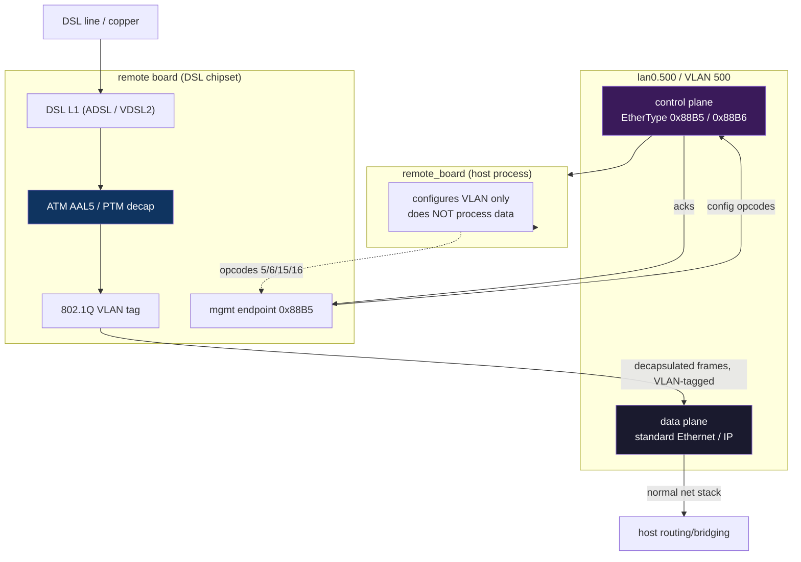
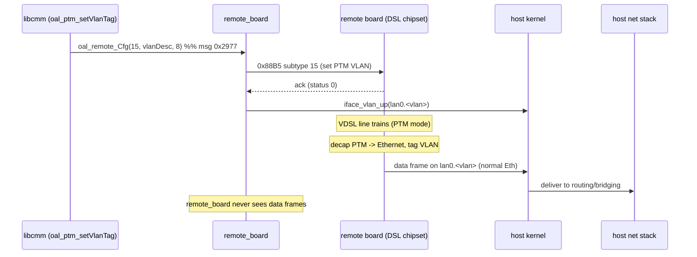

Where ATM/PTM decapsulation happens, and how ADSL/VDSL traffic reaches the host.

## Short answer

**Decapsulation is done by the remote board's DSL chipset, not by `remote_board`
or the host.** `remote_board` never touches data-plane traffic — it only
*configures* the VLAN tag (on both the board and locally) so that decapsulated
Ethernet frames find their way to the host's networking stack.

Nothing is dropped silently: the PTM/VDSL path (opcodes 15/16) is handled
symmetrically to the ATM/ADSL path (opcodes 5/6).

## Two planes on the same wire



- **Control plane** (`0x88B5`/`0x88B6`): board management — what `remote_board`
  and these docs are about.
- **Data plane** (standard Ethernet): the actual user traffic, emitted by the
  board *after* decapsulation, received by the host kernel as ordinary VLAN'd
  Ethernet on `lan0.<vlan>`.

## What each link-config opcode actually does

Every link opcode does **two things** — configure the board **and** mirror the
VLAN interface locally. This is the key to why nothing is dropped:

| Op | Handler | Board side (0x88B5) | Host side (local) |
|----|---------|---------------------|-------------------|
| 5 | `atm_link_add` | send 24-B ATM link+QoS+VLAN descriptor | `iface_vlan_up(lan0.<vlan>)` |
| 6 | `atm_link_del` | send 3-B delete | `iface_vlan_down(lan0.<vlan>)` when type=3 |
| 15 | `ptm_link_add` | send 8-B PTM VLAN descriptor | `iface_vlan_up(lan0.<vlan>, pri)` |
| 16 | `ptm_link_del` | send 3-B delete | `iface_vlan_down(lan0.<vlan>)` when type=3 |

So for VDSL, `ptm_link_add`:
1. Builds a `0x88B5` subtype-15 frame with the VLAN descriptor and sends it to
   the board → the board's PTM path starts tagging decapsulated frames with that
   VLAN.
2. On the board's OK reply, runs `iface_vlan_up(vlan_id, priority)` locally →
   creates `lan0.<vlan>` so the host kernel can receive those frames.

If the board rejects the config, `ptm_link_add` returns an error and the local
interface is **not** created — so a failure is observable, not silent.

## End-to-end data flow (VDSL example)



## Full dispatch table (13 entries)

| op | msg_id | handler | Role |
|----|--------|---------|------|
| 1 | `0x2969` | `dsl_config_up` | DSL line config (modulation + annex) |
| 2 | `0x296A` | `dsl_get_line_obj` | GET DSL line/channel object |
| 3 | `0x296B` | `dsl_config_down` | DSL config down |
| 4 | `0x296C` | `dsl_get_channel_stats` | GET channel stats |
| 5 | `0x296D` | `atm_link_add` | ATM link add (VLAN + local iface up) |
| 6 | `0x296E` | `atm_link_del` | ATM link del (local iface down) |
| 7 | `0x296F` | `main_image_check` | main-board image check |
| 8 | `0x2970` | `firmware_upgrade` | firmware upgrade |
| 9 | `0x2971` | `cmd9_forward` | 2-B forward (**DEAD** — no sender in libcmm) |
| 14 | `0x2976` | `cmd14_forward` | 7-B forward (**DEAD** — no sender in libcmm) |
| 15 | `0x2977` | `ptm_link_add` | PTM/VDSL link add (VLAN + local iface up) |
| 16 | `0x2978` | `ptm_link_del` | PTM/VDSL link del (local iface down) |
| 20 | `0x297C` | `board_identity_check` | board identity / MAC verify |

## Resolved: opcodes 9, 14, 20

Opcodes 9, 14, and 20 were previously listed as "dead — no sender in libcmm".
Board-side analysis (see [../server.md](../server.md)) corrects this:

- **Opcode 9** (LED control): **alive on board** — writes `/proc/tc3162/led_off_mode`.
  Dead only from the host (never sent). May be used by older firmware or test tools.
- **Opcode 14**: **truly dead** — exists in host table only, no board-side handler.
- **Opcode 20** (MAC/interface query): **alive on board** — queries `eth0.1.500`
  MAC address. Dead only from the host.

## Board-side data-plane creation (confirmed from EcoNet MIPS `remote_board`)

The board-side `remote_board` binary (see [../server.md](../server.md)) reveals
the exact interface creation logic. When a link is added (opcode 5 for ATM,
15 for PTM), the board creates a stack of interfaces:

### ATM data path

```
dsl_linkAdd(payload)
  → atmCreateVlanMuxIntf(pvcIndex, vlanEnabled, vid, qosMark)
      nas<pvcId> = ATM SAR virtual device (created by mt7510sar.ko)
      smuxctl add bridge nas<pvcId> nas<pvcId>_<idx> <proto> <vid> <qos> 0
      ifconfig nas<pvcId>_<idx> hw ether FE:FF:FF:FF:FF:<idx+1> up
  → atmCreateVLAN(pvcIndex)
      vconfig add eth0.1 <vlanId>           → eth0.1.2000 etc.
      brctl addbr br<pvcIndex+2>            → br2, br3, ...
      brctl stp br<N> off; brctl setfd br<N> 0
      brctl addif br<N> eth0.1.<vlanId>     (VLAN side)
      brctl addif br<N> nas<pvcId>_<idx>    (ATM side)
      ifconfig br<N> up
```

### PTM data path

```
vdsl_linkAdd(payload)
  → nas8 = PTM virtual device (created by mt7510ptm.ko)
      smuxctl add bridge nas8 nas8_<pvcIndex> <proto> <vid> <qos> 0
      ifconfig nas8_<pvcIndex> hw ether FE:FF:FF:FF:FF:<idx+1> up
  → ptmCreateVLAN(pvcIndex)
      vconfig add eth0.1 <vlanId>           → eth0.1.2000 etc.
      ifconfig eth0.1.<vlanId> hw ether 00:aa:bb:<hi>:<lo>:00
      brctl addbr br<pvcIndex+2>            → br2, br3, ...
      brctl stp br<N> off; brctl setfd br<N> 0
      brctl addif br<N> eth0.1.<vlanId>     (VLAN side)
      brctl addif br<N> nas8_<pvcIndex>     (PTM side)
      ifconfig br<N> up
```

### Interface naming

| Interface | ATM | PTM |
|-----------|-----|-----|
| DSL virtual device | `nas0`–`nas7` | `nas8` (always) |
| MUX sub-interface | `nas<pvcId>_<idx>` | `nas8_<idx>` |
| VLAN interface | `eth0.1.<vlanId>` | `eth0.1.<vlanId>` |
| Bridge | `br<pvcIndex+2>` | `br<pvcIndex+2>` |

### Link status → VLAN lifecycle

The board's `dslStatusCheckHandler` thread (polls every **2 seconds**)
automatically creates/removes VLAN interfaces on DSL status transitions:

- **DSL UP** (`dslHandleStatusUp`): iterates all configured PVCs, calls
  `dsl_linkAdd` / `vdsl_linkAdd` for each, sets the handled flag
- **DSL DOWN** (`dslHandleStatusDown`): iterates all PVCs, calls
  `dsl_linkDel` / `vdsl_linkDel` for each, clears the handled flag

This means the data-plane VLAN is **automatically managed by the board**
based on DSL line state — the host doesn't need to re-send opcodes 5/15
after a resync.

## QinQ / double VLAN tagging

The board uses **nested VLANs** (802.1Q-in-802.1Q) between the host and
the DSL board. This is enabled by two mechanisms in the board's `rcS`
startup script:

```sh
echo 1 > /proc/tc3162/stag_to_vtag     # STAG→VTAG hardware conversion
/userfs/bin/ethphxcmd eth0 vlanpt enable  # VLAN passthrough on PHY
```

### Wire format

```
[DA MAC][SA MAC][0x8100 vid=1][0x8100 vid=<inner>][EtherType][Payload]
                       │              │
                       │              └── inner (service) VLAN:
                       │                  500 = management/control
                       │                  2000–2007 = data PVCs
                       └── outer (transport) VLAN: always 1
```

### How each side handles it

**Board side (EN7516):**
- `eth0` = physical MAC, hardware strips/adds outer VLAN 1 via `stag_to_vtag`
- `eth0.1` = Linux VLAN interface for outer tag (VLAN 1)
- `eth0.1.500` = management interface (inner VLAN 500)
- `eth0.1.<vlanId>` = data interface (inner VLAN 2000–2007)

> **Hypothesis (unconfirmed) — `eth0.1` may map to switch port 1.**
> The EcoNet EN7516 BSP likely uses per-port VLANs to route traffic
> between the SoC's internal switch and its physical Ethernet ports.
> `eth0.1` is probably VLAN 1 = port 1 of the internal switch (the uplink
> to the host MT7986), not a randomly chosen VID. This is suggested by
> the `rcS` script which creates `br0` on `eth0` (CPU port) and uses
> `eth0.1` specifically for the host-facing link, while power-gating the
> other ports:
> ```sh
> echo "tce miiw 9 0 800" > /proc/tc3162/tcci_cmd   # port 1 disable
> echo "tce miiw 10 0 800" > /proc/tc3162/tcci_cmd  # port 2 disable
> echo "tce miiw 11 0 800" > /proc/tc3162/tcci_cmd  # port 3 disable
> echo "tce miiw 12 0 800" > /proc/tc3162/tcci_cmd  # port 4 disable
> ```
> This has NOT been confirmed against EcoNet SDK documentation or switch
> register dumps. It remains a working assumption based on the BSP script
> patterns.
- Bridge (`br<N>`) connects the inner VLAN interface to the ATM/PTM `nas` device

**Host side (MT7986):**
- `lan0` = physical interface (switch chip strips/adds outer VLAN 1)
- `lan0.500` = management interface (inner VLAN 500)
- `lan0.<vlanId>` = data interface (inner VLAN 2000–2007)

> The outer VLAN 1 tag is transparent to both Linux stacks — it's handled by
> hardware (board's EN7516 MAC via `stag_to_vtag`, host's MT7986 switch chip).
> Both sides see only the inner VLAN in their network stack.

### Not traditional QinQ

This is **not** standard 802.1ad (which uses TPID `0x88A8` for the outer tag).
Both VLAN tags use TPID `0x8100` (standard 802.1Q). The outer tag (VLAN 1)
serves as a simple transport separator between the host-board management
network and the rest of the system; it's not an ISP service demarcation.

The "VLAN ID" that users configure in the web UI (e.g., VLAN 835 for ISP) is
the **ISP inner VLAN** that passes through the board's ATM/PTM path — it's
embedded inside the PPPoE/IP payload, not in the transport VLAN tags.

## Transport VLAN id selection rule

The outer transport VLAN id is **not arbitrary** — it follows a strict rule:

- **Range:** `2000`–`2007` (8 values, indices 0–7)
- **Formula:** `vlanid = baseIndex + 2000`, hardcoded in `oal_atm_setVlanTag`
  (`libcmm.so`)
- **Enforced by** `oal_vlanIdFromIfName` (`libcmm.so`):
  ```c
  sscanf(ifName, "lan0.%u", &vid);
  if (vid < 2000 || vid > 0x7d7) error;   // 0x7d7 = 2007
  ```

The `baseIndex` (0–7) is a per-connection value from the TR-181
`Device.ATM.Link.{i}` data model `vlan` field, assigned by the management layer
when a WAN connection is created. For PTM, the full VLAN id is extracted from
the interface name (`lan0.2001` → `2001`).

The +2000 offset avoids collision with all other VLANs in use:

| VLAN range | Use | Source |
|-----------|-----|--------|
| 1–4 | LAN ports | switch chip (`vlan_setting.sh`) |
| 10 | switch management | `vlan_setting.sh` |
| 500 | management/control plane (`0x88B5`/`0x88B6`) | `config.bba`: `INCLUDE_REMOTE_CONTROL_VLAN` |
| **2000–2007** | **transport (outer data VLAN)** | `oal_atm_setVlanTag` / `oal_ptm_setVlanTag` |
| 835/836 | ISP service (inner VLAN) | passes through the board |

> **Not user-configurable.** The web UI "VLAN ID" fields (`dsl.htm`) configure
> the ISP tag (tagVID at payload offset `0x14`), not the transport VLAN. The
> transport VLAN base index is internal to the management layer.

### Dual interface creation

Both `remote_board` and `libcmm` create the transport interface (redundantly):

1. **`remote_board`** handler (`atm_link_add` / `ptm_link_add`) → reads VLAN id
   from the board's response at payload offset `0x12` (ATM) / `0x06` (PTM) →
   calls `iface_vlan_up(vlanid)` → `ifconfig lan0.<vlanid> up`
2. **`libcmm`** (`oal_atm_setVlanTag` / `oal_ptm_setVlanTag`) → after
   `oal_remote_Cfg` returns → calls `oal_addLocalVlanIntf(vlanid)` →
   `vconfig add lan0 <vlanid>` + `setWanIntfFlag`

The daemon replacement needs only one path (the `vconfig`/`ip link` creation).
