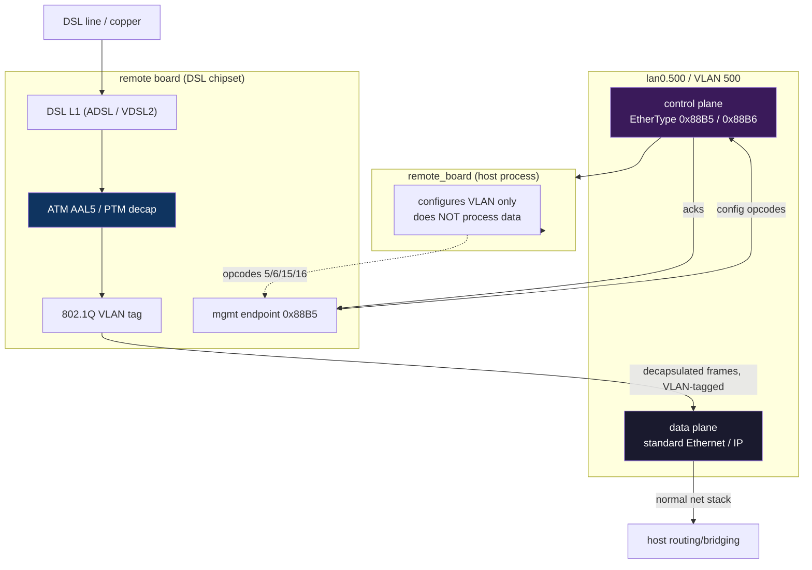
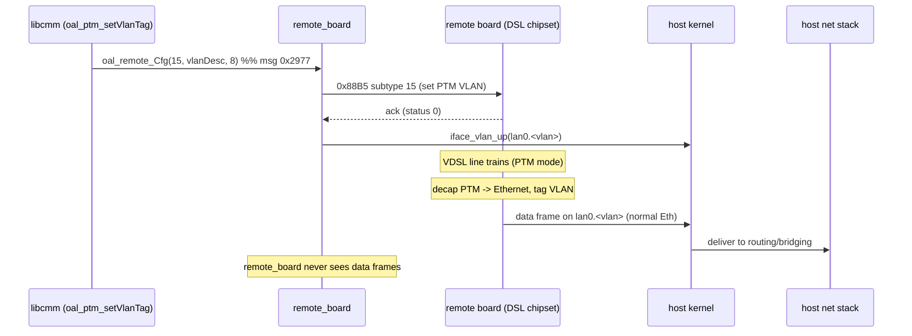

Where ATM/PTM decapsulation happens, and how ADSL/VDSL traffic reaches the host.

## Short answer

**Decapsulation is done by the remote board's DSL chipset, not by `remote_board`
or the host.** `remote_board` never touches data-plane traffic — it only
*configures* the VLAN tag (on both the board and locally) so that decapsulated
Ethernet frames find their way to the host's networking stack.

Nothing is dropped silently: the PTM/VDSL path (opcodes 15/16) is handled
symmetrically to the ATM/ADSL path (opcodes 5/6).

## Two planes on the same wire



- **Control plane** (`0x88B5`/`0x88B6`): board management — what `remote_board`
  and these docs are about.
- **Data plane** (standard Ethernet): the actual user traffic, emitted by the
  board *after* decapsulation, received by the host kernel as ordinary VLAN'd
  Ethernet on `lan0.<vlan>`.

## What each link-config opcode actually does

Every link opcode does **two things** — configure the board **and** mirror the
VLAN interface locally. This is the key to why nothing is dropped:

| Op | Handler | Board side (0x88B5) | Host side (local) |
|----|---------|---------------------|-------------------|
| 5 | `atm_link_add` | send 24-B ATM link+QoS+VLAN descriptor | `iface_vlan_up(lan0.<vlan>)` |
| 6 | `atm_link_del` | send 3-B delete | `iface_vlan_down(lan0.<vlan>)` when type=3 |
| 15 | `ptm_link_add` | send 8-B PTM VLAN descriptor | `iface_vlan_up(lan0.<vlan>, pri)` |
| 16 | `ptm_link_del` | send 3-B delete | `iface_vlan_down(lan0.<vlan>)` when type=3 |

So for VDSL, `ptm_link_add`:
1. Builds a `0x88B5` subtype-15 frame with the VLAN descriptor and sends it to
   the board → the board's PTM path starts tagging decapsulated frames with that
   VLAN.
2. On the board's OK reply, runs `iface_vlan_up(vlan_id, priority)` locally →
   creates `lan0.<vlan>` so the host kernel can receive those frames.

If the board rejects the config, `ptm_link_add` returns an error and the local
interface is **not** created — so a failure is observable, not silent.

## End-to-end data flow (VDSL example)



## Full dispatch table (13 entries)

| op | msg_id | handler | Role |
|----|--------|---------|------|
| 1 | `0x2969` | `dsl_config_up` | DSL line config (modulation + annex) |
| 2 | `0x296A` | `dsl_get_line_obj` | GET DSL line/channel object |
| 3 | `0x296B` | `dsl_config_down` | DSL config down |
| 4 | `0x296C` | `dsl_get_channel_stats` | GET channel stats |
| 5 | `0x296D` | `atm_link_add` | ATM link add (VLAN + local iface up) |
| 6 | `0x296E` | `atm_link_del` | ATM link del (local iface down) |
| 7 | `0x296F` | `main_image_check` | main-board image check |
| 8 | `0x2970` | `firmware_upgrade` | firmware upgrade |
| 9 | `0x2971` | `cmd9_forward` | 2-B forward (**DEAD** — no sender in libcmm) |
| 14 | `0x2976` | `cmd14_forward` | 7-B forward (**DEAD** — no sender in libcmm) |
| 15 | `0x2977` | `ptm_link_add` | PTM/VDSL link add (VLAN + local iface up) |
| 16 | `0x2978` | `ptm_link_del` | PTM/VDSL link del (local iface down) |
| 20 | `0x297C` | `board_identity_check` | board identity / MAC verify |

## Resolved: opcodes 9, 14, 20

Previously listed as "reserved / no sender in libcmm". **Confirmed dead** in a
later full scan: `oal_remote_Cfg` is the sole host→server-`0x3b` bridge, and none
of its 16 call sites passes opcode 9, 14, or 20 (no bypass exists among 85+
`msg_connCliAndSend` callers). Their handlers exist in `remote_board` but are
never invoked from this host build. See [opcodes.md](opcodes.md) for the
verification note and [../plan.md](../../plans/reverse-engineering-plan.md) §"Host management binaries".

## The data-plane EtherType

Not visible from `remote_board` (it only does control). The board emits standard
Ethernet/IP after decap; the host receives it on `lan0.<vlan>` as ordinary
traffic. The VLAN tagging of decapsulated frames (board tag vs local VLAN id,
ATM vs PTM) is documented in [../network.md](../network.md) §"Data plane".

## Transport VLAN id selection rule

The outer transport VLAN id is **not arbitrary** — it follows a strict rule:

- **Range:** `2000`–`2007` (8 values, indices 0–7)
- **Formula:** `vlanid = baseIndex + 2000`, hardcoded in `oal_atm_setVlanTag`
  (`libcmm.so`)
- **Enforced by** `oal_vlanIdFromIfName` (`libcmm.so`):
  ```c
  sscanf(ifName, "lan0.%u", &vid);
  if (vid < 2000 || vid > 0x7d7) error;   // 0x7d7 = 2007
  ```

The `baseIndex` (0–7) is a per-connection value from the TR-181
`Device.ATM.Link.{i}` data model `vlan` field, assigned by the management layer
when a WAN connection is created. For PTM, the full VLAN id is extracted from
the interface name (`lan0.2001` → `2001`).

The +2000 offset avoids collision with all other VLANs in use:

| VLAN range | Use | Source |
|-----------|-----|--------|
| 1–4 | LAN ports | switch chip (`vlan_setting.sh`) |
| 10 | switch management | `vlan_setting.sh` |
| 500 | management/control plane (`0x88B5`/`0x88B6`) | `config.bba`: `INCLUDE_REMOTE_CONTROL_VLAN` |
| **2000–2007** | **transport (outer data VLAN)** | `oal_atm_setVlanTag` / `oal_ptm_setVlanTag` |
| 835/836 | ISP service (inner VLAN) | passes through the board |

> **Not user-configurable.** The web UI "VLAN ID" fields (`dsl.htm`) configure
> the ISP tag (tagVID at payload offset `0x14`), not the transport VLAN. The
> transport VLAN base index is internal to the management layer.

### Dual interface creation

Both `remote_board` and `libcmm` create the transport interface (redundantly):

1. **`remote_board`** handler (`atm_link_add` / `ptm_link_add`) → reads VLAN id
   from the board's response at payload offset `0x12` (ATM) / `0x06` (PTM) →
   calls `iface_vlan_up(vlanid)` → `ifconfig lan0.<vlanid> up`
2. **`libcmm`** (`oal_atm_setVlanTag` / `oal_ptm_setVlanTag`) → after
   `oal_remote_Cfg` returns → calls `oal_addLocalVlanIntf(vlanid)` →
   `vconfig add lan0 <vlanid>` + `setWanIntfFlag`

The daemon replacement needs only one path (the `vconfig`/`ip link` creation).
