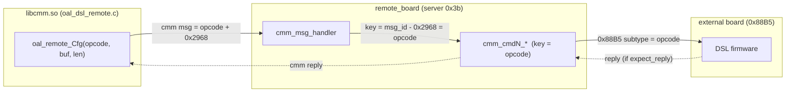

This folder documents how DSL line configuration (xDSL modulation, ATM/PTM links,
annex type) flows from `libcmm.so` to the external board through `remote_board`.

## The key discovery

All DSL configuration in `libcmm.so` lives in **`./src/oal_dsl_remote.c`** and is
funneled through a single function — **`oal_remote_Cfg`** (`0x00325300`):

```c
int oal_remote_Cfg(int opcode, void *buf, ushort len, char expect_reply, ushort timeout) {
    msg_id = opcode + 0x2968;                       // ← the cmm message id
    if (!expect_reply) {
        msg_connCliAndSend(0x3b, ctx, &msg);        // fire-and-forget → server 0x3b
    } else {
        msg_init(ctx);
        msg_connSrv(0x3b, ctx);                      // connect to server 0x3b
        msg_sendAndGetReplyWithTimeout(ctx, &msg, timeout);  // request/reply
    }
}
```

**Server `0x3b` is `remote_board`** (registered via `msg_srvInit(0x3b)` in
`cmm_init`). And `msg_id - 0x2968` is exactly the dispatch key in
`remote_board`'s `cmm_msg_handler`. So the opcode passed to `oal_remote_Cfg` is
the **same number** as `remote_board`'s command key — a perfect 1:1 bridge.



## Opcode cross-reference (libcmm → remote_board)

| op | cmm msg | `libcmm.so` caller(s) | payload | reply | `remote_board` handler | Meaning |
|----|---------|------------------------|---------|:-----:|------------------------|---------|
| 1 | `0x2969` | `oal_dsl_configUp` | 12 B | no | `dsl_config_up` | **DSL line config UP** (modulation + annex + line params) |
| 2 | `0x296A` | `oal_dsl_getConfigModulateType`, `oal_getDev2DslLineObj`, `oal_getDev2DslLineStatsObj`, `oal_getDev2DslChannelObj` | 59 B | **yes** | `dsl_get_line_obj` | **GET DSL line/channel/status** |
| 3 | `0x296B` | `oal_dsl_configDown` | 0 | no | `dsl_config_down` | **DSL config DOWN** |
| 4 | `0x296C` | `oal_getDev2DslChannelStatsTotObj` | 28 B | **yes** | `dsl_get_channel_stats` | **GET channel total stats** |
| 5 | `0x296D` | `oal_atm_setVlanTag`, `oal_atm_addTestIntf` | 24 B | no | `atm_link_add` | **ATM link add** (VLAN + `ifconfig up`) |
| 6 | `0x296E` | `oal_atm_setAtmIfStatus`, `oal_atm_delVlanTag` | 3 B | no | `atm_link_del` | **ATM link del** (`ifconfig down`) |
| 7 | `0x296F` | `oal_remote_upgradeImage` (main) | 0 | no | `main_image_check` | main-board image check (100 s) |
| 8 | `0x2970` | `oal_remote_upgradeImage` (fw) | 128 B path | **yes** | `firmware_upgrade` | **firmware upgrade** |
| 9 | `0x2971` | *(no sender — **DEAD**)* | 2 B | no | `cmd9_forward` | 2-B forward (dead code) |
| 14 | `0x2976` | *(no sender — **DEAD**)* | 7 B | no | `cmd14_forward` | 7-B forward (dead code) |
| 15 | `0x2977` | `oal_ptm_setVlanTag` | 8 B | no | `ptm_link_add` | **PTM/VDSL link add** (VLAN + `ifconfig up`) |
| 16 | `0x2978` | `oal_ptm_delVlanTag` | 3 B | no | `ptm_link_del` | **PTM/VDSL link del** (`ifconfig down`) |
| 20 | `0x297C` | *(no sender — **DEAD**)* | — | — | `board_identity_check` | board identity / MAC check (dead code) |

> The dispatch table at has **13 handlers** (read until the
> zero-`nCmd` terminator, not a fixed length). **Both ADSL (5/6) and VDSL (15/16)
> are fully supported** — each link opcode configures the board *and* mirrors the
> VLAN interface locally. See [data_plane.md](data_plane.md) for where
> decapsulation actually happens.

## Documents in this folder

| Document | Topic |
|----------|-------|
| [opcodes.md](opcodes.md) | Detailed per-opcode breakdown (payloads, reply semantics) |
| [layers.md](layers.md) | ATM vs PTM link handling, annex & modulation types |
| [payloads.md](payloads.md) | TX payload byte-level layouts + enum tables (P1) |
| [responses.md](responses.md) | RX response struct layouts (P2) |
| [data_plane.md](data_plane.md) | Where decapsulation happens (board, not host) |
