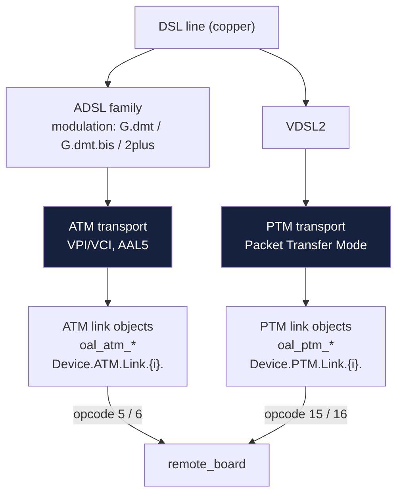
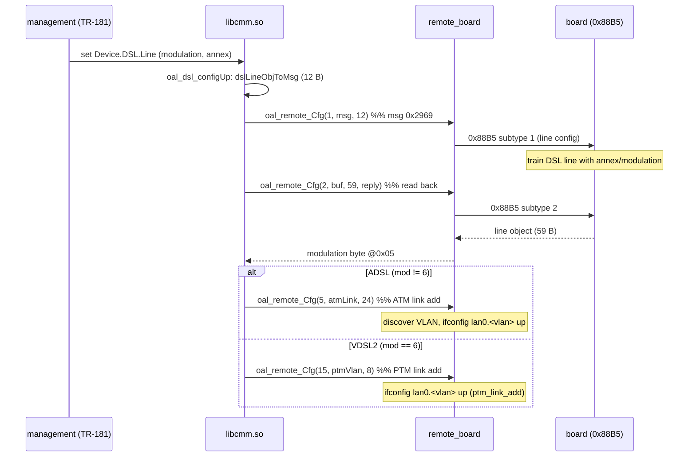

How `libcmm.so` models the DSL stack and maps it onto the remote-board opcodes.
The library implements the **TR-181 Device.DSL data model** (BBF Device:2),
with TP-Link vendor extensions (`X_TP_*`).

## Two layer-2 transports

DSL frames can be carried over two distinct link-layer technologies, selected by
the line's modulation:



| Transport | Used by | libcmm functions | opcodes |
|-----------|---------|------------------|---------|
| **ATM** | ADSL (G.992.x) | `oal_atm_*` | 5 (add), 6 (status/del) |
| **PTM** | VDSL2 (G.993.2) | `oal_ptm_*` | 15 (set VLAN), 16 (del VLAN) |

## ATM layer (`oal_atm_*`)

ATM links are identified by **VPI/VCI** and carry an 802.1Q VLAN tag. Relevant
functions in `./src/oal_dsl_remote.c`:

| Function | Role |
|----------|------|
| `oal_atm_setVlanTag` | Add ATM link + VLAN tag → opcode 5 (24-byte msg: link + QoS + VLAN descriptor) |
| `oal_atm_addTestIntf` | Add a test ATM interface (hardcoded VLAN 2000) → opcode 5 |
| `oal_atm_setAtmIfStatus` (`FUN_00324d38`) | Set ATM interface up/down → opcode 6 |
| `oal_atm_delVlanTag` | Delete ATM VLAN tag → opcode 6 |
| `rsl_atm_vpiVciStrToNum` | Parse `"vpi/vci"` string to numeric |

The VLAN id for ATM links is computed as **`linkObj.vlan + 2000`**, producing
interfaces like `lan0.2000`, `lan0.2001`, … The 24-byte opcode-5 payload is built
by `oal_atm_linkObjToMsg` + `oal_atm_qosObjToMsg` (serialize TR-181
`Device.ATM.Link.{i}.` + `.QoS.` objects).

## PTM layer (`oal_ptm_*`)

PTM (Packet Transfer Mode, RFC 2615/6644) is the VDSL2 packet transport. The
`oal_ptm_*` functions mirror the ATM ones but target
`Device.PTM.Link.{i}.`:

| Function | Role |
|----------|------|
| `oal_ptm_setVlanTag` | Set PTM/VDSL VLAN tag → opcode 15 (8-byte msg) |
| `oal_ptm_delVlanTag` | Delete PTM VLAN tag → opcode 16 (3-byte msg) |
| `oal_ptm_createMainIntf` / `oal_ptm_addIntf` / `oal_ptm_delIntf` | Local interface lifecycle |

PTM opcodes (15, 16) are handled by `ptm_link_add` / `ptm_link_del`, which mirror
the ATM opcodes (5, 6) — forwarding the VLAN config to the board **and** creating
the matching `lan0.<vlan>` interface locally. See [data_plane.md](data_plane.md).

## Annex types

The DSL **annex** defines the frequency band plan (ITU-T G.992.1 annexes).
`libcmm.so` enumerates these (string table at `0x003b0ee0`):

| Annex | Region / use |
|-------|--------------|
| `Annex A` | POTS (worldwide, common) |
| `Annex B` | ISDN (Europe) |
| `Annex I` | POTS, all-digital (spectrum-optimized) |
| `Annex M` | POTS, extended upstream |
| `Annex A/L` | A with L band |
| `Annex A/L/M` | A with L and M bands |
| `Annex B/J` | B with J band |
| `Annex auto` | board selects automatically |

There is also a short list (`0x00349370`) used by the WAN-add path: `Annex A/L`,
`Annex A/L/M`, `Annex M`, `Annex A`, `Annex B`.

Annex is a per-line attribute carried in the **opcode 1** payload
(`oal_dsl_configUp`), serialized from the TP-Link vendor extension
`X_TP_AnnexType`. Debug log:
`"pNewObj:enable=%d, X_TP_ModulationType=%s, X_TP_AnnexType=%s"`.

The annex string is formatted with `"%s%s_Annex_%c"` (`0x003b10c0`) and reported
as `"annexType:%x"` (`0x003b1168`).

## Modulation types

The DSL **modulation** standard. String table at `0x003b0e08`:

| Modulation | Standard |
|------------|----------|
| `ADSL_ANSI_T1.413` | ANSI T1.413 (ADSL1, North America) |
| `ADSL_G.dmt` | G.992.1 (ADSL over POTS) |
| `ADSL_G.lite` | G.992.2 (splitterless ADSL) |
| `ADSL_G.dmt.bis` | G.992.5 (ADSL2+) |
| `ADSL_2plus` | ADSL2+ |
| `ADSL_Multimode` | auto-select among ADSL modes |
| `VDSL2` | G.993.2 (VDSL2) |

### ADSL vs VDSL detection

`oal_dsl_getConfigModulateType` reads the line object via opcode 2, then checks
the modulation byte at response offset **`0x05`**:

```c
*modType = 1;                       // default: ADSL
oal_remote_Cfg(2, buf, 0x3b, expect_reply=1, timeout=3);
if (buf[0x05] == 6) *modType = 2;   // 6 == VDSL2
```

So **modulation code 6 = VDSL2**, anything else = ADSL family. This is what
selects whether ATM (ADSL) or PTM (VDSL) link objects are used downstream.

> Note: `0x3b` is the buffer length passed to `oal_remote_Cfg` (59 bytes), not
> the field offset. The modulation byte is at wire offset `0x05` in the response
> (confirmed in [responses.md](responses.md)).

## Configuration flow (end to end)


