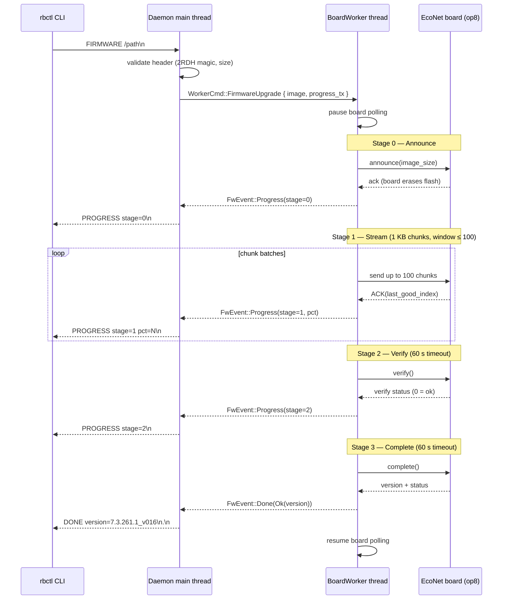

# Firmware Upgrade Implementation Plan

## Overview

Add a `firmware-upgrade` command that lets the CLI send a raw `2RDH`
remote-board firmware image to the daemon, which validates it, uploads it
to the EcoNet board via opcode 8 (4-stage protocol), and reports progress
back to the waiting client.

## Scope

- **Input**: raw `2RDH`/`tclinux.trx` file (the extracted remote-board
  image, 2–8 MB — NOT the full TP-Link container)
- **Protocol**: opcode 8, 4 stages (announce → stream → verify → complete)
- **Exclusivity**: only one upgrade at a time; board polling pauses during
  upload
- **Progress**: CLI receives incremental progress updates over a held-open
  IPC connection

## Architecture



## Implementation steps

### 1. Protocol module: `rbctl_proto/src/firmware.rs`

Frame builders for the 4 opcode-8 stages. Each stage uses the standard
`proto_frame_hdr` (24-byte header, EtherType `0x88B5`, subtype `8`).

```rust
/// Firmware upload stage byte (payload[0]).
pub const STAGE_ANNOUNCE: u8 = 0;
pub const STAGE_STREAM:   u8 = 1;
pub const STAGE_VERIFY:   u8 = 2;
pub const STAGE_COMPLETE: u8 = 3;

/// Chunk size (from host-side analysis).
pub const CHUNK_SIZE: usize = 1024;
/// Max in-flight chunks (sliding window).
pub const WINDOW_SIZE: usize = 100;

/// Build the announce payload: [stage=0, u32 size_be].
pub fn build_announce(image_size: u32) -> [u8; 5];

/// Build a stream payload: [stage=1, u16 chunk_idx_be, chunk_data].
pub fn build_stream(chunk_idx: u16, data: &[u8]) -> Vec<u8>;

/// Build the verify payload: [stage=2].
pub fn build_verify() -> [u8; 1];

/// Build the complete payload: [stage=3].
pub fn build_complete() -> [u8; 1];
```

No new frame types — reuses `build_command_frame` / `parse_response_frame`.

### 2. Board method: `board.rs` — `firmware_upgrade`

```rust
pub struct FwUpgradeResult {
    pub version: u32,
    pub status: u8,
}

pub struct FwProgress {
    pub stage: u8,
    pub chunks_done: u32,
    pub chunks_total: u32,
}

impl<T: Transport> Board<T> {
    pub fn firmware_upgrade(
        &mut self,
        image: &[u8],
        progress: &mut dyn FnMut(FwProgress),
    ) -> Result<FwUpgradeResult, BoardError>;
}
```

**Timeouts** (from host-side `firmware_upgrade` analysis):

| Stage | Timeout | Retries | Notes |
|-------|---------|---------|-------|
| announce | 1500 ms | 5 | board erases flash |
| stream (per ACK) | 300 ms | 20 | 1 KB chunks, window ≤ 100 |
| verify | 60 000 ms | 20 | board checksums full image |
| complete | 60 000 ms | 20 | board finalizes + writes boot flag |

**Stream window logic**:
1. Send up to `WINDOW_SIZE` chunks without waiting
2. Wait for ACK containing `last_good_index`
3. If `ack < base`: board fell behind, resume from `ack`
4. If `ack >= base`: slide window, send next batch

The `progress` callback is called after each ACK and after each stage
transition. The daemon forwards these to the waiting CLI client.

### 3. Firmware header validation: `rbctl_proto/src/firmware.rs`

```rust
pub struct FwHeader {
    pub magic: [u8; 4],        // "2RDH"
    pub header_len: u32,       // BE, should be 256
    pub total_len: u32,        // BE, should match file size
    pub version: String,       // from offset 0x10
    pub kernel_len: u32,       // BE
    pub rootfs_len: u32,       // BE
}

pub const MIN_IMAGE_SIZE: usize = 0x20_0000;  // 2 MB
pub const MAX_IMAGE_SIZE: usize = 0x80_0000;  // 8 MB

pub fn parse_header(data: &[u8]) -> Result<FwHeader, &'static str>;
pub fn validate_image(data: &[u8]) -> Result<FwHeader, &'static str>;
```

Validation checks:
- File starts with `"2RDH"`
- `header_len` == 256
- `total_len` matches file size
- File size in [2 MB, 8 MB] (board rejects outside this range)
- CRC-32/JAMCRC at header offset 0x0C matches content (optional, expensive)

### 4. Worker command channel: `daemon.rs`

Add an `mpsc` command channel from the main thread to `BoardWorker`:

```rust
pub(crate) enum WorkerCmd {
    ReloadConfig(DslConfig),
    RestartLine,
    FirmwareUpgrade {
        image: Vec<u8>,
        // Channel for progress + result back to main thread
        progress_tx: std::sync::mpsc::Sender<FwEvent>,
    },
}

pub(crate) enum FwEvent {
    Progress(FwProgress),
    Done(Result<FwUpgradeResult, String>),
}
```

`BoardWorker::run()` loop changes from a simple `sleep(poll_interval)`
to a `select`-style loop:

```rust
match cmd_rx.recv_timeout(poll_interval) {
    Ok(WorkerCmd::FirmwareUpgrade { image, progress_tx }) => {
        // Pause polling, perform upload, send progress
        let result = board.firmware_upgrade(&image, &mut |p| {
            let _ = progress_tx.send(FwEvent::Progress(p));
        });
        let _ = progress_tx.send(FwEvent::Done(result.map_err(|e| e.to_string())));
        // Resume polling
    }
    Ok(WorkerCmd::ReloadConfig(cfg)) => { ... }
    Ok(WorkerCmd::RestartLine) => { ... }
    Err(Timeout) => { /* normal poll tick */ board.get_line_obj(); }
}
```

### 5. IPC extension: `ipc.rs`

New command and streaming response:

```
Client sends:   FIRMWARE /path/to/remote_board.bin\n
                ────────────────────────────────────
Daemon replies: OK\n
                PROGRESS stage=0\n
                PROGRESS stage=1 pct=10\n
                PROGRESS stage=1 pct=50\n
                ...
                PROGRESS stage=3\n
                DONE version=7.3.261.1_v016 status=0\n
                .\n
                ────────────────────────────────────
Or on error:    ERR: image too small\n
```

Changes:
- `IpcCmd` gains `Firmware(String)` variant (path argument)
- `IpcListener::accept_one` returns a new `IpcAction::FirmwareUpgrade { path }`
- Main thread reads the file, validates header, sends `WorkerCmd::FirmwareUpgrade`
  to worker, then streams `FwEvent` progress back to the IPC client
- The IPC connection stays open during the entire upload (can take minutes)
- Read timeout extended to 10 minutes for `FIRMWARE` command

**Concurrency**: the main thread blocks on the progress channel during
upload. IPC `accept_one` is nonblocking, so other clients that connect
will get `status` responses immediately (served from the cached snapshot).
If a second `FIRMWARE` arrives while one is in progress, respond
`ERR: upgrade already in progress\n`.

### 6. CLI subcommand: `main.rs`

```rust
#[derive(Subcommand)]
enum Command {
    // ... existing variants ...
    /// Upload firmware to the remote board.
    FirmwareUpgrade {
        /// Path to the raw 2RDH firmware image.
        path: PathBuf,
        /// Skip CRC verification (header-only validation).
        #[arg(long)]
        no_verify: bool,
    },
}
```

Dispatch:
```rust
Command::FirmwareUpgrade { path, .. } => {
    ipc_exit_firmware(&path);
}
```

The CLI function:
1. Reads the file locally (for header validation + better error messages)
2. Sends `FIRMWARE <path>` to daemon IPC
3. Streams progress lines to stderr, final result to stdout
4. Exit code 0 on success, 1 on error

### 7. Shared state: `ubus_obj.rs`

Add firmware upgrade status to `SharedState`:

```rust
pub struct SharedState {
    // ... existing fields ...
    pub fw_status: FwStatus,
}

pub enum FwStatus {
    Idle,
    Upgrading { stage: u8, pct: u8 },
}
```

This lets ubus clients query `dsl.fw_status` and CLI `status` to see if
an upgrade is in progress.

## File impact summary

| File | Change |
|------|--------|
| `rbctl_proto/src/firmware.rs` | **NEW** — frame builders, header parser, validation |
| `rbctl_proto/src/lib.rs` | Add `pub mod firmware;` |
| `rbctl_proto/src/unpack.rs` | No change |
| `rbctl_dsl/src/board.rs` | Add `firmware_upgrade()` method |
| `rbctl_dsl/src/daemon.rs` | Add `WorkerCmd` channel, `FwEvent` handling |
| `rbctl_dsl/src/ipc.rs` | Add `Firmware(path)` command, streaming response |
| `rbctl_dsl/src/ubus_obj.rs` | Add `fw_status` field to `SharedState` |
| `rbctl_dsl/src/main.rs` | Add `FirmwareUpgrade` subcommand |

## Testing

1. **Unit tests** (`firmware.rs`): header parsing, validation, announce/stream
   frame builders — pure functions, no I/O
2. **Board mock test** (`board.rs`): mock transport returns canned ACKs for
   each stage; verify chunk windowing and progress callbacks
3. **IPC integration** (`ipc.rs`): mock worker channel, verify progress
   streaming and "already in progress" rejection
4. **Live test** (deferred): requires board hardware

## Error handling

| Error | Source | CLI message |
|-------|--------|-------------|
| Bad header magic | validation | `not a 2RDH firmware image` |
| Size out of range | validation | `image must be 2–8 MB` |
| CRC mismatch | validation | `firmware CRC check failed` |
| Already upgrading | daemon | `upgrade already in progress` |
| Board announce timeout | board | `board did not respond to announce` |
| Board verify failed | board (stage 2 status) | `board firmware verification failed` |
| Board complete failed | board (stage 3 status) | `board reported upgrade failure` |
| File read error | daemon | `cannot read firmware file: <io error>` |

## Design decisions (resolved)

1. **File path, not file contents.** The CLI passes the path to the daemon;
   the daemon reads the file. Both CLI and daemon validate the `2RDH` header
   independently — the CLI gives early feedback for typos/garbage, the daemon
   re-validates to close the TOCTOU window.

2. **Post-upgrade recovery is automatic.** After `complete` succeeds, the
   board reboots. The daemon:
   1. Destroys all data-plane network interfaces (VLAN, bridge) — the board
      is offline and will come back with a potentially different config
   2. Enters a **long-interval polling** state (e.g. 30 s instead of the
      normal poll interval) with a countdown (e.g. 120 s)
   3. During the countdown, attempts `get_line_obj()` — once the board
      responds, declares recovery complete, re-applies the DSL config
      (`line_config_up` + link add), recreates the data-plane VLAN, and
      resumes normal polling
   4. If the countdown expires with no board response, sets status to
      `UpgradingFailed` and logs an error (board may be bricked)

   ```mermaid
   stateDiagram-v2
       [*] --> Normal
       Normal --> Uploading: FIRMWARE command
       Uploading --> Recovering: complete OK (board reboots)
       Uploading --> Normal: error (upload failed)

       Recovering --> Recovering: poll (30s interval, countdown)
       Recovering --> Normal: board responds (re-apply config)
       Recovering --> UpgradingFailed: countdown expired

       UpgradingFailed --> Normal: manual restart / board recovered
   ```

3. **Dual-image: report, don't choose.** The daemon queries the active
   partition before uploading and includes it in the IPC response:
   `OVERWRITE active=tclinux (master)`. The upgrade always writes to the
   active partition and flips the boot flag — same as the stock firmware.
   Partition selection is a future enhancement.

4. **Coarse progress only.** Progress events are emitted on stage
   transitions (announce/stream/verify/complete) and at ~10% granularity
   during streaming — not per-ACK. This keeps the IPC output readable and
   avoids flooding slow terminals.

5. **CLI crash does not abort the upgrade.** The upgrade runs entirely on
   the `BoardWorker` thread. The IPC connection is just an observer — if the
   CLI disconnects, the worker continues and stores the final result in
   `SharedState`. A new CLI can query the result via `status`:
   ```
   fw_status: done
   fw_version: 7.3.261.1_v016
   ```
   or:
   ```
   fw_status: upgrading (stage=1, pct=40)
   ```
