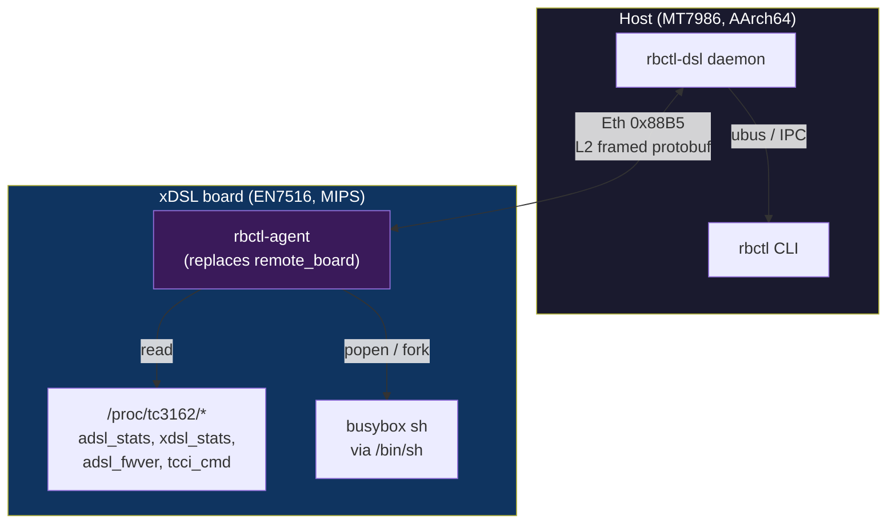
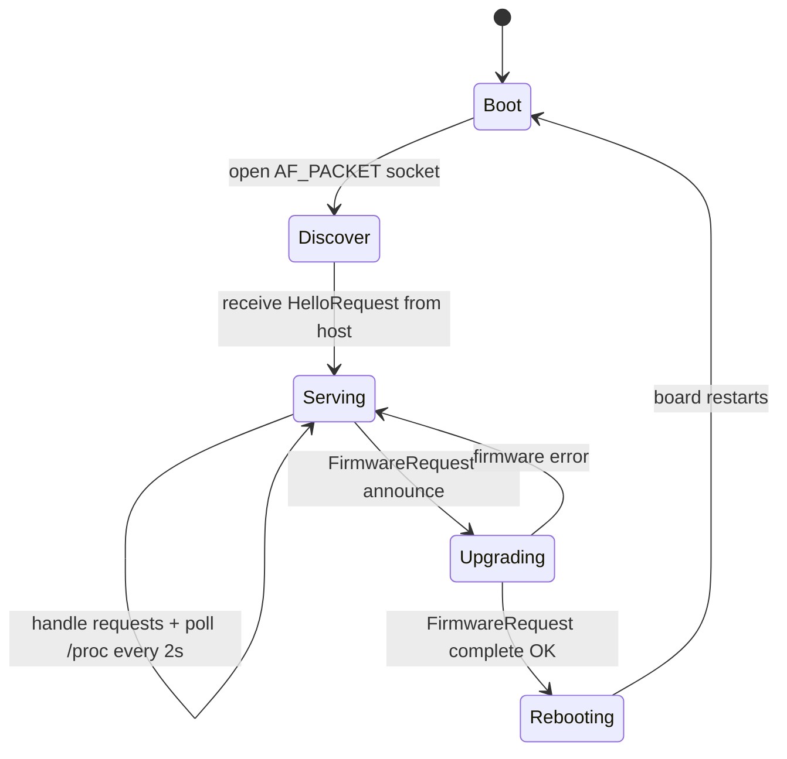

# rbctl xDSL board protocol — protobuf over L2

Design for a new protocol between the host (`rbctl-dsl` daemon) and the EcoNet
xDSL board, intended to **replace** the board-side `remote_board` binary with a
custom agent. Uses **Protocol Buffers** for serialization and runs directly on
**Layer 2** (EtherType) since the board has no IP address.

## Motivation

The OEM protocol (EtherType `0x88B5`, fixed binary payloads) is fully reverse-
engineered but limited:

- Opacity — fixed binary structs, no extensibility, no schema
- Data scarcity — only ~13 aggregate metrics exposed; 40+ fields locked inside
  the DSL driver (`/proc/tc3162/*`) never reach the host
- No remote shell — the board runs Linux but there is no SSH/telnet path from
  the host (the board has no IP stack reachable from the host)

This protocol solves all three by using protobuf (self-describing, extensible)
and adding an optional remote shell channel.

## Design constraints

| Constraint | Detail |
|-----------|--------|
| **No IP** | Board has no IP address; communication is L2 only |
| **EtherType** | Use `0x88B5` (same as OEM) for coexistence during migration, or a new locally-administered EtherType |
| **Transport** | Same raw `AF_PACKET` socket as OEM — no TCP/UDP |
| **Fragmentation** | MTU is ~1500 bytes; large protobuf messages must be chunked |
| **Binary size** | Agent must fit in the board's flash (alongside kernel + rootfs) |
| **Coexistence** | During migration, the agent replaces `/userfs/bin/remote_board` in the `2RDH` image |
| **Toolchain** | Rust + `prost` (protobuf compiler), cross-compiled for `mips-unknown-linux-musl` |

## Protocol layers



## L2 framing

Reuse the existing 24-byte `proto_frame_hdr` (from the OEM protocol) as the L2
envelope, but replace the payload with protobuf-encoded bytes:

```
Offset  Size  Field
0x00    6     dst MAC (board MAC or broadcast for discovery)
0x06    6     src MAC (host interface MAC)
0x0C    2     EtherType 0x88B5 (big-endian)
0x0E    1     magic: 0x50 (PROTOBUF marker, ASCII 'P', distinguishes from OEM 0x11/0x10)
0x0F    1     message_type (see enum below)
0x10    4     sequence (big-endian u32)
0x14    2     payload_len (big-endian u16, protobuf bytes from 0x18 onward)
0x16    2     checksum (CRC-16/ARC, same algorithm as OEM)
0x18    ..    protobuf-encoded Request or Response message
```

The `magic` byte `0x50` (ASCII `'P'` for Protobuf) distinguishes protobuf
frames from OEM frames
(`0x11` command / `0x10` response). This allows the host daemon to support
both protocols simultaneously during migration.

### Why the header is not redundant with protobuf

Protobuf is a **pure serialization format** — it encodes structured data as
bytes and decodes bytes back. It does **not** provide:

| Feature | Protobuf | L2 header | Needed? |
|---------|----------|-----------|---------|
| **Integrity check** | None | CRC-16/ARC | Yes — Ethernet FCS is stripped by NIC before userspace sees the frame |
| **Frame length** | None (stream-oriented) | `payload_len` (u16) | Yes — receiver must know how many bytes to read from a raw socket |
| **Duplicate detection** | None | `sequence` (u32) | Yes — retransmissions can produce duplicate frames |
| **Protocol dispatch** | None | `magic` (0x50) | Yes — distinguish protobuf from OEM on same EtherType |
| **Request/response correlation** | `id` field in messages | `sequence` | Belt-and-suspenders: protobuf `id` handles app-level, header `seq` handles transport-level |

Without the header, a corrupted frame would be fed directly to the protobuf
decoder, which may produce silently wrong data or a cryptic parse error with
no indication of which byte was corrupted.

### EtherType safety — no VoIP conflict

Confirmed via Ghidra analysis of `voip_server_proxy` (host-side AArch64).
The board also runs VoIP daemons, but they use **completely different
EtherTypes**:

| EtherType | Protocol | Magic | Used by |
|-----------|----------|-------|---------|
| `0x88B5` | Board management (OEM + our protobuf) | `0x11`/`0x10` (OEM), `0x50` (protobuf) | `remote_board` |
| `0x88B6` | cmm message bus | varies | `libcmm.so` clients (voip_client, httpd, cos) |
| `0xDD01` | VoIP proxy (direction A) | `0x11` | `voip_server_proxy` |
| `0xDD02` | VoIP proxy (direction B) | `0x11` | `voip_server_proxy` |

All four run on `lan0.500` (VLAN 500), but on different EtherTypes — no
collision. The VoIP proxy uses two unidirectional channels (`0xDD01` and
`0xDD02`), both with magic `0x11`. `voip_client` connects via the cmm bus
(`0x88B6`), not raw sockets.

Our protobuf protocol uses EtherType `0x88B5` + magic `0x50` ('P' for
Protobuf), which is distinct from all three existing protocols.

### Fragmentation

Protobuf messages that exceed the MTU (~1470 bytes of payload after headers)
are split into multiple frames:

```
Frame header gains a fragment flag:
  0x0E bit 0x80 = fragmented
  0x0F bits 0-3 = fragment index (0-15, supports up to 16 frames = ~23 KB)
```

The reassembler collects all fragments with the same sequence number before
decoding the protobuf message.

## Message types

```protobuf
syntax = "proto3";

package rbctl.v1;

// ─── Envelope: every frame carries one of these ───────────────────────

enum MessageType {
  MESSAGE_TYPE_UNSPECIFIED = 0;
  REQUEST                  = 1;
  RESPONSE                = 2;
  EVENT                   = 3;   // async push from board to host
}

// ─── Request ──────────────────────────────────────────────────────────

message Request {
  uint32 id = 1;                    // correlation ID (host-assigned)
  oneof payload {
    HelloRequest          hello          = 10;
    GetLineStatusRequest  line_status    = 11;
    GetLineStatsRequest   line_stats     = 12;
    GetChannelStatsRequest channel_stats = 13;
    ConfigRequest         config         = 14;
    FirmwareRequest       firmware       = 15;
    ShellRequest          shell          = 16;
    GetSpectrumRequest    spectrum       = 17;
    GetDiagnosticsRequest diagnostics    = 18;
    GetBoardInfoRequest   board_info     = 19;
  }
}

// ─── Response ─────────────────────────────────────────────────────────

message Response {
  uint32 id = 1;                    // matches Request.id
  bool   ok = 2;                    // true on success
  string error = 3;                 // human-readable error if !ok
  oneof payload {
    HelloResponse          hello          = 10;
    LineStatusResponse     line_status    = 11;
    LineStatsResponse      line_stats     = 12;
    ChannelStatsResponse   channel_stats  = 13;
    ConfigResponse         config         = 14;
    FirmwareResponse       firmware       = 15;
    ShellResponse          shell          = 16;
    SpectrumResponse       spectrum       = 17;
    DiagnosticsResponse    diagnostics    = 18;
    BoardInfoResponse      board_info     = 19;
  }
}

// ─── Event (async, board → host) ──────────────────────────────────────

message Event {
  oneof payload {
    LinkStatusEvent   link_status   = 1;
    FirmwareProgress  fw_progress   = 2;
  }
}
```

## Message definitions

### Hello / Discovery

```protobuf
message HelloRequest {}

message HelloResponse {
  string  agent_version     = 1;   // agent build version
  string  board_hw_version  = 2;   // from /proc/tc3162/ or SoC ID
  string  dsl_fw_version    = 3;   // from /proc/tc3162/adsl_fwver
  string  kernel_version    = 4;   // uname -r
  uint32  uptime_secs       = 5;   // board uptime
  MacAddress board_mac      = 6;
  string  active_partition  = 7;   // "tclinux" or "tclinux_slave"
  RepeatedString capabilities = 8; // "shell", "spectrum", "vectoring", ...
}

message MacAddress {
  bytes mac = 1;  // 6 bytes
}
```

### Line status (replaces opcode 2)

```protobuf
message GetLineStatusRequest {}

message LineStatusResponse {
  // ── Basic ──
  LinkState       link_state    = 1;
  ModulationType  modulation    = 2;
  DataPath        data_path     = 3;   // ATM or PTM
  AnnexType       annex         = 4;
  uint32          uptime_secs   = 5;   // current session

  // ── Rates (kbps) ──
  DirectionalU32  current_rate       = 10;
  DirectionalU32  attainable_rate    = 11;
  PerChannelRates per_channel_rates  = 12;

  // ── Signal metrics (dB × 10) ──
  DirectionalU32  noise_margin   = 20;
  DirectionalU32  attenuation    = 21;
  DirectionalU32  output_power   = 22;
  DirectionalU32  snr_margin     = 23;  // alias for noise_margin

  // ── Error counters (cumulative since link-up) ──
  DirectionalU32  crc_errors     = 30;
  DirectionalU32  fec_errors     = 31;
  DirectionalU32  hes_errors     = 32;
  PerChannelErrors per_channel_errors = 33;

  // ── Error seconds ──
  DirectionalU32  es   = 40;  // errored seconds
  DirectionalU32  ses  = 41;  // severely errored seconds
  DirectionalU32  uas  = 42;  // unavailable seconds
  DirectionalU32  los  = 43;  // loss of signal seconds
  DirectionalU32  lof  = 44;  // loss of frame seconds
  DirectionalU32  lpr  = 45;  // loss of power seconds

  // ── Far-end identification ──
  FarEndInfo     far_end        = 50;

  // ── Vectoring / G.INP ──
  VectoringInfo  vectoring      = 60;
  GinpInfo       ginp           = 61;

  // ── INP / delay ──
  DirectionalU32  inp_symbols    = 70;  // impulse noise protection
  DirectionalU32  interleave_delay_us = 71;

  // ── VDSL2 ──
  uint32          vdsl2_profile_bitmask = 80;
  BandPlan        band_plan              = 81;

  // ── Raw timestamp ──
  uint64          stats_timestamp = 90; // when the stats were read
}

// ─── Shared types ──

enum LinkState {
  LINK_STATE_UNSPECIFIED  = 0;
  NO_SIGNAL               = 1;
  HANDSHAKE               = 2;
  TRAINING                = 3;
  SHOWTIME                = 4;  // = Up
}

enum ModulationType {
  MODULATION_UNSPECIFIED  = 0;
  ADSL_T1413              = 1;
  ADSL_GDMT               = 2;
  ADSL_GLITE              = 3;
  ADSL2                   = 4;
  ADSL2PLUS               = 5;
  VDSL2                   = 6;
}

enum DataPath {
  DATA_PATH_UNSPECIFIED = 0;
  ATM                   = 1;
  PTM                   = 2;
}

enum AnnexType {
  ANNEX_UNSPECIFIED = 0;
  A                 = 1;
  B                 = 2;
  I                 = 3;
  M                 = 4;
}

message DirectionalU32 {
  uint32 downstream = 1;
  uint32 upstream   = 2;
}

message PerChannelRates {
  // Separate fast/interleaved channel rates (both directions)
  uint32 ds_fast       = 1;
  uint32 ds_interleaved = 2;
  uint32 us_fast       = 3;
  uint32 us_interleaved = 4;
}

message PerChannelErrors {
  PerChannelDirection near_end = 1;
  PerChannelDirection far_end  = 2;
}

message PerChannelDirection {
  uint32 crc_fast         = 1;
  uint32 crc_interleaved  = 2;
  uint32 fec_fast         = 3;
  uint32 fec_interleaved  = 4;
  uint32 hes_fast         = 5;
  uint32 hes_interleaved  = 6;
}

message FarEndInfo {
  uint32 vendor_id       = 1;   // ATU-R vendor ID (EOC)
  bytes  vendor_id_raw   = 2;   // full 8-byte vendor ID
  uint32 standard_version = 3;  // ITU-T standard version code
  string vendor_name     = 4;   // decoded vendor name if known
  string country_code    = 5;   // if reported
}

message VectoringInfo {
  bool   enabled          = 1;
  bool   active           = 2;
  uint32 sync_detected    = 3;   // G.vector synchronization
  string vector_profile   = 4;   // e.g. "R-Vector1_2"
}

message GinpInfo {
  bool   enabled          = 1;
  uint32 actual_inp       = 2;   // actual impulse noise protection
  uint32 dtu_tx_count     = 3;   // transmitted DTUs
  uint32 dtu_rx_count     = 4;   // received DTUs
  uint32 dtu_err_count    = 5;   // errored DTUs
}

message BandPlan {
  string profile          = 1;   // "17a", "30a", "35b", "12a", "8b", "8d"
  repeated Band bands     = 2;
}

message Band {
  uint32 index            = 1;
  uint32 start_tone       = 2;
  uint32 end_tone         = 3;
  uint32 psd_max          = 4;   // dBm/Hz
  uint32 tone_count       = 5;
}
```

### Line stats (replaces opcode 4, extended)

```protobuf
message GetLineStatsRequest {
  bool include_far_end = 1;
  bool include_retransmission = 2;
}

message LineStatsResponse {
  // ── Near-end (this ATU-R) ──
  NearFarStats near_end = 1;
  // ── Far-end (ATU-C / DSLAM) ──
  NearFarStats far_end  = 2;

  // ── Retransmission (G.INP / ARQ) ──
  RetransmissionStats retransmission = 3;

  // ── Aggregate counters ──
  uint32 total_act_seconds      = 10;  // cumulative across sessions
  uint32 current_act_seconds    = 11;  // current session
}

message NearFarStats {
  uint32 crc_fast          = 1;
  uint32 crc_interleaved   = 2;
  uint32 fec_fast          = 3;
  uint32 fec_interleaved   = 4;
  uint32 hes_fast          = 5;
  uint32 hes_interleaved   = 6;
  uint32 es                = 7;   // errored seconds
  uint32 ses               = 8;   // severely errored seconds
  uint32 uas               = 9;   // unavailable seconds
  uint32 los               = 10;  // loss of signal seconds
  uint32 lof               = 11;  // loss of frame seconds
  uint32 fast_rate         = 12;  // kbps
  uint32 interleaved_rate  = 13;  // kbps
  uint32 path0_crc         = 14;
  uint32 path0_fec         = 15;
  uint32 path1_crc         = 16;
  uint32 path1_fec         = 17;
}

message RetransmissionStats {
  uint32 tx_dtu_count      = 1;
  uint32 rx_dtu_count      = 2;
  uint32 correct_dtu       = 3;
  uint32 errored_dtu       = 4;
  uint32 error_free_bits   = 5;
  uint32 min_throughput    = 6;   // min error-free throughput rate
  uint32 actual_throughput = 7;   // actual error-free throughput rate
  uint32 rein_value        = 8;   // REIN impulse noise value
  uint32 shine_value       = 9;   // SHINE impulse noise value
  uint32 act_delay_rtx_us  = 10;  // retransmission delay (µs)
}
```

### Channel stats (replaces opcode 4 fallback)

```protobuf
message GetChannelStatsRequest {}

message ChannelStatsResponse {
  uint32 status           = 1;
  uint32 receive_blocks   = 2;
  uint32 receive_errors   = 3;
  uint32 receive_discards = 4;
  uint32 transmit_blocks  = 5;
  uint32 transmit_errors  = 6;
  uint32 transmit_discards = 7;
}
```

### Spectrum data (NEW — per-tone graphs)

```protobuf
message GetSpectrumRequest {
  // Request specific data types
  bool snr_per_tone   = 1;
  bool bits_per_tone  = 2;
  bool hlog           = 3;   // loop transfer function
  bool qln            = 4;   // quiet line noise
}

message SpectrumResponse {
  ToneData snr   = 1;   // SNR per tone (dB, ×100)
  ToneData bits  = 2;   // bit allocation per tone (0-15)
  ToneData gain  = 3;   // gain per tone
  ToneData hlog  = 4;   // Hlog per tone (dB, ×100)
  ToneData qln   = 5;   // QLN per tone (dBm/Hz, ×100)
}

message ToneData {
  uint32 start_tone    = 1;
  uint32 tone_count    = 2;
  uint32 tone_spacing  = 3;   // kHz (4.3125 for ADSL, 8.0 for VDSL2 US0)
  // Packed values — one int32 per tone (big-endian on wire, protobuf handles encoding)
  repeated sint32 values = 4 [packed = true];
}
```

### Config (replaces opcodes 1, 5/6, 15/16)

```protobuf
message ConfigRequest {
  oneof action {
    LineConfig     line_config     = 1;
    AtmLinkConfig  atm_link_add    = 2;
    AtmLinkOp      atm_link_del    = 3;
    PtmLinkConfig  ptm_link_add    = 4;
    PtmLinkOp      ptm_link_del    = 5;
    LineOp         line_retrain    = 6;
    LineOp         line_reset      = 7;
  }
}

message LineConfig {
  // ── Basic (already in OEM opcode 1) ──
  ModulationType modulation     = 1;
  AnnexType      annex          = 2;
  bool           bitswap        = 3;
  bool           sra            = 4;
  uint32         vdsl2_profile  = 5;

  // ── SNRM tuning ──
  // Offset from DSLAM-default target SNRM, in tenths of dB.
  // Negative = lower target = attempt higher rate.
  // 0 = no offset (use DSLAM default).
  // Example: -30 = lower target by 3.0 dB.
  // Agent converts to dB×512 internally: db512 = value * 512 / 10.
  int32          snrm_offset_db_tenths = 6;

  // ── Rate capping ──
  // 0 = no cap (use profile maximum).
  uint32         max_ds_rate_kbps  = 10;
  uint32         max_us_rate_kbps  = 11;

  // ── Vectoring ──
  // 0 = off, 1 = on. Auto-negotiated with DSLAM during training.
  uint32         vectoring_mode  = 20;
}

// AdvancedConfig covers rarely-changed parameters that are not part of the
// main LineConfig. Accessible via a separate request type so the main config
// stays simple. The host CLI can expose these as `rbctl advanced set <key>`.
message AdvancedConfig {
  oneof param {
    int32  target_snrm_db_tenths      = 1;  // absolute target SNRM (overrides offset)
    int32  min_snrm_db_tenths         = 2;  // minimum SNRM floor before relink
    uint32 inp_min_symbols            = 3;  // impulse noise protection
    uint32 max_interleave_delay_us    = 4;
    bool   upbo_enabled               = 5;  // upstream power backoff
    int32  tx_power_limit_dbm_tenths  = 6;  // TX power cap
    bool   rfi_cancel                 = 7;  // RFI cancellation
    uint32 ginp_mode                  = 8;  // 0=auto, 1=force on, 2=off
    bool   sos_enabled                = 9;  // save our showtime
    ToneBlackout blackout             = 10; // disable tone range
    TcciRaw tcci_cmd                  = 11; // raw chipset command passthrough
  }
}

message ToneBlackout {
  uint32 start_tone = 1;
  uint32 end_tone   = 2;
}

// Raw tcci_cmd passthrough for power users / debugging.
// The agent writes the command string to /proc/tc3162/tcci_cmd and
// returns any output. This is the escape hatch for any chipset parameter
// not covered by the structured fields above.
message TcciRaw {
  string command = 1;   // e.g. "wan vdsl2 set bs_param 60 6 100 10 32 256"
}

message AtmLinkConfig {
  uint32 vpi       = 1;
  uint32 vci       = 2;
  uint32 encap     = 3;  // 0=LLC, 1=VCMUX
  uint32 link_type = 4;  // 0=EoA, 6=PPPoA, 7=IPoA
  uint32 qos       = 5;  // 0=UBR, 1=CBR, 2=VBR
  uint32 pcr       = 6;
  uint32 scr       = 7;
  uint32 mbs       = 8;
  uint32 vlan_id   = 9;  // 2000-2007
}

message PtmLinkConfig {
  bool   tag_enable = 1;
  uint32 tag_vid    = 2;
  uint32 tag_pri    = 3;
  uint32 vlan_id    = 4;  // 2000-2007
}

message AtmLinkOp { uint32 vlan_id = 1; uint32 cmd = 2; }
message PtmLinkOp { uint32 vlan_id = 1; uint32 cmd = 2; }
message LineOp    {}  // no parameters

message ConfigResponse {
  bool   ok      = 1;
  string error   = 2;
  uint32 vlan_id = 3;  // board-assigned VLAN for link add operations
}
```

### Firmware upgrade (replaces opcode 8)

```protobuf
message FirmwareRequest {
  oneof stage {
    FirmwareAnnounce   announce  = 1;
    FirmwareChunk      chunk     = 2;
    FirmwareVerify     verify    = 3;
    FirmwareComplete   complete  = 4;
  }
}

message FirmwareAnnounce {
  uint32 image_size = 1;
}

message FirmwareChunk {
  uint32 chunk_index = 1;
  bytes  data        = 2;  // up to 1024 bytes
}

message FirmwareVerify   {}
message FirmwareComplete {}

message FirmwareResponse {
  uint32 stage            = 1;
  bool   ok               = 2;
  uint32 last_good_chunk  = 3;  // for stream ACK
  uint32 version          = 4;  // for complete
  string error            = 5;
}
```

### Remote shell (NEW)

```protobuf
message ShellRequest {
  oneof action {
    ShellOpen   open  = 1;
    ShellData   data  = 2;
    ShellResize resize = 3;
    ShellClose  close = 4;
  }
}

message ShellOpen {
  uint32 rows = 1;
  uint32 cols = 2;
  string term = 3;  // e.g. "xterm" (default: "vt100")
}

message ShellData {
  bytes stdin = 1;   // host → board
}

message ShellResize {
  uint32 rows = 1;
  uint32 cols = 2;
}

message ShellClose {}

message ShellResponse {
  uint32 session_id = 1;  // identifies the shell session
  bytes  stdout     = 2;  // board → host
  bool   exited      = 3;
  int32  exit_code   = 4;
}
```

The shell is implemented via `forkpty()` + `execve("/bin/sh")` on the board.
The agent multiplexes shell data with status polling on the same L2 socket.
A sliding window or simple ACK scheme prevents flooding the board's CPU.

### Diagnostics (NEW — loop diagnostic mode)

```protobuf
message GetDiagnosticsRequest {
  bool run_hlog = 1;   // trigger Hlog measurement
  bool run_qln  = 2;   // trigger QLN measurement
}

message DiagnosticsResponse {
  ToneData hlog        = 1;
  ToneData qln         = 2;
  bool     in_progress = 3;  // true if measurement still running
}
```

### Board info (NEW — environmental / hardware)

```protobuf
message GetBoardInfoRequest {}

message BoardInfoResponse {
  // ── Temperatures ──
  int32  cpu_temp_celsius    = 1;   // SoC temperature (from cputempmgr)
  int32  dsl_chip_temp_celsius = 2; // DSL chipset internal temp (from driver, if available)

  // ── Flash / dual-image ──
  string active_partition    = 10;  // "tclinux" or "tclinux_slave"
  bool   dual_image_supported = 11;
  FlashPartition tclinux      = 12;
  FlashPartition tclinux_alt  = 13;

  // ── Boot info ──
  uint32 boot_index           = 20;  // current boot image (0=master, 1=slave)
  uint32 boot_flag            = 21;  // raw boot flag value

  // ── Memory ──
  uint32 mem_total_kb         = 30;
  uint32 mem_free_kb          = 31;

  // ── Load average ──
  float  load_1min            = 40;
  float  load_5min            = 41;
  float  load_15min           = 42;

  // ── DSL chipset firmware ──
  string dsl_chipset_fw       = 50;  // from /proc/tc3162/adsl_fwver
  string dsl_chipset_hw       = 51;  // dmt_hw_version
  uint32 cnxt_version         = 52;  // Conexant firmware version code

  // ── Port status (internal switch) ──
  repeated PortStatus ports   = 60;  // per-port link/speed/state

  // ── OAM ping result (ATM only) ──
  OamPingResult oam_ping      = 70;
}

message FlashPartition {
  string name        = 1;  // e.g. "tclinux"
  uint32 offset      = 2;  // bytes
  uint32 size        = 3;  // bytes
  bool   is_active   = 4;
  bool   is_committed = 5;
  bool   is_valid    = 6;
}

message PortStatus {
  uint32 index    = 1;
  bool   link_up  = 2;
  uint32 speed_mbps = 3;
  bool   power_gated = 4;  // port is powered down
}

message OamPingResult {
  bool   enabled    = 1;
  bool   success    = 2;
  uint32 rtt_ms     = 3;
  string endpoint   = 4;
}
```

### Async events (board → host push)

```protobuf
message LinkStatusEvent {
  LinkState    old_state = 1;
  LinkState    new_state = 2;
  uint64       timestamp = 3;
}

message FirmwareProgress {
  uint32 stage = 1;
  uint32 pct   = 2;
}
```

## Capabilities negotiation

The host calls `HelloRequest` first. The response lists supported capabilities:

```
capabilities: ["shell", "spectrum", "vectoring", "ginp", "diagnostics",
               "board_info", "snrm_offset", "rate_cap", "upbo", "oam_ping"]
```

If the board agent doesn't support a feature (e.g., older build), the host
falls back gracefully. This allows incremental deployment.

## Error handling

All responses carry `ok` + `error`:

```protobuf
// Success
{ id: 42, ok: true, line_status: { ... } }

// Failure
{ id: 42, ok: false, error: "/proc/tc3162/adsl_stats: no such file" }
```

Host behavior on `!ok`: log the error, report degraded status via ubus/IPC,
retry on next poll cycle.

## Security

| Concern | Mitigation |
|---------|-----------|
| **Unauthorized shell** | Agent only accepts shell requests from the host MAC address (learned during Hello exchange) |
| **Firmware tampering** | Agent verifies `2RDH` CRC-32/JAMCRC before writing to flash |
| **Resource exhaustion** | Shell session has idle timeout (5 min); max 1 concurrent session |
| **Replay attacks** | Sequence numbers + CRC (same as OEM); not cryptographic security but matches the L2 trust model |

The L2 link between host and board is a **private point-to-point Ethernet**
(VLAN 1 over the internal connector). There is no external network path to the
board. MAC-based filtering is sufficient within this threat model.

## Agent lifecycle



## File layout (agent crate)

```
rbctl-agent/                 (MIPS cross-compiled, static musl)
├── Cargo.toml
├── proto/
│   └── rbctl.proto          (this schema)
├── src/
│   ├── main.rs              (entry: socket, event loop)
│   ├── transport.rs         (L2 frame encode/decode + fragmentation)
│   ├── handler.rs           (request dispatch)
│   ├── dsl_stats.rs         (/proc/tc3162/* reader + parser)
│   ├── spectrum.rs          (tcci_cmd show snr/bitgain/hlog/qln)
│   ├── shell.rs             (forkpty + /bin/sh session)
│   └── firmware.rs          (2RDH validate + flash write)
└── build.rs                 (prost protobuf compilation)
```

## Host-side integration (rbctl-dsl)

The `rbctl-dsl` daemon gains a new mode: **protobuf backend** (alongside the
existing OEM backend). A `--backend protobuf` flag or UCI option selects
which protocol to use. The daemon's public API (ubus, IPC, CLI) stays
identical — only the board communication layer changes.

```
┌─────────────────────────────────────┐
│         rbctl-dsl daemon            │
│  ┌───────┐  ┌───────┐  ┌─────────┐ │
│  │ ubus  │  │  IPC  │  │ CLI API │ │
│  └───┬───┘  └───┬───┘  └────┬────┘ │
│      └──────────┴───────────┘      │
│                 │                   │
│         ┌───────┴───────┐           │
│         │  BoardClient  │           │
│         └───────┬───────┘           │
│           ┌─────┴─────┐             │
│           │           │             │
│     ┌─────┴───┐ ┌────┴──────┐      │
│     │OEM 0x88B5│ │Protobuf   │      │
│     │(existing)│ │0x88B5+0x50│      │
│     └──────────┘ └───────────┘      │
└─────────────────────────────────────┘
```

## Migration path

1. **Phase 1**: Build agent, test on board via UART (serial console). Agent
   runs as a second process alongside OEM `remote_board`.
2. **Phase 2**: Build custom `2RDH` firmware image with agent replacing
   `remote_board`. Flash via opcode 8. Host daemon runs in protobuf mode.
3. **Phase 3**: Full feature set — spectrum graphs, remote shell, vectoring
   status. OEM protocol removed from host daemon.
