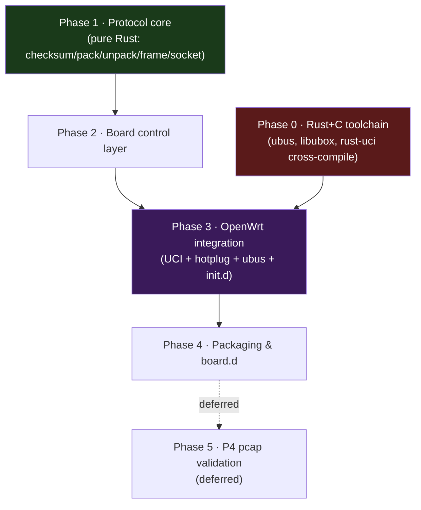

# Implementation Plan — `rbctl-dsl` daemon (Rust)

Build a Rust daemon that configures the EcoNet xDSL board over `0x88B5` and
integrates with OpenWrt (UCI / hotplug / ubus / init.d), replacing the
proprietary `remote_board` + `libcmm.so` + `wanConfWind3` stack on a mainline
kernel.

Protocol specifics live in [reverse-engineering-plan.md](reverse-engineering-plan.md) (RE) + [examples/](../examples/)
(reference code) + [openwrt.md](../docs/openwrt.md) (integration contract). This doc is
the **build plan**.

## Non-goals (out of scope)

- **Firmware update (opcode 8)** — excluded.
- Per-tone statistics / SNR tuning / power / OLR / vectoring control — the board
  doesn't expose them (see [openwrt.md](../docs/openwrt.md) §4.4).
- Kernel DSL driver — none needed (data plane = stacked VLAN on `lan0`, §5.4).
- **P4 pcap validation** — deferred to Phase 5 (needs shell access).

## Scope boundary — what the daemon owns vs. doesn't

| In scope (the daemon does this) | Out of scope (someone else's job) |
|---------------------------------|-----------------------------------|
| Board config over `0x88B5` (line up/down, ATM/PTM link, VLAN tags) | WAN protocol — PPPoE/DHCP/IP assignment, routes |
| Create/destroy the full `lan0` VLAN stack (outer + inner) | netifd integration — netifd is **not** used for xDSL |
| Poll line state + emit hotplug events (§3) | Firmware update (opcode 8) |
| Publish the ubus `dsl` object (§4) | Per-tone stats / SNR tuning / vectoring |
| Read its UCI config + init.d reload | LEDs (handled by the reused `led_dsl.sh` on our events) |

> **The WAN-protocol boundary is deliberate.** The daemon brings the DSL line up
> and surfaces the `lan0.<2xxx>.<isp>` interface + a `DSL_INTERFACE_STATUS=UP`
> event. Whatever runs PPPoE/DHCP on that interface is a **separate** layer
> (external tooling, a standalone `pppd`, or — if the operator chooses — a
> generic netifd `network.wan` binding to the device). The daemon neither calls
> netifd nor launches `pppd`; it is a **DSL configuration daemon**, not a WAN
> manager. This mirrors the original firmware, where `libcmm` configured the line
> and `oal_wan_initPPPoE` was a separate concern.

> **Standalone model validated upstream.** The Lantiq reference
> (`ltq-vdsl-vr9-app`) confirms DSL daemons don't integrate with netifd either —
> see the footnote in [openwrt.md](../docs/openwrt.md) §5.4. xDSL is not a
> netifd-managed protocol.

## Distribution — external OpenWrt feed

The `rbctl-dsl` package (daemon binary + init script + board.d) together with
its vendored Rust crates is delivered as a **custom external feed** — **not**
submitted to OpenWrt mainline.

**Why external, not mainline:**
- The C-binding crates (`ubus`, `libubox`, `rust-uci`) are not in the OpenWrt
  package feed and must be vendored into the build — mainline doesn't ship them.
- The target is a specific vendor board (EcoNet over the proprietary `0x88B5`
  protocol); the wire format is not generally reusable upstream.
- The data plane assumes a non-standard topology (external board on `lan0`,
  QinQ stacked VLANs) that does not fit the mainline DSL abstraction (which
  expects a SoC DSL driver registering `dsl0`).

**Feed layout:**
```
rbctl-feed/                       (the external feed repo)
└── rbctl-dsl/                    (the OpenWrt package)
    ├── Makefile                  (Phase 4 — cargo build, DEPENDS, install)
    ├── Cargo.toml                (workspace)
    ├── crates/                   (rbctl_proto, rbctl_dsl, + vendored ubus/libubox/rust-uci)
    └── files/                    (init script, board.d)
```

**Consuming it in a buildroot/SDK:**
```sh
echo "src-link rbctl /path/to/rbctl-feed" >> feeds.conf
./scripts/feeds update rbctl
./scripts/feeds install rbctl-dsl
make package/rbctl-dsl/compile V=s     # → bin/.../rbctl-dsl_<ver>_aarch64_cortex-a53.ipk
```
The package then appears under the `rbctl` feed in `make menuconfig` and can be
added to a device profile via `DEVICE_PACKAGES`.

**Plan implication:** Phase 4 (packaging) targets this external-feed layout, not
an OpenWrt pull request. Mainlining is a separate, later effort and would
require generalizing beyond the EcoNet board plus resolving the crate vendoring
(upstream `ubus`/`libubox`/`rust-uci` Rust crates or hand-written FFI).

## Dependency graph — phases complete in order



> **Hard gate:** Phase 3 requires **both** Phase 0 (the UCI/ubus crates must
> link) **and** Phase 2 (the board must answer). **Phase 0 and Phase 1 are
> independent — run them in parallel.** Do not begin a phase until its
> predecessors' gate criteria are met.

## Workspace layout

```
rbctl-dsl/                      (OpenWrt package root)
├── Cargo.toml                  (workspace)
├── crates/
│   ├── rbctl_proto/            (Phase 1 — pure-Rust protocol lib, ZERO C deps)
│   ├── rbctl_dsl/              (Phase 2/3 — the daemon binary)
│   ├── ubus/        }          (Phase 0 — vendored, C-bound)
│   ├── libubox/     }          (Phase 0 — vendored, C-bound)
│   └── rust-uci/    }          (Phase 0 — vendored, C-bound)
├── files/
│   ├── rbctl_dsl.init          (Phase 3/4 → /etc/init.d/dsl_control)
│   └── board.d/02_network      (Phase 4)
└── Makefile                    (Phase 4 — OpenWrt package)
```

The three C-binding crates are vendored into the workspace because OpenWrt's
cargo build is **offline** (`cargo vendor`); they are not in the SDK.

---

## Phase 0 — Rust + C cross-compile toolchain (PREREQUISITE)

**Why first, and why it can block everything:** every UCI/ubus feature in Phase
3 links against OpenWrt's C libraries through these crates. If they fail to
cross-compile, the integration strategy itself changes — so prove they build
**before** writing any integration code.

**Target:** `aarch64-unknown-linux-musl` (MT7986 Cortex-A53, matches the device
toolchain `…_aarch64_cortex-a53_gcc-8.4.0_musl`).

**Tasks**
1. In the OpenWrt SDK, build/stage the C libraries: **libubox**, **libubus**,
   **libuci** (standard packages; `libubus`/`libuci` both depend on `libubox`).
   Confirm `.so` + headers under
   `staging_dir/target-aarch64_cortex-a53_musl/usr/{lib,include}`.
2. `rustup target add aarch64-unknown-linux-musl`.
3. Cross-link config — `.cargo/config.toml`:
   ```toml
   [target.aarch64-unknown-linux-musl]
   linker = "<sdk>/staging_dir/toolchain-…_aarch64_cortex-a53_gcc-8.4.0_musl/bin/aarch64-openwrt-linux-musl-gcc"
   rustflags = ["-L<staging>/usr/lib"]
   ```
4. Vendor the three crates into `crates/`; set `BINDGEN_EXTRA_CLANG_ARGS` to the
   staged `usr/include` so bindgen finds `<libubox/...>`, `<libubus/...>`,
   `<libuci.h>`.
5. `cargo vendor` the whole workspace (offline build).

**GATE (must pass before Phase 3):** a ~20-line binary that
(a) opens a `Uci` context via `rust-uci`, (b) connects to ubus via the `ubus`
crate, (c) runs one `uloop` iteration — **compiles, links, and runs on the
target without crashing**. If bindgen or linking fails here, **stop** and either
fix the crate or replace it with a hand-written FFI before proceeding.

---

## Phase 1 — Protocol core library (pure Rust, no C deps)

**Why:** the board protocol is self-contained and fully unit-testable on the
host with no target hardware and no C crates. Do this in parallel with Phase 0.

**Deliverable:** `crates/rbctl_proto` — a library (no C dependencies, so it
builds on the dev host).

**Tasks (port from the reference implementations)**
1. `checksum.rs` ← [`examples/checksum.py`](../examples/checksum.py) — CRC-16/ARC
   nibble table, `set_checksum` / `verify_checksum`.
2. `pack.rs` ← [`examples/pack.py`](../examples/pack.py) — `pack_dsl_line` /
   `pack_atm_link` / `pack_ptm_link` / `pack_link_del` + enum tables. Note
   `pack_dsl_line` takes `bitswap: bool` and `sra: bool` (opcode-1 bytes
   `[0x02]`/`[0x03]` — resolved as `X_TP_BitswapEnable`/`X_TP_SRAEnable`).
   The modulation/annex/profile tables here (sourced from
   [modulation_annex.md](../docs/xdsl/modulation_annex.md)) feed `validate.rs`
   below.
3. `validate.rs` — `validate_line_config(modulation, annex, profile)` enforcing
   the modulation × annex × profile compatibility rules in §3a.1. Pure enum
   logic, no I/O; unit-testable on the host.
4. `unpack.rs` ← [`examples/unpack.py`](../examples/unpack.py) —
   `unpack_line_obj` / `unpack_channel_stats`.
5. `frame.rs` — `proto_frame_hdr` builder (24-byte header, big-endian), sequence
   counter, magic `0x11` = command (TX) / `0x10` = response (RX).
6. `socket.rs` — `AF_PACKET`/`SOCK_RAW`, bind `lan0.<vlan>`, simple BPF
   (EtherType `0x88B5` + src-MAC match), send/recv with timeout + retransmit,
   MAC-learning handshake (broadcast → learn board MAC → unicast).
7. Unit tests: the checksum vector `0x1ea0`, pack→unpack round-trips, frame
   build+verify, plus the §3a.1 validation matrix.

**GATE:** `cargo test -p rbctl_proto` green on the dev host. (Socket/framing
tests may be feature-gated or use a netns loopback.)

---

## Phase 2 — Board control layer (depends on Phase 1)

**Deliverable:** a `Board` struct (`crates/rbctl_dsl/src/board.rs`) wrapping the
live opcodes, plus outer-transport VLAN management.

**Tasks**
1. Implement the opcodes on top of `rbctl_proto`:
   - `line_config_up(mod, annex, bitswap, sra, profile)` → op 1; `line_config_down()` → op 3
   - `get_line_obj()` → op 2 → `LineObj`; `get_channel_stats()` → op 4 → `ChannelStats`
   - `atm_link_add(...)` → op 5; `atm_link_del(vlan)` → op 6
   - `ptm_link_add(...)` → op 15; `ptm_link_del(vlan)` → op 16
2. **Transport VLAN management (outer only):** create/destroy `lan0.<vlanid>`
   via netlink (`tinyln-rs` wrapping libnl-tiny — `RtnlLink::add_vlan` / `del` /
   `set_up` / `set_down`). The transport VLAN id follows the vendor rule:
   **`vlanid = baseIndex + 2000`**, range **2000–2007** (enforced by
   `oal_vlanIdFromIfName` in the original). The base index (0–7) is a
   per-connection value from UCI (`transport_vlan` option, default `0` → VLAN
   2000). QinQ inner ISP VLAN is handled by **netifd**, not us.
3. **Line-state poller:** poll op 2 every ~1 s; produce a stream of `LineState`
   transitions (`NoSignal` / `Up` / `Initializing` / `EstablishingLink`).

> **Design decision — daemon owns outer transport VLAN only.** The daemon creates
> the outer transport VLAN (`lan0.<2xxx>`) via netlink. QinQ inner ISP VLAN stacking
> (`lan0.<2xxx>.<isp>`) is handled by **netifd**. The config interface (e.g.
> `lan0.500`) is passed as `--config-iface` and already exists. Two new crates:
>
> | Crate | Purpose | Depends on |
> |-------|---------|------------|
> | `af_packet` | AF_PACKET raw Ethernet socket (BPF filter, bind, TX/RX) | libc only |
> | `tinyln-rs` (+`tinyln-rs-sys`) | Safe wrapper for OpenWrt libnl-tiny (VLAN, interface mgmt) | libnl-tiny |

**GATE:** against the real board (or recorded frame fixtures until hardware
access): the line trains, op 2 returns `Up`, the transport interface appears and
disappears on up/down. **Do not start Phase 3 until op 2 round-trips.**

---

## Phase 3 — OpenWrt integration (depends on Phase 0 **and** Phase 2)

Four sub-components; each independently testable.

### Daemon runtime structure

Single binary, one `uloop` (libubox) runloop, a small thread/task layout:

```
rbctl-dsl (main)
├── uloop ──────────────────────────── the single event runloop (libubox)
├── board task (Phase 2)
│   ├── line-state poller: op 2 every ~1 s ──► LineState events
│   └── command path: op 1/3/5/6/15/16 on demand + on reload
├── hotplug emitter (3b) ───────────── fork+exec dsl_notify.sh on transitions
├── ubus object `dsl` (3c) ─────────── uloop-managed, always queryable
└── config watcher (3a/3d) ─────────── SIGHUP / procd reload → re-read UCI → re-apply
```

Workspace modules map 1:1 to the layout: `rbctl_proto` (Phase 1, pure Rust) and
`rbctl_dsl` with submodules `board` / `uci_cfg` / `hotplug` / `ubus_obj` / `main`.

### 3a. UCI config loader (`rust-uci`)
Read `/etc/config/network` (`dsl` + `atm-bridge` sections) and map to board
config, **reusing existing options** ([openwrt.md](../docs/openwrt.md) §2.4):

| UCI option | Maps to | Note |
|---|---|---|
| `annex` | op 1 annex byte | `a`/`b`/`j`/`m` → board `ANNEX` enum |
| `line_mode` | op 1 modulation | `adsl` → ADSL variants, `vdsl` → VDSL2 (6) |
| `tone` | op 1 VDSL2 profile bitmask | `8a`…`35b` (board's band-plan selector) |
| `bitswap` | op 1 byte `0x02` | `0`/`1` → `X_TP_BitswapEnable` (TX-only, not echoed in op 2) |
| `sra` | op 1 byte `0x03` | `0`/`1` → `X_TP_SRAEnable` (TX-only, not echoed in op 2) |
| `xfer_mode` | selects op 5 (atm) vs op 15 (ptm) | |
| `transport_vlan` *(new — daemon option)* | transport VLAN base index (0–7) | `vlanid = transport_vlan + 2000` (range 2000–2007, enforced by vendor rule); default `0` → VLAN 2000 |
| `encaps` (atm-bridge) | op 5 byte `0x10` | `llc` / `vcmux` |
| `payload` (atm-bridge) | op 5 byte `0x11` linkType | `bridged`→EoA(0), `routed`→IPoA(7), `pppoa`→PPPoA(6) |
| `vpi` / `vci` (atm-bridge) | op 5 bytes `0x01` / `0x02` | |
| `isp_vid` *(new — daemon option)* | inner ISP VLAN id(s) to stack | e.g. `835` (data), `836` (voip); the daemon creates `lan0.<2xxx>.<isp>` itself |
| `ds_snr_offset` | **ignored** | board can't set SNR — log + document |
| `firmware` | **not used** | excluded |

The complete daemon UCI shape — standard options reused, plus **one**
daemon-specific addition (`isp_vid`):

```
config dsl 'dsl'
    option annex          'b'        # → op 1 annex      (a|b|j|m|...)
    option line_mode      'vdsl'     # → op 1 modulation (adsl|vdsl)
    option tone           'av'       # → op 1 VDSL2 profile bitmask
    option bitswap        '1'        # → op 1 byte 0x02  (0|1)
    option sra            '1'        # → op 1 byte 0x03  (0|1)
    option xfer_mode      'ptm'      # → op 15 (ptm) vs op 5 (atm)
    option transport_vlan '0'        # daemon option: base index → vlanid = 0+2000 = 2000
    list   isp_vid        '835'      # daemon option: inner ISP VLAN(s) to stack
    # list isp_vid        '836'      #   (voip) — repeat as list for multi-service
    # option firmware                # NOT used (excluded)
    # option ds_snr_offset           # ignored (board can't set SNR)

config atm-bridge 'atm'          # ATM (xfer_mode=atm) only
    option vpi        '8'
    option vci        '35'
    option encaps     'llc'      # → op 5 byte 0x10 (llc|vcmux)
    option payload    'bridged'  # → op 5 byte 0x11 (bridged→EoA=0, routed→IPoA=7, pppoa→PPPoA=6)
```

Everything except `transport_vlan` and `isp_vid` is the stock OpenWrt DSL schema
([openwrt.md](../docs/openwrt.md) §2.4) — no other vendor extension is needed.

#### 3a.1 Config validation guard — modulation / tone / annex consistency

The resolved `(modulation, annex, profile)` triple must be consistent before
`line_config_up()` is allowed to TX. The original firmware (`libcmm.so`) does
**not** validate — `oal_dsl_lineObjToMsg` silently serializes whatever the
management layer resolves; an invalid combination either trains wrong or fails
opaquely. The daemon hardens this.

**Rule source:** the `valid_annexes` field of `modulationTypes` and the
profile-population guard inside `oal_dsl_lineObjToMsg`, tabulated in
[modulation_annex.md](../docs/xdsl/modulation_annex.md). The guard lives in
`rbctl_proto` (pure enum logic, no I/O) next to the modulation/annex/profile
tables from Phase 1; the UCI loader (3a) calls it **after** translating
`line_mode`/`annex`/`tone` to board codes and **before** handing the triple to
the board layer.

```rust
// crates/rbctl_proto/src/validate.rs
pub fn validate_line_config(modulation: u8, annex: u8, profile: u32) -> Result<(), LineConfigError> {
    // 1. tone/profile is only meaningful for VDSL2 (6) / Multimode (7).
    if profile != 0 && !matches!(modulation, 6 | 7) {
        return Err(LineConfigError::ProfileRequiresVdsl2 { modulation, profile });
    }
    // 2. The configured annex's letters must all be in the modulation's valid_annexes set.
    //    T1.413 (0) and G.lite (2) have valid_annexes = NULL → only Annex auto (8) passes.
    if annex != ANNEX_AUTO {
        let valid = valid_annexes(modulation)
            .ok_or(LineConfigError::AnnexesNotDefined { modulation })?;
        for letter in annex_letters(annex) {
            if !valid.contains(letter) {
                return Err(LineConfigError::AnnexNotInStandard { annex, modulation, letter });
            }
        }
    }
    Ok(())
}
```

| # | Check | Reject when | Rationale |
|---|-------|-------------|-----------|
| 1 | profile ↔ modulation | `profile != 0 && modulation ∉ {6,7}` | ADSL serializers zero bytes `[4..7]` — a non-zero profile with an ADSL code is user error the board would silently drop. |
| 2 | annex ↔ modulation | `annex ≠ auto && letters(annex) ⊄ valid_annexes(modulation)` | e.g. `Annex M` with `G.992.1` (valid=`ABC`) is non-standard; `T1.413`/`G.lite` (`valid_annexes=NULL`) reject every non-auto annex. |
| 3 | xfer_mode ↔ modulation | `modulation==6 && xfer_mode!=PTM` (and the ATM mirror for codes 0–5) | selects op 5 vs op 15; mismatch sends the link to the wrong transport. |

> **Lookup table** — `valid_annexes` per modulation code (from
> [modulation_annex.md](../docs/xdsl/modulation_annex.md)):
> `0,2 → none` · `1 → ABC` · `3 → ABCIJM` · `4,5,6,7 → ABCIJLM`.
> Annex-letter sets per annex code: `0→A · 1→B · 2→I · 3→M · 4→AL · 5→ALM · 6→J · 7→BJ · 8→auto`.

**Behavior on violation:** log at `ERROR` with the offending triple, **do not
TX opcode 1**, and make the UCI reload / `line_config_up()` return non-zero so
procd and any operator script can see the line never came up. Never silently
clamp — a misconfigured annex is a config bug, not a board fault, and clamping
would hide it behind a "wrong mode trained" symptom that takes a line capture
to diagnose.

**Unit tests (`rbctl_proto::validate`):** cover every axis of the compatibility
matrix in [modulation_annex.md](../docs/xdsl/modulation_annex.md) — at minimum:
profile + any ADSL code rejects; `Annex M` + `G.992.1` rejects; any annex +
`T1.413`/`G.lite` rejects (only `auto` passes); `Annex A` + `G.992.3` passes;
`profile=0x040` + `VDSL2` passes; all single-letter annexes pass for
`VDSL2`/`Multimode`; `auto` passes for every modulation.

### 3b. Hotplug event emitter
On each `LineState` transition, fork+exec the `-n` notify script with:
- `DSL_NOTIFICATION_TYPE=DSL_INTERFACE_STATUS`, value `UP`/`DOWN`/`HANDSHAKE`/
  `TRAINING` (mapped from board `linkStatus`).
- When the negotiated mode is known, also
  `DSL_NOTIFICATION_TYPE=DSL_STATUS` + `DSL_TC_LAYER_STATUS=ATM` (ADSL) or
  `EFM` (PTM) — note **`EFM`, not `PTM`** (historical quirk, §3.2).
- On `SIGTERM`: synthesize a final `DOWN` before exit.

### 3c. ubus `dsl` object (`ubus` + `libubox` crates)
Publish object `dsl` with method `metrics` (and `statistics` returning **empty**,
per §4.4 — no per-tone data on this board). Populate `metrics` from op 2/4 per
the capability matrix: `state`/`mode`/`annex`/`profile`/rates/SNR/attenuation/
errors(partial); emit `UNKNOWN`/absent for `power_state`/`olr`/`erb`/`atu_c`.
Run the ubus+uloop loop in a dedicated thread; keep the object alive for the
daemon's lifetime.

### 3d. init.d / procd + reload
`/etc/init.d/dsl_control`: procd script, `config_load network`, execs
`rbctl-dsl -n /sbin/dsl_notify.sh` with UCI-derived args;
`procd_add_reload_trigger network`.
**Reload logic:** on SIGHUP / `reload` — re-read UCI; if line params changed,
`line_config_down()` → re-apply → `line_config_up()`; recreate the transport
interface if its VLAN id changed.

**GATE:** daemon runs under procd — reads UCI, brings the line up, LEDs react,
`ubus call dsl metrics` returns data,
`uci set network.dsl.annex=… && uci commit && /etc/init.d/dsl_control reload`
reconfigures the live line, and an intentionally invalid triple (e.g.
`line_mode=adsl` with a VDSL2 `tone`) is **rejected** with a logged error and
no opcode-1 TX (§3a.1).

---

## Phase 4 — Packaging & board.d (depends on Phase 3) — DONE

**Tasks**
1. ✅ OpenWrt `Makefile`: cargo build via the SDK's Rust support, offline vendored
   deps, `DEPENDS:=+libuci +libnl-tiny`; installs binary + init script +
   notify script + LED hotplug + uci-defaults.
2. ✅ First-boot UCI generation via `/etc/uci-defaults/dsl_defaults` (not
   `board.d` — we're an external feed, not part of target base-files).
   Creates `network.dsl` (annex=b, line_mode=vdsl, tone=av, xfer_mode=ptm,
   bitswap=1, sra=1, transport_vlan=0, config_iface=lan0.500) and
   `network.atm` (vpi=8, vci=35, llc, bridged) if they don't exist.
3. ✅ LED hotplug handler `/etc/hotplug.d/dsl/led_dsl.sh` — drives the
   UCI-configured `led_dsl` LED on `DSL_INTERFACE_STATUS` transitions
   (HANDSHAKE → slow blink, TRAINING → fast blink, UP → on, DOWN → off).
   Shipped standalone (not from `ltq-dsl-base`, which we don't depend on).
4. ✅ Simplified init script — passes only `-i <config_iface>` and
   `-n <notify>`; the daemon reads all line config from UCI itself.
5. (target.mk `DEFAULT_PACKAGES += rbctl-dsl` — operator's choice for the
   specific device profile.)
6. ✅ No `10_atm.sh` / `10_ptm.sh` — no TC kernel module to load.

**GATE:** ✅ `make package/rbctl-dsl/compile` produces a 359 KB APK that
installs all 5 files (binary, init, notify, led_dsl.sh, dsl_defaults).
Runtime first-boot test pending device deployment.

### Shipped files map

```
/usr/sbin/rbctl-dsl                  — the daemon binary (354 KB stripped)
/etc/init.d/dsl_control              — procd init script
/sbin/dsl_notify.sh                  — exec /sbin/hotplug-call dsl
/etc/hotplug.d/dsl/led_dsl.sh        — LED handler (HANDSHAKE/TRAINING/UP/DOWN)
/etc/uci-defaults/dsl_defaults       — first-boot UCI generation
```

---

## Phase 5 — P4 pcap validation (DEFERRED)

When shell access is regained:
- `tcpdump -i lan0 ether proto 0x88b5` + `tcpdump -i lan0 vlan 2001` — capture
  control + QinQ data frames.
- Byte-compare the Rust `rbctl_proto` output against captured frames.
- Confirm QinQ double-tagging (`0x8100 2001 · 0x8100 835`).
- Lock the inferred RX metric field names against real values.

---

## Risk register

| Risk | Phase | Mitigation |
|------|-------|------------|
| A C-binding crate fails to cross-compile (bindgen + musl + aarch64) | 0 | Validate the 20-line binary **first**; if a crate won't build, swap it for a hand-written FFI before committing to the integration design. |
| RX metric field *names* inferred wrong | 2 / 3c | Cosmetic only (LuCI mis-labels) until Phase 5 confirms; offsets/types are authoritative. |
| Interface-readiness timing | 2 | The daemon must create the **full** VLAN stack (both levels) **before** emitting `DSL_INTERFACE_STATUS=UP`, so whatever binds to `lan0.<2xxx>.<isp>` finds it present; validate the ordering in Phase 4. |
| Board-side QinQ push/pop unconfirmed (board firmware not in hand) | 2 | Architecture is firm host-side; a Phase 5 capture locks it. |
| Invalid modulation/annex/tone combo trains wrong or fails opaquely | 1 / 3a | The original `libcmm.so` does not validate; `rbctl_proto::validate` (§3a.1) rejects inconsistent triples before TX, hardened beyond the firmware. Rules locked to [modulation_annex.md](../docs/xdsl/modulation_annex.md); unit-tested in Phase 1. |
