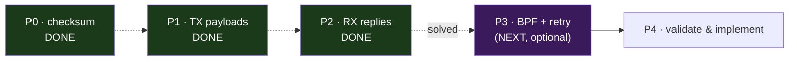
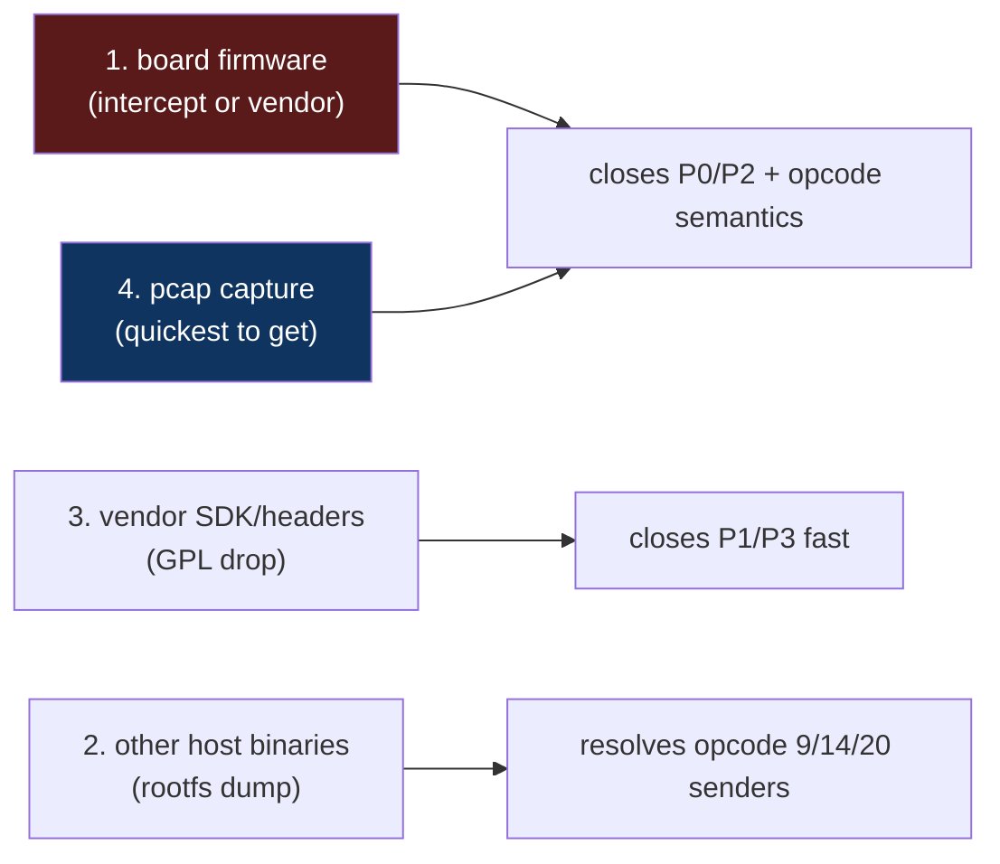

# Plan: Complete Binary Analysis for a `remote_board` Replacement

Goal: extract everything needed to write a **standalone replacement** that
configures the xDSL board directly over `0x88B5`, with **no `libcmm.so`
dependency**. The implementation plan for the replacement (a Rust daemon,
`rbctl-dsl`) is in [rbctl-daemon-plan.md](rbctl-daemon-plan.md); this document
tracks the binary analysis that feeds it.

> The replacement drops the entire cmm/`0x88B6` inbound layer and replaces it with
> a CLI argument parser. The `0x88B5` board-facing stack is reused verbatim. This
> plan closes the remaining analysis gaps so the replacement can be implemented
> with no further reverse engineering.

## Foundation already in place

Fully documented and reusable as-is (see [map.md](../docs/map.md), [protocol.md](../docs/protocol.md),
[checksum.md](../docs/checksum.md), [xdsl/](../docs/xdsl/index.md)):

**Transport & framing**
- Frame layout (`proto_frame_hdr`): dst/src MAC, ethertype `0x88B5`, magic
  (`0x10`/`0x11`), subtype, sequence, payload-len, checksum, payload-type
- Socket setup: `AF_PACKET`/`SOCK_RAW`, bind to `lan0.<vlan>`, kernel does 802.1Q
- MAC-learning handshake (`proto_recv_frame`): broadcast first, learn board MAC
- Send/retry/recv skeleton (`proto_send`, `proto_recv` timeouts & retransmit)
- VLAN interface lifecycle (`iface_vlan_up` / `iface_vlan_down`); local vlan id =
  `dslVlan + 2000` (interface `lan0.<vlan>`)

**Checksum (P0 — SOLVED)**
- **CRC-16/ARC** (poly `0x8005`), nibble-table impl, covered region
  `frame[0x0E..0x0E+payload_len+9]`, checksum field zeroed, stored big-endian
- Runnable reference: [../examples/checksum.py](../examples/checksum.py)

**Opcode surface (complete)**
- 13 handlers in `remote_board`; **10 live** {1,2,3,4,5,6,7,8,15,16},
  **3 confirmed dead** {9,14,20} (no host sender — sole-bridge proof)
- Firmware upload 4-stage protocol (chunking, ACK window, handshake)

**`libcmm.so` = the OAL layer (fully mapped)**
- `oal_remote_Cfg` (`0x00325300`, `./src/oal_dsl_remote.c`) is the **sole** host→
  server-`0x3b` bridge; `msg_id = opcode + 0x2968`
- All 15 OAL wrappers decompiled → exact opcode, payload size, mode per command
- **TX serializers and RX deserializers located with addresses** (the P1/P2
  targets, below) — analysis is now a transcription, not a hunt

**`proto_postprocess` byte-swap table (extracted during P0)**
- The authoritative per-`(magic, subtype)` field byte-order, indexed by opcode —
  directly yields the RX struct layouts (e.g. op 2 = 59 B = ~13×`uint32`+2×`uint16`;
  op 4 = 28 B = 7×`uint32`). Feeds P2 with no extra RE.

**Hardware (confirmed from build-path leak)**
- Host = MediaTek **MT7986** (AArch64); remote board = **EcoNet** EN75xx (MIPS),
  autonomous SoC with own OS/flash/RAM

## Gaps to close — prioritized



| Priority | Gap | Why it matters | Blocks |
|----------|-----|----------------|-------|
| ~~P0~~ | ~~checksum~~ | ~~solved — CRC-16/ARC~~ | ~~done~~ |
| ~~P1~~ | ~~TX payload byte layouts~~ | ~~solved — see [xdsl/payloads.md](../docs/xdsl/payloads.md)~~ | ~~done~~ |
| ~~P2~~ | ~~RX response struct layouts~~ | ~~solved — see [xdsl/responses.md](../docs/xdsl/responses.md)~~ | ~~done~~ |
| **P3** | BPF filter, retry/retransmit semantics | polish only (enums + postprocess already done) | polish |
| **P4** | capture-and-compare validation | confidence the replacement is wire-compatible (blocked on shell access) | release |

> **Core protocol fully reverse-engineered.** P0–P2 + the libcmm scan deliver a
> complete, implementation-ready spec: checksum, every TX encoder, every RX
> parser, all enums, and the opcode surface. P3 is cosmetic; P4 awaits regained
> shell access for a live capture.

---

## P0 — The checksum — SOLVED

**Status: complete.** Algorithm identified, ported, and self-tested. The P0
blocker is cleared — the CLI replacement can now build frames the board will
accept.

The checksum is **CRC-16/ARC** (poly `0x8005`, init `0x0000`, refin = refout =
true, xorout `0x0000`), computed over `frame[0x0E .. 0x0E + payload_len + 9]`
with the checksum field zeroed, stored **big-endian**. Reverse-engineered from
`proto_compute_checksum` + the 16-entry nibble table `g_awCrcTable`.

| Checklist item | Result |
|----------------|--------|
| Decompile `proto_compute_checksum` fully | done — nibble-table loop, 16 entries |
| Algorithm family | **CRC-16/ARC** (poly `0x8005`, reflected `0xA001`) |
| init / bit order / final XOR / table vs bitwise | init `0x0000`, refin=refout=true (LSB-first), xorout `0`, **nibble-table** (4-bit) |
| Reference implementation + test vector | [checksum.md](../docs/checksum.md) + [../examples/checksum.py](../examples/checksum.py) (`dsl_config_down` sample → `0x1ea0`) |
| Cross-check against captured frame | pending a pcap (P4) — the self-test proves the port == bit-by-bit CRC-16/ARC across lengths 0–1024 |

**Deliverable:** [../examples/checksum.py](../examples/checksum.py) reproduces the
board's check exactly; the CLI replacement imports `set_checksum` /
`verify_checksum` directly. Full write-up in [checksum.md](../docs/checksum.md).

> Ghidra: `g_awCrcTable` (`0x00404b80`) labelled + plate-commented; bridge
> functions `oal_remote_Cfg` / `oal_atm_setAtmIfStatus` renamed in `libcmm.so`.

---

## P1 — TX payload encodings — SOLVED

**Status: complete.** All write/config opcodes mapped; enum tables extracted;
packers implemented in [../examples/pack.py](../examples/pack.py). Full write-up
in [xdsl/payloads.md](../docs/xdsl/payloads.md).

The packing logic lives in `libcmm.so` serializers (TX side); `remote_board` just
forwards the bytes. Byte-order confirmed big-endian via `proto_postprocess`
cross-check (every multi-byte field's swap offset matches the serializer output).

**Targets** (all decompiled; renamed in Ghidra):

| Opcode | Size | Serializer | Result |
|--------|------|-----------|--------|
| 1 `dsl_config_up` | 12 B | `oal_dsl_lineObjToMsg` | modulation + annex + VDSL2 profile bitmask |
| 5 `atm_link_add` | 24 B | `oal_atm_linkObjToMsg` + `oal_atm_qosObjToMsg` | VPI/VCI/PCR/SCR/MBS + encap/linkType + VLAN tag |
| 15 `ptm_link_add` | 8 B | inline `oal_ptm_setVlanTag` | tag enable/vid/pri + local vlan |
| 6 / 16 `*_link_del` | 3 B | inline `oal_*_delVlanTag` | vlan-id + type byte (`3` = delete) |
| 7 `main_image_check` | 0 B | (no payload) | — |
| 8 `firmware_upgrade` | 128 B | path string (already documented) | — |

**Extracted:**
- [x] Field-by-field byte map (offset, size, encoding, byte order) — [xdsl/payloads.md](../docs/xdsl/payloads.md)
- [x] Enum value tables — modulation (8), annex (9), VDSL2 profile (9), ATM encap/linkType/QoS
- [x] Pack function per opcode — `pack_dsl_line` / `pack_atm_link` / `pack_ptm_link` / `pack_link_del` in [../examples/pack.py](../examples/pack.py)

**Bonus:** resolved the frame/payload boundary — `bPayload_type` (offset `0x18`)
is payload byte 0, not a header field; `wPayload_len` = descriptor length.

> Two DSL bytes (`[2]`,`[3]`, from TR-181 obj `+0x2c9`/`+0x2ca`) have TBD
> semantics — they're passed through verbatim. Their meaning surfaces in P2
> (same struct is read back in the opcode-2 reply) or from a capture. They do
> not block implementation (default `0`).

---

## P2 — RX response layouts — SOLVED

**Status: complete.** Both replies fully mapped; parser in
[../examples/unpack.py](../examples/unpack.py). Write-up in
[xdsl/responses.md](../docs/xdsl/responses.md).

Static analysis only (no pcap available). The libcmm deserializers are
authoritative for offsets/types; `proto_postprocess` confirms byte-order.

| Opcode | Reply | Parser | Result |
|--------|-------|--------|--------|
| 2 `dsl_get_line_obj` | 59 B | `oal_dsl_msgToLineObj` + 2 slicers | status, linkStatus, modulation, annex, VDSL2 profile bitmask + 12 metric uint32 |
| 4 `dsl_get_channel_stats` | 28 B | `oal_dsl_msgToChannelStatsTotObj` | status + 6 counters (Tx/Rx blocks/errors/discards) |

**Confirmed:** linkStatus (`0/2`=NoSignal, `1`=Up, `3`=Initializing,
`4`=EstablishingLink), modulation byte at **`0x05`** (not `0x3b` — corrected:
`local_3b` was a stack offset), annex at `0x07`, VDSL2 profile bitmask at
`0x39`. Magic `0x10` = response, `0x11` = command.

**Inferred (need capture to confirm names, not offsets):** the 12 line-metric
and 6 channel-stat uint32 field *names* follow TR-181 ordering. The byte map
itself is fixed.

**Deliverable:** `unpack_line_obj()`, `unpack_channel_stats()` in
[../examples/unpack.py](../examples/unpack.py); a `status` CLI verb is now
implementable.

---

## P3 — Enums, edge cases, polish

- [x] **Modulation enum table** — done in P1: 8 entries, see
      [xdsl/payloads.md](../docs/xdsl/payloads.md).
- [x] **Annex enum table** — done in P1: 9 entries, see
      [xdsl/payloads.md](../docs/xdsl/payloads.md).
- [x] ~~**`proto_postprocess`**~~ — **done in P0**: it is the per-`(magic,subtype)`
      byte-swap layer (host↔wire); no payload transformation beyond byte order.
      Feeds P1/P2 directly.
- [ ] **BPF filter** (optional) — for a CLI tool a simple EtherType+src-MAC match
      suffices; full filter replication not required.
- [ ] **Retry/retransmit semantics** — confirm `proto_recv`'s retransmit count
      and timeout units (ms) are as documented.

---

## P4 — Validation

- [ ] **Capture reference frames**: run the original `remote_board` + a packet
      capture on `lan0.500` (`tcpdump -i lan0.500 ether proto 0x88b5`), exercise
      each command, and save the `.pcap`.
- [ ] **Byte-compare**: for each opcode, generate the frame with the new code and
      diff against the capture (checksums included).
- [ ] **Live test** against the real board: config-up → verify line trains →
      config-down.

---

## Suggested implementation skeleton (superseded by the daemon plan)

> The CLI skeleton below was the original concept. The implementation has since
> evolved into a phased Rust daemon (`rbctl-dsl`) — see
> > [rbctl-daemon-plan.md](rbctl-daemon-plan.md) for the current design. This
> > skeleton is retained as a reference for the verb set and socket setup.

```
rbctl  (proposed CLI)
 ├── socket: AF_PACKET / SOCK_RAW, bind lan0.<vlan>, proto 0x88B5
 ├── frame.c   : proto_frame_hdr build + MAC learning + seq
 ├── checksum.c: DONE → ../examples/checksum.py  (CRC-16/ARC)
 ├── pack.c    : (from P1) pack_dsl_line / pack_atm_link / pack_ptm_link
 ├── unpack.c  : (from P2) line/status parsers
 └── verbs:
       rbctl line-up   --modulation VDSL2 --annex B
       rbctl atm-add   --vpi 8 --vci 35 --vlan 2001
       rbctl ptm-add   --vlan 2001
       rbctl line-down
       rbctl status
       rbctl firmware  <image.bin>
```

The control socket (`0x88B6`) and `libcmm.so` are **not reproduced** — the CLI
*is* the management client now.

## Suspected missing binaries & artifacts

The gaps above are derived by reverse-engineering `remote_board` + `libcmm.so`.
Several **missing artifacts** would provide the same information more directly
and authoritatively — and would close some gaps that the host binaries *cannot*
answer on their own. Listed by value.

### 1. Board firmware image (the `0x88B5` responder) — **highest value**

The remote DSL board is an **autonomous embedded system with its own OS, flash,
and RAM** — it is not a peripheral loaded by the host at runtime, and the host
binaries contain no board firmware blob. The board boots standalone from its own
flash and exposes the `0x88B5` protocol as its management interface. **We do not
possess this firmware** — it is the single biggest missing piece.

The opcode-8 (`firmware_upgrade`) payload is precisely a **flash upgrade image**:
the 4-stage upload streams the image to the board, which writes it to its own
flash and reboots into it. That upgrade image *is* a copy of the board's
firmware, which makes intercepting one the practical way to obtain it for
analysis.

| Closes | How |
|--------|-----|
| **P2 (RX layouts)** | the board *builds* the 59 B line object, 28 B stats, ACKs — its structs are the ground truth, no inference from libcmm deserializers needed |
| **P0 (checksum)** | confirms the algorithm from the receiver side (cross-check `remote_board`'s `proto_compute_checksum`) |
| Opcodes 9, 14, 20 | reveals what they actually do on the board (currently dead — no host sender exists) |
| Flash/reboot flow | the board-side receiver of the 4-stage upload, flash write, reboot — and the board's own OS/bootloader layout |

**How to obtain (none currently in hand):**
- **Intercept during upgrade** — `/var/tmp/remoteflash.bin` is staged on the host
  briefly before `firmware_upgrade` streams it (opcode 8). Copy it during a real
  upgrade: `cp /var/tmp/remoteflash.bin /tmp/capture.bin`. This is the most
  reliable path and yields a known-good flash image.
- **Vendor download** — the device is TP-Link (per `X_TP_*` vendor extensions);
  a matching firmware release from the vendor's support site typically bundles
  the remote-board image (may need unpacking the container format).
- **Read-back from board flash** — no read-back opcode was found in `libcmm.so`
  or `remote_board`, so the board cannot be dumped over `0x88B5` as-is. Would
  require JTAG/UART on the board itself, or a vendor service opcode not present in
  this host-software build.
- **JTAG / UART** — physical access to the board's debug headers (if present)
  bypasses the protocol entirely and can dump flash directly.

> Note: because the board is a self-contained SoC, its firmware is also the place
> where the **DSL chipset driver, ATM/PTM decapsulation, and the `0x88B5`
> responder state machine** live — analyzing it would explain the data plane end
> of [xdsl/data_plane.md](../docs/xdsl/data_plane.md), not just the control plane.


### 2. Host management binaries — opcodes 9/14/20 senders — RESOLVED

**The host rootfs was obtained (`squashfs-root/`) and fully scanned. No host
binary sends opcodes 9, 14, or 20.** Closed 2026-08.

`oal_remote_Cfg` (`libcmm.so`) is the sole path to server `0x3b`. Exhaustive
enumeration of its 16 call sites (across 15 wrappers) shows they pass only
**{1, 2, 3, 4, 5, 6, 7, 8, 15, 16}**. A cross-check of all 85+
`msg_connCliAndSend` callers confirms no other code path targets server `0x3b`.
Therefore `cmd9_forward`, `cmd14_forward`, and `board_identity_check` are **dead
code** in this host build — their semantics would only surface from a
board-firmware analysis (item #1). See [xdsl/opcodes.md](../docs/xdsl/opcodes.md) for the
verification note.

Rootfs-pull + scan recipe (kept for future "who sends opcode X" questions):
- Pull the squashfs / UBI / MTD dump.
- Find libcmm linkers: `readelf -d <bin> | grep libcmm`.
- Senders always funnel through `oal_remote_Cfg` → enumerate its callers (the
  opcode is the first argument at each call site).

### 3. Vendor DSL SDK / headers

The `0x88B5` protocol is defined in the chipset vendor's SDK. The board's DSL
SoC is an **EcoNet** part (confirmed). The `DMVS_ADSL`/`DMVS_VDSL` strings seen
in the host binaries are EcoNet's DSL management API; `oal_`/`rsl_` prefixes are
the BBF TR-181 framework layer on top.

> **Architecture note:** `remote_board` is AArch64 (ARMv8-A, 64-bit) — but that
> is the *host* binary (the router's main CPU). The board's EcoNet SoC is a
> separate processor and is **most likely MIPS** (the EcoNet EN75xx DSL family is MIPS-based). A board
> firmware image, if obtained, should be loaded into Ghidra as **MIPS** (not
> AArch64), little- or big-endian depending on the exact part.

| Closes | How |
|--------|-----|
| **P1 (TX encodings)** | SDK headers define the on-wire structs (`proto_frame_hdr`, line/link descriptors) — no need to RE `dslLineObjToMsg` etc. |
| **P3 (enums)** | modulation/annex/encap enum tables come straight from headers |

**How to obtain:** the EcoNet DSL CPE SDK / driver source, or the device's own
GPL source release (TP-Link publishes GPL tarballs — these typically bundle the
EcoNet driver drop). Even partial headers (`dmvs_*.h`, the FAPI-ish layer)
short-circuit much of P1/P3.

### 4. Packet captures (cross-ref P4)

Not a binary, but an artifact that **removes guesswork** from every step:
- A `tcpdump -i lan0.500 ether proto 0x88b5 -w board.pcap` taken while exercising
  each opcode provides ground-truth frames (checksums, exact payload bytes,
  response layouts) that let us validate the RE'd structures byte-for-byte.
- Pairs naturally with item #1 (a capture during a real config session shows the
  board's actual responses, complementing the firmware analysis).

### Priority for acquisition



**Quickest wins:** a packet capture (#4) and an intercepted firmware image (#1)
require no vendor cooperation and immediately de-risk P0 and P2. The SDK (#3) is
the biggest accelerator if obtainable.

## Out of scope

- The `0x88B6` cmm bus and server `0x3b` (replaced by CLI invocation)
- `msg_serveForever` and its type-`0x15` ack loop (cmm-internal, not board-facing)
- TR-181 datamodel plumbing (the CLI exposes direct primitives, not the full
  `Device.DSL.` object tree)
- Opcodes 9, 14, 20 — dead (no sender in `libcmm.so`); implement only if a
  sender is later found
